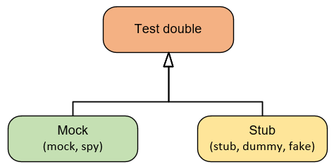
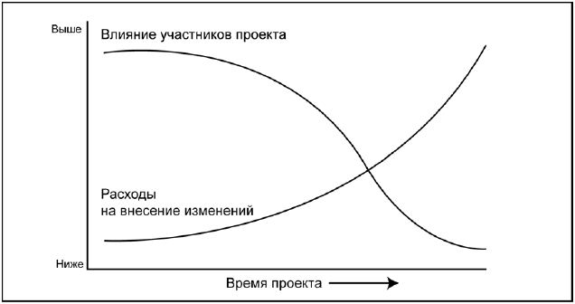
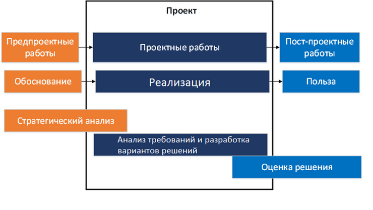
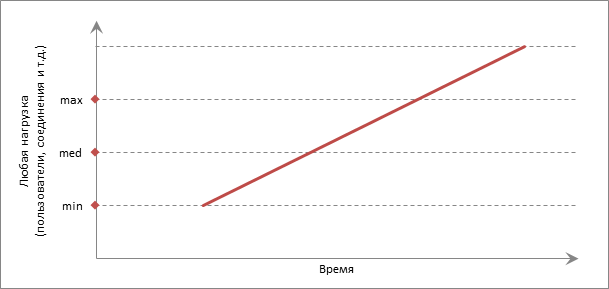
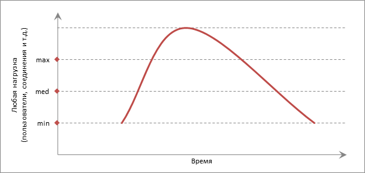
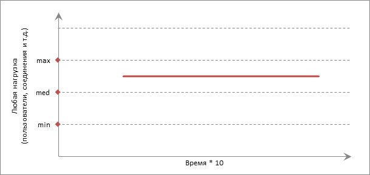
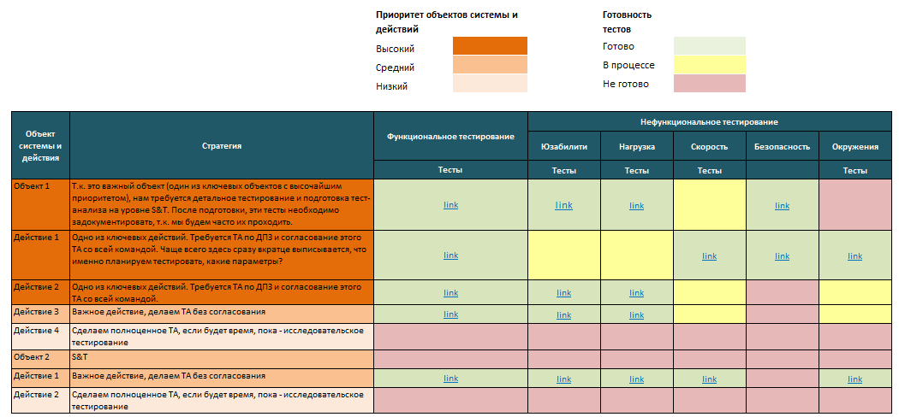

# Запитання для співбесіди на теми

- [1. Python](https://github.com/tendil/interview_questions_qa_python_js_java/blob/main/README.md#1-python)

- [2. GIT](https://github.com/tendil/interview_questions_qa_python_js_java/blob/main/README.md#2-git)

- [3. JavaScript](https://github.com/tendil/interview_questions_qa_python_js_java/blob/main/README.md#3-javascript)

- [4. Java](https://github.com/tendil/interview_questions_qa_python_js_java/blob/main/README.md#4-java)

- [5. QA Manual](https://github.com/tendil/interview_questions_qa_python_js_java/blob/main/README.md#5-qa-manual)

- [6. QA Automation](https://github.com/tendil/interview_questions_qa_python_js_java/blob/main/README.md#6-qa-automation)

- [7. TypeScript](https://github.com/tendil/interview_questions_qa_python_js_java/blob/main/README.md#7-typescript)

- [8. CI CD](https://github.com/tendil/interview_questions_qa_python_js_java/blob/main/README.md#8-ci-cd)

- [9. Основні принципи програмування](https://github.com/tendil/interview_questions_qa_python_js_java/blob/main/README.md#9-основні-принципи-програмування)

- [10. Теорія тестування](https://github.com/tendil/interview_questions_qa_python_js_java/blob/main/README.md#10-теорія-тестування)

---

## 1. Python

- [1. Види типізації](https://github.com/tendil/interview_questions_qa_python_js_java/blob/main/README.md#1-види-типізації)
- [2. Типізація python](https://github.com/tendil/interview_questions_qa_python_js_java/blob/main/README.md#2-що-таке-змінна)
- [3. Що таке змінна](https://github.com/tendil/interview_questions_qa_python_js_java/blob/main/README.md#3-що-таке-змінна)
- [4. Числа в python](https://github.com/tendil/interview_questions_qa_python_js_java/blob/main/README.md#4-числа-в-python)
- [5. Рядки в python](https://github.com/tendil/interview_questions_qa_python_js_java/blob/main/README.md#5-рядки-в-python)
- [6. Списки і кортежі в python](https://github.com/tendil/interview_questions_qa_python_js_java/blob/main/README.md#6-рядки-в-python)
- [7. Словник в python](https://github.com/tendil/interview_questions_qa_python_js_java/blob/main/README.md#7-cловник-в-python)
- [8. Які типи даних відносяться до структур даних](https://github.com/tendil/interview_questions_qa_python_js_java/blob/main/README.md#8-які-типи-даних-відносяться-до-структур-даних)
- [9. Що таке віртуальне середовище](https://github.com/tendil/interview_questions_qa_python_js_java/blob/main/README.md#9-що-таке-віртуальне-середовище)
- [10. Як встановити віртуальне середовище](https://github.com/tendil/interview_questions_qa_python_js_java/blob/main/README.md#10-як-встановити-віртуальне-середовище)
- [11. Види форматування рядків](https://github.com/tendil/interview_questions_qa_python_js_java/blob/main/README.md#11-види-форматування-рядків)
- [12. Зрізи або срізи в python](https://github.com/tendil/interview_questions_qa_python_js_java/blob/main/README.md#12-cрізи-або-срізи-в-python)
- [13. Що таке ітерація](https://github.com/tendil/interview_questions_qa_python_js_java/blob/main/README.md#13-що-таке-ітерація)
- [14. Які цикли існують в python](https://github.com/tendil/interview_questions_qa_python_js_java/blob/main/README.md#14-які-цикли-існують-в-python)
- [15. В чому різниця між while та for](https://github.com/tendil/interview_questions_qa_python_js_java/blob/main/README.md#15-в-чому-різниця-між-while-та-for)
- [16. Як реалізоване розгалуження в python](https://github.com/tendil/interview_questions_qa_python_js_java/blob/main/README.md#16-як-реалізоване-розгалуження-в-python)
- [17. Як запросити в користувача ввід](https://github.com/tendil/interview_questions_qa_python_js_java/blob/main/README.md#17-як-запитати-в-користувача-ввід)
- [18. Приведення типів](https://github.com/tendil/interview_questions_qa_python_js_java/blob/main/README.md#18-приведення-типів)
- [19. Що таке анотація типів](https://github.com/tendil/interview_questions_qa_python_js_java/blob/main/README.md#19-що-таке-анотація-типів)
- [20. Рядок це послідовність чи ні](https://github.com/tendil/interview_questions_qa_python_js_java/blob/main/README.md#20-рядок-це-послідовність-чи-ні)
- [21. Що таке PEP8](https://github.com/tendil/interview_questions_qa_python_js_java/blob/main/README.md#21-що-таке-pep)
- [22. Що таке функція range](https://github.com/tendil/interview_questions_qa_python_js_java/blob/main/README.md#22-що-таке-функція-range)
- [23. Що робить enumerate](https://github.com/tendil/interview_questions_qa_python_js_java/blob/main/README.md#23-що-робить-enumerate)
- [24. Які методи списків](https://github.com/tendil/interview_questions_qa_python_js_java/blob/main/README.md#24-які-методи-списків)
- [25. Що в python не є об'єктом](https://github.com/tendil/interview_questions_qa_python_js_java/blob/main/README.md#25-що-в-python-не-є-об'єктом)
- [26. Назви змінних](https://github.com/tendil/interview_questions_qa_python_js_java/blob/main/README.md#26-назви-змінних)
- [27. Що таке літерали](https://github.com/tendil/interview_questions_qa_python_js_java/blob/main/README.md#27-що-таке-літерали)
- [28. Чи можна число зробити рядком](https://github.com/tendil/interview_questions_qa_python_js_java/blob/main/README.md#28-чи-можна-число-зробити-рядком)
- [29. Що робить метод split()](https://github.com/tendil/interview_questions_qa_python_js_java/blob/main/README.md#29-що-робить-метод-split)
- [30. Що робить метод join()](https://github.com/tendil/interview_questions_qa_python_js_java/blob/main/README.md#30-що-робить-метод-join)
- [31. Як імпортувати модуль](https://github.com/tendil/interview_questions_qa_python_js_java/blob/main/README.md#31-як-імпортувати-модуль)
- [32. Як імпортувати весь вміст модуля](https://github.com/tendil/interview_questions_qa_python_js_java/blob/main/README.md#32-як-імпортувати-весь-вміст-модуля)
- [33. Скільки пар ключ-значення може бути в словнику](https://github.com/tendil/interview_questions_qa_python_js_java/blob/main/README.md#33-скільки-пар-ключ-значення-може-бути-в-словнику)
- [34. Який тип даних може бути значенням в словнику](https://github.com/tendil/interview_questions_qa_python_js_java/blob/main/README.md#34-який-тип-даних-може-бути-значенням-в-словнику)
- [35. Як дізнатися id елемента](https://github.com/tendil/interview_questions_qa_python_js_java/blob/main/README.md#35-як-дізнатися-id-елемента)
- [36. Як дізнатися версію python](https://github.com/tendil/interview_questions_qa_python_js_java/blob/main/README.md#36-як-дізнатися-версію-python)
- [37. Відмінності другого python від 3](https://github.com/tendil/interview_questions_qa_python_js_java/blob/main/README.md#37-відмінності-другого-python-від-3)
- [38. Як перервати виконання циклу](https://github.com/tendil/interview_questions_qa_python_js_java/blob/main/README.md#38-як-перервати-виконання-циклу)
- [39. Що означає continue](https://github.com/tendil/interview_questions_qa_python_js_java/blob/main/README.md#39-що-означає-continue)
- [40. Що буде, якщо порівняти 5 і 5.0](https://github.com/tendil/interview_questions_qa_python_js_java/blob/main/README.md#40-що-буде-якщо-порівняти-5-і-50)
- [41. Що швидше: python або c++](https://github.com/tendil/interview_questions_qa_python_js_java/blob/main/README.md#41-що-швидше-python-або-c)
- [42. Що таке байт-код](https://github.com/tendil/interview_questions_qa_python_js_java/blob/main/README.md#42-що-таке-байт-код)
- [43. Як уникнути конфліктів при імпорті файлів](https://github.com/tendil/interview_questions_qa_python_js_java/blob/main/README.md#43-як-уникнути-конфліктів-при-імпорті-файлів)
- [44. Що означає %s %d](https://github.com/tendil/interview_questions_qa_python_js_java/blob/main/README.md#44-що-означає-s-d)
- [45. Що таке клас](https://github.com/tendil/interview_questions_qa_python_js_java/blob/main/README.md#45-що-таке-клас)
- [46. Що таке успадкування](https://github.com/tendil/interview_questions_qa_python_js_java/blob/main/README.md#46-що-таке-спадкування)
- [47. Що таке інкапсуляція](https://github.com/tendil/interview_questions_qa_python_js_java/blob/main/README.md#47-що-таке-інкапсуляція)
- [48. Що таке поліморфізм](https://github.com/tendil/interview_questions_qa_python_js_java/blob/main/README.md#48-що-таке-поліморфізм)
- [49. Скільки може бути батьків і спадкоємців у класу](https://github.com/tendil/interview_questions_qa_python_js_java/blob/main/README.md#49-скільки-може-бути-батьків-і-спадкоємців-у-класу)
- [50. Що таке перевантаження операторів](https://github.com/tendil/interview_questions_qa_python_js_java/blob/main/README.md#50-що-таке-перевантаження-операторів)
- [51. Магічні методи](https://github.com/tendil/interview_questions_qa_python_js_java/blob/main/README.md#51-магічні-методи)
- [52. Модифікатори доступу](https://github.com/tendil/interview_questions_qa_python_js_java/blob/main/README.md#52-модифікатори-доступу)
- [53. Генератори](https://github.com/tendil/interview_questions_qa_python_js_java/blob/main/README.md#53-генератори)
- [54. Як пишуться коментарі в python](https://github.com/tendil/interview_questions_qa_python_js_java/blob/main/README.md#54-як-пишуться-коментарі-в-python)
- [55. Як можна змінити (зворотній) порядок елементів у списку](https://github.com/tendil/interview_questions_qa_python_js_java/blob/main/README.md#55-як-можна-змінити-зворотній-порядок-елементів-у-списку)
- [56. Якщо ми не поставимо двокрапку в кінці рядка для циклу "do-while", він все одно виконається?](https://github.com/tendil/interview_questions_qa_python_js_java/blob/main/README.md#56-якщо-ми-не-поставимо-двокрапку-в-кінці-рядка-для-циклу-do-while-він-все-одно-виконається)
- [57. Як видалити зі списку дублікат елемента](https://github.com/tendil/interview_questions_qa_python_js_java/blob/main/README.md#57-як-видалити-зі-списку-дублікат-елемента)
- [58. Розкажіть про арифметичні оператори //, %, і **](https://github.com/tendil/interview_questions_qa_python_js_java/blob/main/README.md#58-розкажіть-про-арифметичні-оператори---і-)
- [59. Як порахувати довжину рядка (string)](https://github.com/tendil/interview_questions_qa_python_js_java/blob/main/README.md#59-як-порахувати-довжину-рядка-string)
- [60. Розкажіть про генератори списків (list comprehension)](https://github.com/tendil/interview_questions_qa_python_js_java/blob/main/README.md#60-розкажіть-про-генератори-списків-list-comprehension)
- [61. Що таке HTTP](https://github.com/tendil/interview_questions_qa_python_js_java/blob/main/README.md#61-що-таке-http)
- [62. Що таке json, xml](https://github.com/tendil/interview_questions_qa_python_js_java/blob/main/README.md#62-що-таке-json-xml)
- [63. Чим відрізняється HTML від XML](https://github.com/tendil/interview_questions_qa_python_js_java/blob/main/README.md#63-чим-відрізняється-html-від-xml)
- [64. Що таке CRUD](https://github.com/tendil/interview_questions_qa_python_js_java/blob/main/README.md#64-що-таке-crud)
- [65. Який патерн програмування реалізує Django](https://github.com/tendil/interview_questions_qa_python_js_java/blob/main/README.md#65-який-патерн-програмування-реалізує-django)
- [66. На якому етапі в додатку Django відбувається запит до бази даних](https://github.com/tendil/interview_questions_qa_python_js_java/blob/main/README.md#66-на-якому-етапі-в-додатку-django-відбувається-запит-до-бази-даних)
- [67. Який результат буде Post.objects.all() і якого типу верне](https://github.com/tendil/interview_questions_qa_python_js_java/blob/main/README.md#67-який-результат-буде-postobjectsall-і-якого-типу-верне)
- [68. Що таке SQL](https://github.com/tendil/interview_questions_qa_python_js_java/blob/main/README.md#68-що-таке-sql)
- [69. Яким запитом я можу витягнути всі дані з таблиці](https://github.com/tendil/interview_questions_qa_python_js_java/blob/main/README.md#69-яким-запитом-я-можу-витягнути-всі-дані-з-таблиці)
- [70. Що таке багато-до-багатьох (многие-ко-многим)](https://github.com/tendil/interview_questions_qa_python_js_java/blob/main/README.md#70-що-таке-багато-до-багатьох-многие-ко-многим)
- [71. Як реалізується М2М в SQL](https://github.com/tendil/interview_questions_qa_python_js_java/blob/main/README.md#71-як-реалізується-м2м-в-sql)
- [72. Що таке JOIN і яким він може бути](https://github.com/tendil/interview_questions_qa_python_js_java/blob/main/README.md#72-що-таке-join-і-яким-він-може-бути)
- [73. Що таке View](https://github.com/tendil/interview_questions_qa_python_js_java/blob/main/README.md#73-що-таке-view)
- [74. Що таке міксини](https://github.com/tendil/interview_questions_qa_python_js_java/blob/main/README.md#74-що-таке-міксини)
- [75. Префіксні та інфіксні оператори](https://github.com/tendil/interview_questions_qa_python_js_java/blob/main/README.md#75-префіксні-та-інфіксні-оператори)
- [76. Два способи створення класу](https://github.com/tendil/interview_questions_qa_python_js_java/blob/main/README.md#76-два-способи-створення-класу)
- [77. Чим файл .pyc відрізняється від .py](https://github.com/tendil/interview_questions_qa_python_js_java/blob/main/README.md#77-чим-файл-pyc-відрізняється-від-py)
- [78. Що робить python об'єктно-орієнтованим](https://github.com/tendil/interview_questions_qa_python_js_java/blob/main/README.md#78-що-робить-python-обєктно-орієнтованим)
- [79. Як проводиться відлагодження програми на Python](https://github.com/tendil/interview_questions_qa_python_js_java/blob/main/README.md#79-як-проводиться-відлагодження-програми-на-python)
- [80. Що таке GIL](https://github.com/tendil/interview_questions_qa_python_js_java/blob/main/README.md#80-що-таке-gil)
- [81. Що таке Django Middleware](https://github.com/tendil/interview_questions_qa_python_js_java/blob/main/README.md#81-що-таке-django-middleware)
- [82. Як вставити об'єкт так, щоб він опинився під певним індексом?](https://github.com/tendil/interview_questions_qa_python_js_java/blob/main/README.md#82-як-вставити-обєкт-так-щоб-він-опинився-під-певним-індексом)
- [83. Що потрібно зробити, щоб функція повертала значення? Використовувати оператор return або yield](https://github.com/tendil/interview_questions_qa_python_js_java/blob/main/README.md#83-що-потрібно-зробити-щоб-функція-повертала-значення)
- [84. Що якщо в функції не буде return, чи вона щось поверне?](https://github.com/tendil/interview_questions_qa_python_js_java/blob/main/README.md#84-що-якщо-в-функції-не-буде-return-чи-вона-щось-поверне)
- [85. Напишіть в одну строку, як можна отримати найпізнішу за кодом літеру у рядку](https://github.com/tendil/interview_questions_qa_python_js_java/blob/main/README.md#85-напишіть-в-одну-строку-як-можна-отримати-найпізнішу-за-кодом-літеру-у-рядку)
- [86. Як конвертувати список в рядок?](https://github.com/tendil/interview_questions_qa_python_js_java/blob/main/README.md#86-як-конвертувати-список-в-рядок)
- [87. Принципи SOLID](https://github.com/tendil/interview_questions_qa_python_js_java/blob/main/README.md#87-принципи-solid)
- [88. SQL JOIN](https://github.com/tendil/interview_questions_qa_python_js_java/blob/main/README.md#88-sql-join)
- [89. SQL оператор HAVING](https://github.com/tendil/interview_questions_qa_python_js_java/blob/main/README.md#89-sql-оператор-having)
- [90. Метакласи в Python](https://github.com/tendil/interview_questions_qa_python_js_java/blob/main/README.md#90-метакласи-в-python)
- [91. Множинне успадкування](https://github.com/tendil/interview_questions_qa_python_js_java/blob/main/README.md#91-множинне-спадкування)
- [92. Компоненти django](https://github.com/tendil/interview_questions_qa_python_js_java/blob/main/README.md#92-компоненти-django)
- [93. Які вбудовані типи доступні в Python](https://github.com/tendil/interview_questions_qa_python_js_java/blob/main/README.md#93-які-вбудовані-типи-доступні-в-python)
- [94. Mutable та immutable типи даних](https://github.com/tendil/interview_questions_qa_python_js_java/blob/main/README.md#94-mutable-та-immutable-типи-даних)
- [95. Лямбда-функція в Python](https://github.com/tendil/interview_questions_qa_python_js_java/blob/main/README.md#95-лямбда-функція-в-python)
- [96. Що означає простір імен](https://github.com/tendil/interview_questions_qa_python_js_java/blob/main/README.md#96-що-означає-простір-імен)
- [97. Чим відрізняється pickling від unpickling](https://github.com/tendil/interview_questions_qa_python_js_java/blob/main/README.md#97-чим-відрізняється-pickling-від-unpickling)
- [98. Різниця між генераторами та ітераторами](https://github.com/tendil/interview_questions_qa_python_js_java/blob/main/README.md#98-різниця-між-генераторами-та-ітераторами)
- [99. Як перетворити число в рядок](https://github.com/tendil/interview_questions_qa_python_js_java/blob/main/README.md#99-як-перетворити-число-в-рядок)
- [100. Обов'язково чи функція Python повинна повертати значення](https://github.com/tendil/interview_questions_qa_python_js_java/blob/main/README.md#100-обовязково-чи-функція-python-повинна-повертати-значення)
- [101. Чи існує в Python функція main()](https://github.com/tendil/interview_questions_qa_python_js_java/blob/main/README.md#101-чи-існує-в-python-функція-main)
- [102. Який метод використовувався перед оператором «in» для перевірки наявності ключа в словнику](https://github.com/tendil/interview_questions_qa_python_js_java/blob/main/README.md#102-який-метод-використовувався-перед-оператором-in-для-перевірки-наявності-ключа-в-словнику)
- [103. Управління пам'яттю в Python](https://github.com/tendil/interview_questions_qa_python_js_java/blob/main/README.md#103-управління-памяттю-в-python)
- [104. Що таке PYTHONPATH](https://github.com/tendil/interview_questions_qa_python_js_java/blob/main/README.md#104-що-таке-pythonpath)
- [105. Що таке модулі Python](https://github.com/tendil/interview_questions_qa_python_js_java/blob/main/README.md#105-що-таке-модулі-python)
- [106. Що означає self в Python](https://github.com/tendil/interview_questions_qa_python_js_java/blob/main/README.md#106-що-означає-self-в-python)
- [107. Як Python інтерпретується як мова](https://github.com/tendil/interview_questions_qa_python_js_java/blob/main/README.md#107-як-python-інтерпретується-як-мова)
- [108. Як інтерпретується Python](https://github.com/tendil/interview_questions_qa_python_js_java/blob/main/README.md#108-як-інтерпретується-python)
- [109. Як в Python керується пам'ятю](https://github.com/tendil/interview_questions_qa_python_js_java/blob/main/README.md#109-як-в-python-керується-памятю)
- [110. Що таке функція в Python](https://github.com/tendil/interview_questions_qa_python_js_java/blob/main/README.md#110-що-таке-функція-в-python)
- [111. Що таке локальні та глобальні змінні в Python](https://github.com/tendil/interview_questions_qa_python_js_java/blob/main/README.md#111-що-таке-локальні-та-глобальні-змінні-в-python)
- [112. Чому лямбда-форми в Python не мають операторів](https://github.com/tendil/interview_questions_qa_python_js_java/blob/main/README.md#112-чому-лямбда-форми-в-python-не-мають-операторів)
- [113. Від'ємні індекси і чому їх використовують](https://github.com/tendil/interview_questions_qa_python_js_java/blob/main/README.md#113-відємні-індекси-і-чому-їх-використовують)
- [114. Як отримати список усіх ключів в словнику](https://github.com/tendil/interview_questions_qa_python_js_java/blob/main/README.md#114-як-отримати-список-усіх-ключів-в-словнику)
- [115. Різниця між списком та кортежем](https://github.com/tendil/interview_questions_qa_python_js_java/blob/main/README.md#115-різниця-між-списком-та-кортежем)
- [116. Що таке ітератори в Python](https://github.com/tendil/interview_questions_qa_python_js_java/blob/main/README.md#116-що-таке-ітератори-в-python)
- [117. Що таке функція map в Python](https://github.com/tendil/interview_questions_qa_python_js_java/blob/main/README.md#117-що-таке-функція-map-в-python)
- [118. Що таке поверхнева копія](https://github.com/tendil/interview_questions_qa_python_js_java/blob/main/README.md#118-що-таке-поверхнева-копія)
- [119. Що таке глибока копія](https://github.com/tendil/interview_questions_qa_python_js_java/blob/main/README.md#119-що-таке-глибока-копія)
- [120. Що робить функція zip()](https://github.com/tendil/interview_questions_qa_python_js_java/blob/main/README.md#120-що-робить-функція-zip)
- [121. Що робить оператор with в Python](https://github.com/tendil/interview_questions_qa_python_js_java/blob/main/README.md#121-що-робить-оператор-with-в-python)
- [122. Коли виконується блок except в конструкції try-except](https://github.com/tendil/interview_questions_qa_python_js_java/blob/main/README.md#122-коли-виконується-блок-except-в-конструкції-try-except)
- [123. Де ви будете використовувати while замість for](https://github.com/tendil/interview_questions_qa_python_js_java/blob/main/README.md#123-де-ви-будете-використовувати-while-замість-for)
- [124. Чи є масиви NumPy в Python кращими за списки](https://github.com/tendil/interview_questions_qa_python_js_java/blob/main/README.md#124-чи-є-масиви-numpy-в-python-кращими-за-списки)
- [125. Як отримати поточний робочий каталог за допомогою Python](https://github.com/tendil/interview_questions_qa_python_js_java/blob/main/README.md#125-як-отримати-поточний-робочий-каталог-за-допомогою-python)
- [126. Що таке приведення в Python](https://github.com/tendil/interview_questions_qa_python_js_java/blob/main/README.md#126-що-таке-приведення-в-python)
- [127. Як можна видалити змінні в Python](https://github.com/tendil/interview_questions_qa_python_js_java/blob/main/README.md#127-як-можна-видалити-змінні-в-python)
- [128. В чому різниця між методами append та extend](https://github.com/tendil/interview_questions_qa_python_js_java/blob/main/README.md#128-в-чому-різниця-між-методами-append-та-extend)
- [129. Що означає *args, **kwargs і навіщо нам їх використовувати](https://github.com/tendil/interview_questions_qa_python_js_java/blob/main/README.md#129-що-означає-args-kwargs-і-навіщо-нам-їх-використовувати)
- [130. Що означає одинарний і подвійний підкреслення перед ім'ям об'єкта (dunder methods)](https://github.com/tendil/interview_questions_qa_python_js_java/blob/main/README.md#130-що-означає-одинарний-і-подвійний-підкреслення-перед-ім'ям-об'єкта-dunder-methods)
- [131. Що таке генератор](https://github.com/tendil/interview_questions_qa_python_js_java/blob/main/README.md#131-що-таке-генератор)
- [132. Яка мета одинарної змінної підкреслення в Python](https://github.com/tendil/interview_questions_qa_python_js_java/blob/main/README.md#132-яка-мета-одинарної-змінної-підкреслення-в-python)
- [133. Які типи успадкування існують в Python](https://github.com/tendil/interview_questions_qa_python_js_java/blob/main/README.md#133-які-типи-спадкування-в-python)
- [134. Що таке розпакування кортежу](https://github.com/tendil/interview_questions_qa_python_js_java/blob/main/README.md#134-що-таке-розпакування-кортежу)
- [135. Чи звільняється вся пам'ять після виходу з Python](https://github.com/tendil/interview_questions_qa_python_js_java/blob/main/README.md#135-чи-звільняється-вся-пам'ять-після-виходу-з-python)
- [136. Чи є функція дійсною, якщо вона не має оператора return](https://github.com/tendil/interview_questions_qa_python_js_java/blob/main/README.md#136-чи-є-функція-дійсною-якщо-вона-не-має-оператора-return)
- [137. На що корисно використовувати ООП](https://github.com/tendil/interview_questions_qa_python_js_java/blob/main/README.md#137-на-що-корисно-використовувати-ооп)
- [138. Що таке об'єкт](https://github.com/tendil/interview_questions_qa_python_js_java/blob/main/README.md#138-що-таке-об'єкт)
- [139. В чому різниця між класом та структурою](https://github.com/tendil/interview_questions_qa_python_js_java/blob/main/README.md#139-в-чому-різниця-між-класом-та-структурою)
- [140. Чи можете ви викликати метод базового класу без створення екземпляру](https://github.com/tendil/interview_questions_qa_python_js_java/blob/main/README.md#140-чи-можете-ви-викликати-метод-базового-класу-без-створення-екземпляру)
- [141. В чому різниця між класом та об'єктом](https://github.com/tendil/interview_questions_qa_python_js_java/blob/main/README.md#141-в-чому-різниця-між-класом-та-об'єктом)
- [142. Що таке суперклас](https://github.com/tendil/interview_questions_qa_python_js_java/blob/main/README.md#142-що-таке-суперклас)
- [143. Що таке підклас](https://github.com/tendil/interview_questions_qa_python_js_java/blob/main/README.md#143-що-таке-підклас)
- [144. Що таке абстракція](https://github.com/tendil/interview_questions_qa_python_js_java/blob/main/README.md#144-що-таке-абстракція)
- [145. Різниця між процедурним програмуванням та ООП](https://github.com/tendil/interview_questions_qa_python_js_java/blob/main/README.md#145-різниця-між-процедурним-програмуванням-та-ооп)
- [146. В чому різниця між модулем та пакетом в Python](https://github.com/tendil/interview_questions_qa_python_js_java/blob/main/README.md#146-в-чому-різниця-між-модулем-та-пакетом-в-python)

## 2. GIT

- [1. Що таке Git](https://github.com/tendil/interview_questions_qa_python_js_java/blob/main/README.md#1-що-таке-git)
- [2. Як створити локальний Git репозиторій](https://github.com/tendil/interview_questions_qa_python_js_java/blob/main/README.md#2-як-створити-локальний-git-репозиторій)
- [3. Що таке git push](https://github.com/tendil/interview_questions_qa_python_js_java/blob/main/README.md#3-що-таке-git-push)
- [4. Що робить git commit](https://github.com/tendil/interview_questions_qa_python_js_java/blob/main/README.md#4-що-робить-git-commit)
- [5. Git merge та rebase](https://github.com/tendil/interview_questions_qa_python_js_java/blob/main/README.md#5-git-merge-та-rebase)

## 3. JavaScript

| №   | Питання                                                                                                                                                                                                                                                                                      |
|-----|----------------------------------------------------------------------------------------------------------------------------------------------------------------------------------------------------------------------------------------------------------------------------------------------|
| 1   | [Які існують способи створення об'єктів у JavaScript](https://github.com/tendil/interview_questions_qa_python_js_java/blob/main/README.md#1-які-існують-способи-створення-обєктів-у-javascript)                                                                                              |
| 2   | [Що таке ланцюг прототипів](https://github.com/tendil/interview_questions_qa_python_js_java/blob/main/README.md#2-що-таке-ланцюг-прототипів)                                                                                                                                                 |
| 3   | [В чому різниця між методами Call, Apply та Bind](https://github.com/tendil/interview_questions_qa_python_js_java/blob/main/README.md#3-в-чому-різниця-між-методами-call-apply-та-bind)                                                                                                      |
| 4   | [Що таке JSON та його загальні операції](https://github.com/tendil/interview_questions_qa_python_js_java/blob/main/README.md#4-що-таке-json-та-його-загальні-операції)                                                                                                                       |
| 5   | [Яка мета методу slice для масиву](https://github.com/tendil/interview_questions_qa_python_js_java/blob/main/README.md#5-яка-мета-методу-slice-для-масиву)                                                                                                                                   |
| 6   | [Яка мета методу splice для масиву](https://github.com/tendil/interview_questions_qa_python_js_java/blob/main/README.md#6-яка-мета-методу-splice-для-масиву)                                                                                                                                 |
| 7   | [В чому різниця між slice та splice](https://github.com/tendil/interview_questions_qa_python_js_java/blob/main/README.md#7-в-чому-різниця-між-slice-та-splice)                                                                                                                               |
| 8   | [Як порівняти Об'єкт із Map](https://github.com/tendil/interview_questions_qa_python_js_java/blob/main/README.md#8-як-порівняти-обєкт-із-map)                                                                                                                                                |
| 9   | [В чому різниця між операторами == та ===](https://github.com/tendil/interview_questions_qa_python_js_java/blob/main/README.md#9-в-чому-різниця-між-операторами--та--operators)                                                                                                              |
| 10  | [Що таке лямбда- або стрілкові функції](https://github.com/tendil/interview_questions_qa_python_js_java/blob/main/README.md#10-що-таке-лямбда-або-стрілкові-функції)                                                                                                                         |
| 11  | [Що таке функція першого класу](https://github.com/tendil/interview_questions_qa_python_js_java/blob/main/README.md#11-що-таке-функція-першого-класу)                                                                                                                                        |
| 12  | [Що таке функція першого порядку](https://github.com/tendil/interview_questions_qa_python_js_java/blob/main/README.md#12-що-таке-функція-першого-порядку)                                                                                                                                    |
| 13  | [Що таке функція вищого порядку](https://github.com/tendil/interview_questions_qa_python_js_java/blob/main/README.md#13-що-таке-функція-вищого-порядку)                                                                                                                                      |
| 14  | [Що таке унарна функція](https://github.com/tendil/interview_questions_qa_python_js_java/blob/main/README.md#14-що-таке-унарна-функція)                                                                                                                                                      |
| 15  | [Що таке функція каррінг](https://github.com/tendil/interview_questions_qa_python_js_java/blob/main/README.md#15-що-таке-функція-каррінг)                                                                                                                                                    |
| 16  | [Що таке чиста функція](https://github.com/tendil/interview_questions_qa_python_js_java/blob/main/README.md#16-що-таке-чиста-функція)                                                                                                                                                        |
| 17  | [Яка мета ключового слова let](https://github.com/tendil/interview_questions_qa_python_js_java/blob/main/README.md#17-яка-мета-ключового-слова-let)                                                                                                                                          |
| 18  | [В чому різниця між let та var](https://github.com/tendil/interview_questions_qa_python_js_java/blob/main/README.md#18-в-чому-різниця-між-let-та-var)                                                                                                                                        |
| 19  | [Яка причина вибору назви let як ключового слова](https://github.com/tendil/interview_questions_qa_python_js_java/blob/main/README.md#19-яка-причина-вибору-назви-let-як-ключового-слова)                                                                                                    |
| 20  | [Як перевизначити змінні в switch блоку без помилки](https://github.com/tendil/interview_questions_qa_python_js_java/blob/main/README.md#20-як-перевизначити-змінні-в-switch-блоку-без-помилки)                                                                                              |
| 21  | [Що таке Тимчасова мертва зона](https://github.com/tendil/interview_questions_qa_python_js_java/blob/main/README.md#21-що-таке-тимчасова-мертва-зона)                                                                                                                                        |
| 22  | [Що таке Негайно Викликані Функціональні Вирази (IIFE)](https://github.com/tendil/interview_questions_qa_python_js_java/blob/main/README.md#22-що-таке-negajno-viklikani-funkcijni-virazi-iife)                                                                                              |
| 23  | [Як декодувати або закодувати URL в JavaScript?](https://github.com/tendil/interview_questions_qa_python_js_java/blob/main/README.md#23-як-декодувати-або-закодувати-url-в-javascript)                                                                                                       |
| 24  | [Що таке мемоізація](https://github.com/tendil/interview_questions_qa_python_js_java/blob/main/README.md#24-що-таке-мемоізація)                                                                                                                                                              |
| 25  | [Що таке Хойстінг](https://github.com/tendil/interview_questions_qa_python_js_java/blob/main/README.md#25-що-таке-хойстінг)                                                                                                                                                                  |
| 26  | [Що таке класи в ES6](https://github.com/tendil/interview_questions_qa_python_js_java/blob/main/README.md#26-що-таке-класи-в-es6)                                                                                                                                                            |
| 27  | [Що таке замикання](https://github.com/tendil/interview_questions_qa_python_js_java/blob/main/README.md#27-що-таке-замикання)                                                                                                                                                                |
| 28  | [Що таке модулі](https://github.com/tendil/interview_questions_qa_python_js_java/blob/main/README.md#28-що-таке-модулі)                                                                                                                                                                      |
| 29  | [Чому вам потрібні модулі](https://github.com/tendil/interview_questions_qa_python_js_java/blob/main/README.md#29-чому-вам-потрібні-модулі)                                                                                                                                                  |
| 30  | [Що таке область видимості в JavaScript](https://github.com/tendil/interview_questions_qa_python_js_java/blob/main/README.md#30-що-таке-область-видимості-в-javascript)                                                                                                                      |
| 31  | [Що таке сервісний працівник (service worker)](https://github.com/tendil/interview_questions_qa_python_js_java/blob/main/README.md#31-що-таке-сервісний-працівник-service-worker)                                                                                                            |
| 32  | [Як ви змінюєте DOM, використовуючи сервісний працівник (service worker)](https://github.com/tendil/interview_questions_qa_python_js_java/blob/main/README.md#32-як-ви-змінюєте-dom-використовуючи-сервісний-працівник-service-worker)                                                       |
| 33  | [Як ви перевикористовуєте інформацію під час перезапуску сервісного працівника (service worker)](https://github.com/tendil/interview_questions_qa_python_js_java/blob/main/README.md#33-як-ви-перевикористовуєте-інформацію-під-час-перезапуску-сервісного-працівника-service-worker)        |
| 34  | [Що таке IndexedDB](https://github.com/tendil/interview_questions_qa_python_js_java/blob/main/README.md#34-що-таке-indexeddb)                                                                                                                                                                |
| 35  | [Що таке веб-сховище (web storage)](https://github.com/tendil/interview_questions_qa_python_js_java/blob/main/README.md#35-що-таке-веб-сховище-web-storage)                                                                                                                                  |
| 36  | [Що таке пост-повідомлення (post message)](https://github.com/tendil/interview_questions_qa_python_js_java/blob/main/README.md#36-що-таке-пост-повідомлення-post-message)                                                                                                                    |
| 37  | [Що таке кука (cookie)](https://github.com/tendil/interview_questions_qa_python_js_java/blob/main/README.md#37-що-таке-кука-cookie)                                                                                                                                                          |
| 38  | [Чому вам потрібна кука (cookie)](https://github.com/tendil/interview_questions_qa_python_js_java/blob/main/README.md#38-чому-вам-потрібна-кука-cookie)                                                                                                                                      |
| 39  | [Які параметри куки (cookie)](https://github.com/tendil/interview_questions_qa_python_js_java/blob/main/README.md#39-які-параметри-куки-cookie)                                                                                                                                              |
| 40  | [Як видаляти куку (cookie)](https://github.com/tendil/interview_questions_qa_python_js_java/blob/main/README.md#40-як-видаляти-куку-cookie)                                                                                                                                                  |
| 41  | [Яка різниця між кукою, локальним сховищем та сеансовим сховищем (local storage та session storage)](https://github.com/tendil/interview_questions_qa_python_js_java/blob/main/README.md#41-яка-різниця-між-кукою-локальним-сховищем-та-сеансовим-сховищем-local-storage-та-session-storage) |
| 42  | [Яка основна різниця між localStorage та sessionStorage](https://github.com/tendil/interview_questions_qa_python_js_java/blob/main/README.md#42-яка-основна-різниця-між-localstorage-та-sessionstorage)                                                                                      |
| 43  | [Як отримати доступ до веб-сховища (web storage)](https://github.com/tendil/interview_questions_qa_python_js_java/blob/main/README.md#43-як-отримати-доступ-до-веб-сховища-web-storage)                                                                                                      |
| 44  | [Які методи доступні для сеансового сховища (session storage)](https://github.com/tendil/interview_questions_qa_python_js_java/blob/main/README.md#44-які-методи-доступні-для-сеансового-сховища-session-storage)                                                                            |
| 45  | [Що таке подія сховища (storage event) та його обробник події (event handler)](https://github.com/tendil/interview_questions_qa_python_js_java/blob/main/README.md#45-що-таке-подія-сховища-storage-event-та-його-обробник-події-event-handler)                                              |
| 46  | [Чому вам потрібне веб-сховище (web storage)](https://github.com/tendil/interview_questions_qa_python_js_java/blob/main/README.md#46-чому-вам-потрібне-веб-сховище-web-storage)                                                                                                              |
| 47  | [Як перевірити підтримку веб-сховища браузером (browser support)](https://github.com/tendil/interview_questions_qa_python_js_java/blob/main/README.md#47-як-перевірити-підтримку-веб-сховища-браузером-browser-support)                                                                      |
| 48  | [Як перевірити підтримку веб-працівників браузером (browser support)](https://github.com/tendil/interview_questions_qa_python_js_java/blob/main/README.md#48-як-перевірити-підтримку-веб-працівників-браузером-browser-support)                                                              |
| 49  | [Надайте приклад веб-працівника (web worker)](https://github.com/tendil/interview_questions_qa_python_js_java/blob/main/README.md#49-надайте-приклад-веб-працівника-web-worker)                                                                                                              |
| 50  | [Які обмеження веб-працівників на DOM](https://github.com/tendil/interview_questions_qa_python_js_java/blob/main/README.md#50-які-обмеження-веб-працівників-на-dom)                                                                                                                          |
| 51  | [Що таке обіцянка (promise)](https://github.com/tendil/interview_questions_qa_python_js_java/blob/main/README.md#51-що-таке-обіцянка-promise)                                                                                                                                                |
| 52  | [Чому вам потрібна обіцянка (promise)](https://github.com/tendil/interview_questions_qa_python_js_java/blob/main/README.md#52-чому-вам-потрібна-обіцянка-promise)                                                                                                                            |
| 53  | [Які три стани у обіцянки (promise)](https://github.com/tendil/interview_questions_qa_python_js_java/blob/main/README.md#53-які-три-стані-у-обіцянки-promise)                                                                                                                                |
| 54  | [Що таке зворотний виклик (callback function)](https://github.com/tendil/interview_questions_qa_python_js_java/blob/main/README.md#54-що-таке-зворотний-виклик-callback-function)                                                                                                            |
| 55  | [Чому нам потрібні зворотні виклики (callbacks)](https://github.com/tendil/interview_questions_qa_python_js_java/blob/main/README.md#55-чому-нам-потрібні-зворотні-виклики-callbacks)                                                                                                        |
| 56  | [Що таке "інферно зворотніх викликів" (callback hell)](https://github.com/tendil/interview_questions_qa_python_js_java/blob/main/README.md#56-що-таке-інферно-зворотніх-викликів-callback-hell)                                                                                              |
| 57  | [Що таке події, відправлені з сервера (server-sent events)](https://github.com/tendil/interview_questions_qa_python_js_java/blob/main/README.md#57-що-таке-події-відправлені-з-сервера-server-sent-events)                                                                                   |
| 58  | [Як ви отримуєте повідомлення подій, відправлених з сервера (server-sent events)](https://github.com/tendil/interview_questions_qa_python_js_java/blob/main/README.md#58-як-ви-отримуєте-повідомлення-подій-відправлених-з-сервера-server-sent-events)                                       |
| 59  | [Як перевірити підтримку браузером для подій, відправлених з сервера (server-sent events)](https://github.com/tendil/interview_questions_qa_python_js_java/blob/main/README.md#59-як-перевірити-підтримку-браузером-для-подій-відправлених-з-сервера-server-sent-events)                     |
| 60  | [Які події доступні для подій, відправлених з сервера (server-sent events)](https://github.com/tendil/interview_questions_qa_python_js_java/blob/main/README.md#60-які-події-доступні-для-подій-відправлених-з-сервера-server-sent-events)                                                   |
| 60  | [Які події доступні для подій, відправлених з сервера (server-sent events)](https://github.com/tendil/interview_questions_qa_python_js_java/blob/main/README.md#60-які-події-доступні-для-подій-відправлених-з-сервера-server-sent-events)                                                   |
| 61  | [Які основні правила обіцянок (promise)](https://github.com/tendil/interview_questions_qa_python_js_java/blob/main/README.md#61-які-основні-правила-обіцянок-promise)                                                                                                                        |                                                                                                                                                                                                             |
| 62  | [Що таке зворотній виклик у зворотньому виклику (callback in callback)](https://github.com/tendil/interview_questions_qa_python_js_java/blob/main/README.md#62-що-таке-зворотній-виклик-у-зворотньому-виклику-callback-in-callback)                                                          |
| 63  | [Що таке ланцюг обіцянок (promise chaining)](https://github.com/tendil/interview_questions_qa_python_js_java/blob/main/README.md#63-що-таке-ланцюг-обіцянок-promise-chaining)                                                                                                                |
| 64  | [Що таке promise.all](https://github.com/tendil/interview_questions_qa_python_js_java/blob/main/README.md#64-що-таке-promiseall)                                                                                                                                                             |
| 65  | [Яка мета методу race у обіцянок (promise)](https://github.com/tendil/interview_questions_qa_python_js_java/blob/main/README.md#65-яка-мета-методу-race-у-обіцянок-promise)                                                                                                                  |
| 66  | [Що таке строгий режим у JavaScript (strict mode)](https://github.com/tendil/interview_questions_qa_python_js_java/blob/main/README.md#66-що-таке-строгий-режим-у-javascript-strict-mode)                                                                                                    |
| 67  | [Чому вам потрібен строгий режим (strict mode)](https://github.com/tendil/interview_questions_qa_python_js_java/blob/main/README.md#67-чому-вам-потрібен-строгий-режим-strict-mode)                                                                                                          |
| 68  | [Як ви оголошуєте строгий режим (strict mode)](https://github.com/tendil/interview_questions_qa_python_js_java/blob/main/README.md#68-як-ви-оголошуєте-строгий-режим-strict-mode)                                                                                                            |
| 69  | [Яка мета подвійного оклику (!!) (double exclamation)](https://github.com/tendil/interview_questions_qa_python_js_java/blob/main/README.md#69-яка-мета-подвійного-оклику-double-exclamation)                                                                                                 |
| 70  | [Яка мета оператора delete](https://github.com/tendil/interview_questions_qa_python_js_java/blob/main/README.md#70-яка-мета-оператора-delete)                                                                                                                                                |
| 71  | [Який оператор typeof](https://github.com/tendil/interview_questions_qa_python_js_java/blob/main/README.md#71-який-оператор-typeof)                                                                                                                                                          |
| 72  | [Що таке властивість undefined](https://github.com/tendil/interview_questions_qa_python_js_java/blob/main/README.md#72-що-таке-властивість-undefined)                                                                                                                                        |
| 73  | [Що таке значення null](https://github.com/tendil/interview_questions_qa_python_js_java/blob/main/README.md#73-що-таке-значення-null)                                                                                                                                                        |
| 74  | [Яка різниця між значенням null та undefined](https://github.com/tendil/interview_questions_qa_python_js_java/blob/main/README.md#74-яка-різниця-між-значенням-null-та-undefined)                                                                                                            |
| 75  | [Що таке функція eval](https://github.com/tendil/interview_questions_qa_python_js_java/blob/main/README.md#75-що-таке-функція-eval)                                                                                                                                                          |
| 76  | [Яка різниця між об'єктом window та document](https://github.com/tendil/interview_questions_qa_python_js_java/blob/main/README.md#76-яка-різниця-між-об'єктом-window-та-document)                                                                                                            |
| 77  | [Як ви отримуєте доступ до історії у JavaScript](https://github.com/tendil/interview_questions_qa_python_js_java/blob/main/README.md#77-як-ви-отримуєте-доступ-до-історії-у-javascript)                                                                                                      |
| 78  | [Як ви визначаєте, чи включена клавіша Caps Lock, чи ні](https://github.com/tendil/interview_questions_qa_python_js_java/blob/main/README.md#78-як-ви-визначаєте-чи-включена-клавіша-caps-lock-чи-ні)                                                                                        |
| 79  | [Що таке функція isNaN](https://github.com/tendil/interview_questions_qa_python_js_java/blob/main/README.md#79-що-таке-функція-isnan)                                                                                                                                                        |
| 80  | [Яка різниця між змінними, які не оголошені, та змінними, які мають значення undefined](#яка-різниця-між-змінними-які-не-оголошені-та-змінними-які-мають-значення-undefined)                                                                                                                 |
| 81  | [Що таке глобальні змінні](https://github.com/tendil/interview_questions_qa_python_js_java/blob/main/README.md#81-що-таке-глобальні-змінні)                                                                                                                                                  |
| 82  | [Які проблеми із глобальними змінними](https://github.com/tendil/interview_questions_qa_python_js_java/blob/main/README.md#82-які-проблеми-із-глобальними-змінними)                                                                                                                          |
| 83  | [Що таке властивість NaN](https://github.com/tendil/interview_questions_qa_python_js_java/blob/main/README.md#83-що-таке-властивість-nan)                                                                                                                                                    |
| 84  | [Яка мета функції isFinite](https://github.com/tendil/interview_questions_qa_python_js_java/blob/main/README.md#84-яка-мета-функції-isfinite)                                                                                                                                                |
| 85  | [Що таке потік подій (event flow)](https://github.com/tendil/interview_questions_qa_python_js_java/blob/main/README.md#85-що-таке-потік-подій-event-flow)                                                                                                                                    |
| 86  | [Що таке всплиття подій (event bubbling)](https://github.com/tendil/interview_questions_qa_python_js_java/blob/main/README.md#86-що-таке-всплиття-подій-event-bubbling)                                                                                                                      |
| 87  | [Що таке захоплення подій (event capturing)](https://github.com/tendil/interview_questions_qa_python_js_java/blob/main/README.md#87-що-таке-захоплення-подій-event-capturing)                                                                                                                |
| 88  | [Як ви відправляєте форму за допомогою JavaScript](https://github.com/tendil/interview_questions_qa_python_js_java/blob/main/README.md#88-як-ви-відправляєте-форму-за-допомогою-javascript)                                                                                                  |
| 89  | [Як ви знаходите деталі операційної системи](https://github.com/tendil/interview_questions_qa_python_js_java/blob/main/README.md#89-як-ви-знаходите-деталі-операційної-системи)                                                                                                              |
| 90  | [Яка різниця між подіями document load та DOMContentLoaded](https://github.com/tendil/interview_questions_qa_python_js_java/blob/main/README.md#90-яка-різниця-між-подіями-document-load-та-domcontentloaded)                                                                                |
| 91  | [Яка різниця між вбудованими (native), господарськими (host) та користувацькими (user) об'єктами](https://github.com/tendil/interview_questions_qa_python_js_java/blob/main/README.md#91-яка-різниця-між-вбудованими-native-господарськими-host-та-користувацькими-user-обєктами)            |
| 92  | [Які інструменти або техніки використовуються для відлагодження коду JavaScript](https://github.com/tendil/interview_questions_qa_python_js_java/blob/main/README.md#92-які-інструменти-або-техніки-використовуються-для-відлагодження-коду-javascript)                                      |
| 93  | [Які переваги та недоліки обіцянок (promises) порівняно зі зворотніми викликами (callbacks)](https://github.com/tendil/interview_questions_qa_python_js_java/blob/main/README.md#93-які-переваги-та-недоліки-обіцянок-promises-порівняно-зі-зворотніми-викликами-callbacks)                  |
| 94  | [Яка різниця між атрибутом та властивістю (property)](https://github.com/tendil/interview_questions_qa_python_js_java/blob/main/README.md#94-яка-різниця-між-атрибутом-та-властивістю-property)                                                                                              |
| 95  | [Що таке політика однакового походження (same-origin policy)](https://github.com/tendil/interview_questions_qa_python_js_java/blob/main/README.md#95-що-таке-політика-однакового-походження-same-origin-policy)                                                                              |
| 96  | [Яка мета фрази void 0](https://github.com/tendil/interview_questions_qa_python_js_java/blob/main/README.md#96-яка-мета-фрази-void-0)                                                                                                                                                        |
| 97  | [Чи є JavaScript компільованою чи інтерпретованою мовою](https://github.com/tendil/interview_questions_qa_python_js_java/blob/main/README.md#97-чи-є-javascript-компільованою-чи-інтерпретованою-мовою)                                                                                      |
| 98  | [Чи є JavaScript чутливою до регістру мовою](https://github.com/tendil/interview_questions_qa_python_js_java/blob/main/README.md#98-чи-є-javascript-чутливою-до-регістру-мовою)                                                                                                              |
| 99  | [Чи існує якась зв'язок між Java та JavaScript](https://github.com/tendil/interview_questions_qa_python_js_java/blob/main/README.md#99-чи-існує-якась-зв'язок-між-java-та-javascript)                                                                                                        |
| 100 | [Що таке події (events)](https://github.com/tendil/interview_questions_qa_python_js_java/blob/main/README.md#100-що-таке-події-events)                                                                                                                                                       |

## 4. Java


## 5. QA Manual


## 6. QA Automation


## 7. TypeScript


## 8. CI CD


## 9. Основні принципи програмування

[1. Статуси відповідей HTTP](https://github.com/tendil/interview_questions_qa_python_js_java/blob/main/README.md#1-статуси-відповідей-http)

## 10. Теорія тестування

- [1. Що таке тестування](https://github.com/tendil/interview_questions_qa_python_js_java/blob/main/README.md#1-що-таке-тестування)
- [2. Навіщо тестувати програмне забезпечення](https://github.com/tendil/interview_questions_qa_python_js_java/blob/main/README.md#2-навіщо-тестувати-програмне-забезпечення)
- [3. Які існують етапи тестування](https://github.com/tendil/interview_questions_qa_python_js_java/blob/main/README.md#3-які-існують-етапи-тестування)
- [4. Які типи тестування можна назвати](https://github.com/tendil/interview_questions_qa_python_js_java/blob/main/README.md#4-які-типи-тестування-можна-назвати)
- [5. Які рівні тестування ви знаєте](https://github.com/tendil/interview_questions_qa_python_js_java/blob/main/README.md#5-які-рівні-тестування-знаєте)
- [6. Які техніки проектування тестів ви знаєте](https://github.com/tendil/interview_questions_qa_python_js_java/blob/main/README.md#6-які-техніки-тест-дизайну-знаєте)
- [7. Що таке техніка аналізу класів еквівалентності](https://github.com/tendil/interview_questions_qa_python_js_java/blob/main/README.md#7-що-таке-техніка-аналізу-класів-еквівалентності)
- [8. Що таке техніка аналізу межових значень? В чому цінність цієї техніки](https://github.com/tendil/interview_questions_qa_python_js_java/blob/main/README.md#8-що-таке-техніка-аналізу-межових-значень-в-чому-цінність-цієї-техніки)
- [9. Що таке Regression і Confirmation тестування, в чому різниця між ними](https://github.com/tendil/interview_questions_qa_python_js_java/blob/main/README.md#9-що-таке-regression-і-confirmation-тестування-в-чому-різниця-між-ними)
- [10. Як часто варто проводити регресійне тестування продукту](https://github.com/tendil/interview_questions_qa_python_js_java/blob/main/README.md#10-як-часто-варто-проводити-регресійне-тестування-продукту)
- [11. Які існують види інтеграційного тестування](https://github.com/tendil/interview_questions_qa_python_js_java/blob/main/README.md#11-які-існують-види-інтеграційного-тестування)
- [12. Що таке Configuration testing](https://github.com/tendil/interview_questions_qa_python_js_java/blob/main/README.md#12-що-таке-configuration-testing)
- [13. Що таке Exploratory testing](https://github.com/tendil/interview_questions_qa_python_js_java/blob/main/README.md#13-що-таке-exploratory-testing)
- [14. Які існують UI-стандарти](https://github.com/tendil/interview_questions_qa_python_js_java/blob/main/README.md#14-які-існують-ui-стандарти)
- [15. Що таке Black/Grey/White Box Testing](https://github.com/tendil/interview_questions_qa_python_js_java/blob/main/README.md#15-що-таке-blackgreywhite-box-testing)
- [16. Що таке Performance Testing](https://github.com/tendil/interview_questions_qa_python_js_java/blob/main/README.md#16-що-таке-performance-testing)
- [17. Що таке Smoke і Sanity тестування і в чому різниця між ними](https://github.com/tendil/interview_questions_qa_python_js_java/blob/main/README.md#17-що-таке-smoke-і-sanity-тестування-і-в-чому-різниця-між-ними)
- [18. Що таке Traceability Matrix](https://github.com/tendil/interview_questions_qa_python_js_java/blob/main/README.md#18-що-таке-traceability-matrix)
- [19. Що таке Sanity Testing](https://github.com/tendil/interview_questions_qa_python_js_java/blob/main/README.md#19-що-таке-sanity-testing)
- [20. Що таке End-to-End тест](https://github.com/tendil/interview_questions_qa_python_js_java/blob/main/README.md#20-що-таке-end-to-end-тест)
- [21. Що таке тестування безпеки](https://github.com/tendil/interview_questions_qa_python_js_java/blob/main/README.md#21-що-таке-тестування-безпеки)
- [22. Що таке тестування на основі ризиків](https://github.com/tendil/interview_questions_qa_python_js_java/blob/main/README.md#22-що-таке-тестування-на-основі-ризиків)
- [23. Що таке динамічне тестування](https://github.com/tendil/interview_questions_qa_python_js_java/blob/main/README.md#23-що-таке-динамічне-тестування)
- [24. Що таке "парадокс пестициду"](https://github.com/tendil/interview_questions_qa_python_js_java/blob/main/README.md#24-що-таке-парадокс-пестициду)
- [25. Опишіть основні фази STLC? Надайте визначення Entry і Exit Criteria](https://github.com/tendil/interview_questions_qa_python_js_java/blob/main/README.md#25-опишіть-основні-фази-stlc-надайте-визначення-entry-і-exit-criteria)
- [26. Що таке Bug, Error, Failure, Fault](https://github.com/tendil/interview_questions_qa_python_js_java/blob/main/README.md#26-що-таке-bug-error-failure-fault)
- [27. Які є атрибути звіту про помилку? Які основні поля для заповнення](https://github.com/tendil/interview_questions_qa_python_js_java/blob/main/README.md#27-які-є-атрибути-звіту-про-помилку-які-основні-поля-для-заповнення)
- [28. Яка різниця між пріоритетом і серйозністю](https://github.com/tendil/interview_questions_qa_python_js_java/blob/main/README.md#28-яка-різниця-між-пріоритетом-і-серйозністю) 
- [29. Наведіть приклади серйозної, але не пріоритетної помилки](https://github.com/tendil/interview_questions_qa_python_js_java/blob/main/README.md#29-наведіть-приклади-серйозної-але-не-пріоритетної-помилки) 
- [30. В чому різниця між валідацією і верифікацією](https://github.com/tendil/interview_questions_qa_python_js_java/blob/main/README.md#30-в-чому-різниця-між-валідацією-і-верифікацією) 
- [31. Навіщо потрібна тестова документація і які її види](https://github.com/tendil/interview_questions_qa_python_js_java/blob/main/README.md#31-навіщо-потрібна-тестова-документація-і-які-її-види) 
- [32. Що таке тест-план? Які елементи він має](https://github.com/tendil/interview_questions_qa_python_js_java/blob/main/README.md#32-що-таке-тест-план-які-елементи-він-має) 
- [33. Яку обов'язкову інформацію має містити тест-план](https://github.com/tendil/interview_questions_qa_python_js_java/blob/main/README.md#33-яку-обовязкову-інформацію-має-містити-тест-план) 
- [34. Яка різниця між чеклистом і тест-кейсами](https://github.com/tendil/interview_questions_qa_python_js_java/blob/main/README.md#34-яка-різниця-між-чеклистом-і-тест-кейсами) 
- [35. Обязанності QA](https://github.com/tendil/interview_questions_qa_python_js_java/blob/main/README.md#35-обов'язки-qa)
- [36. Що знаєте про тестування навантаження? У якому випадку слід проводити таке тестування? На якому етапі готовності продукту](https://github.com/tendil/interview_questions_qa_python_js_java/blob/main/README.md#36-що-знаєте-про-тестування-навантаження-у-якому-випадку-слід-проводити-таке-тестування-на-якому-етапі-готовності-продукту)
- [37. Decision table і як її можна використовувати](https://github.com/tendil/interview_questions_qa_python_js_java/blob/main/README.md#37-decision-table-і-як-її-можна-використовувати)
- [38. Що може бути критеріями запуску і завершення тестування](https://github.com/tendil/interview_questions_qa_python_js_java/blob/main/README.md#38-що-може-бути-критеріями-запуску-і-завершення-тестування)
- [39. Приклади підходів для тестування локалізації](https://github.com/tendil/interview_questions_qa_python_js_java/blob/main/README.md#39-приклади-підходів-для-тестування-локалізації)
- [40. A/B тестування](https://github.com/tendil/interview_questions_qa_python_js_java/blob/main/README.md#40-a-b-тестування)
- [41. Що таке mock/stub? Які знаєте інструменти для роботи з ними](https://github.com/tendil/interview_questions_qa_python_js_java/blob/main/README.md#41-що-таке-mockstub-які-знаєте-інструменти-для-роботи-з-ними)
- [42. Коли потрібно використовувати техніку Pairwise](https://github.com/tendil/interview_questions_qa_python_js_java/blob/main/README.md#42-коли-потрібно-використовувати-техніку-pairwise)
- [43. Fuzz-тестування і де його використовують](https://github.com/tendil/interview_questions_qa_python_js_java/blob/main/README.md#43-fuzz-тестування-і-де-його-використовують)
- [44. REgexp](https://github.com/tendil/interview_questions_qa_python_js_java/blob/main/README.md#44-regexp)
- [45. Як змінюється вартість дефекту під час тестування ПЗ](https://github.com/tendil/interview_questions_qa_python_js_java/blob/main/README.md#45-як-змінюється-вартість-дефекту-під-час-тестування-пз)
- [46. Які шляхи аналізу бізнесу клієнта? Як визначити доцільність того чи іншого функціоналу](https://github.com/tendil/interview_questions_qa_python_js_java/blob/main/README.md#46-які-шляхи-аналізу-бізнесу-клієнта-як-визначити-доцільність-того-чи-іншого-функціоналу)
- [47. Яке має бути відсоткове співвідношення між позитивним і негативним тестуванням на проєкті](https://github.com/tendil/interview_questions_qa_python_js_java/blob/main/README.md#47-яке-має-бути-відсоткове-співвідношення-між-позитивним-і-негативним-тестуванням-на-проєкті)
- [48. Чи є різниця між bug leakage і bug release](https://github.com/tendil/interview_questions_qa_python_js_java/blob/main/README.md#48-чи-є-різниця-між-bug-leakage-і-bug-release)
- [49. Що потрібно покривати тест-кейсами, а що вважається надлишковою витратою часу і грошей? Коли недоцільно писати тест-кейси](https://github.com/tendil/interview_questions_qa_python_js_java/blob/main/README.md#49-що-потрібно-покривати-тест-кейсами-а-що-вважається-надлишковою-витратою-часу-і-грошей-коли-недоцільно-писати-тест-кейси)
- [50. Як порахувати Cyclomatic complexity](https://github.com/tendil/interview_questions_qa_python_js_java/blob/main/README.md#50-як-порахувати-cyclomatic-complexity)
- [51. У чому основна різниця між defect detection percentage і defect removal efficiency](https://github.com/tendil/interview_questions_qa_python_js_java/blob/main/README.md#51-у-чому-основна-різниця-між-defect-detection-percentage-і-defect-removal-efficiency)
- [52. Які моделі risk-based testing ви знаєте](https://github.com/tendil/interview_questions_qa_python_js_java/blob/main/README.md#52-які-моделі-risk-based-testing-ви-знаєте)
- [53. Тестування API? Інструменти](https://github.com/tendil/interview_questions_qa_python_js_java/blob/main/README.md#53-тестування-api-інструменти)
- [54. Load, Stress та Stability testing? Якими інструментами користуються для їх виконання](https://github.com/tendil/interview_questions_qa_python_js_java/blob/main/README.md#54-load-stress-та-stability-testing-якими-інструментами-користуються-для-їх-виконання)
- [55. Як ви будуватимете і впроваджуватимете стратегію з автоматизації тестування](https://github.com/tendil/interview_questions_qa_python_js_java/blob/main/README.md#55-як-ви-будуватимете-і-впроваджуватимете-стратегію-з-автоматизації-тестування)
- [56. Як обробляти браузерні повідомлення (alerts)](https://github.com/tendil/interview_questions_qa_python_js_java/blob/main/README.md#56-як-обробляти-браузерні-повідомлення-alerts)
- [57. Концепція дизайну Appium](https://github.com/tendil/interview_questions_qa_python_js_java/blob/main/README.md#57-концепція-дизайну-appium)
- [58. Electron? Як використовувати Selenium для тестування програм на його основ](https://github.com/tendil/interview_questions_qa_python_js_java/blob/main/README.md#58-electron-як-використовувати-selenium-для-тестування-програм-на-його-основ)
- [59. Що таке і чим відрізняються віртуальна машина, симулятор та емулятор](https://github.com/tendil/interview_questions_qa_python_js_java/blob/main/README.md#59-що-таке-і-чим-відрізняються-віртуальна-машина-симулятор-та-емулятор)
- [60. Контейнер і чим він відрізняється від віртуальної машини](https://github.com/tendil/interview_questions_qa_python_js_java/blob/main/README.md#60-контейнер-і-чим-він-відрізняється-від-віртуальної-машини)
- [61. IaaS та PaaS? Приклади використання](https://github.com/tendil/interview_questions_qa_python_js_java/blob/main/README.md#61-iaas-та-paas-приклади-використання)
- [62. Configuration Management](https://github.com/tendil/interview_questions_qa_python_js_java/blob/main/README.md#62-configuration-management)
- [63. SSH і як ним користуватися](https://github.com/tendil/interview_questions_qa_python_js_java/blob/main/README.md#63-ssh-і-як-ним-користуватися)
- [64. Bash і Batch скрипти? Для чого їх використовують](https://github.com/tendil/interview_questions_qa_python_js_java/blob/main/README.md#64-bash-і-batch-скрипти-для-чого-їх-використовують)
- [65. Різниця між авторизацією та автентифікацією](https://github.com/tendil/interview_questions_qa_python_js_java/blob/main/README.md#65-різниця-між-авторизацією-та-автентифікацією)
- [66. Чи може сервер відправити код 400, якщо проблема на його стороні](https://github.com/tendil/interview_questions_qa_python_js_java/blob/main/README.md#66-чи-може-сервер-відправити-код-400-якщо-проблема-на-його-стороні)
- [67. Як перевірити обрив з'єднання WebSocket](https://github.com/tendil/interview_questions_qa_python_js_java/blob/main/README.md#67-як-перевірити-обрив-зєднання-websocket)
- [68. Основні види вразливості веб-додатків](https://github.com/tendil/interview_questions_qa_python_js_java/blob/main/README.md#68-основні-види-вразливості-веб-додатків)
- [69. Які інструменти для тестування Web performance client-side знаєте](https://github.com/tendil/interview_questions_qa_python_js_java/blob/main/README.md#69-які-інструменти-для-тестування-web-performance-client-side-знаєте)
- [70. Cніфери? Які знаєте](https://github.com/tendil/interview_questions_qa_python_js_java/blob/main/README.md#70-cніфери-які-знаєте)
- [71. Різниця між DROP та TRUNCATE](https://github.com/tendil/interview_questions_qa_python_js_java/blob/main/README.md#71-різниця-між-drop-та-truncate)
- [72. Функція CASE](https://github.com/tendil/interview_questions_qa_python_js_java/blob/main/README.md#72-функція-case)
- [73. Що таке collation](https://github.com/tendil/interview_questions_qa_python_js_java/blob/main/README.md#73-що-таке-collation)
- [74. Що таке схема GraphQL](https://github.com/tendil/interview_questions_qa_python_js_java/blob/main/README.md#74-що-таке-схема-graphql)
- [75. Різниця між OLTP та OLAP](https://github.com/tendil/interview_questions_qa_python_js_java/blob/main/README.md#75-різниця-між-oltp-та-olap)
- [76. Типи реплікації в SQL Server?](https://github.com/tendil/interview_questions_qa_python_js_java/blob/main/README.md#76-типи-реплікації-в-sql-server)
- [77. Self Join](https://github.com/tendil/interview_questions_qa_python_js_java/blob/main/README.md#77-self-join)
- [78. ](https://github.com/tendil/interview_questions_qa_python_js_java/blob/main/README.md#78-)
- [79. ](https://github.com/tendil/interview_questions_qa_python_js_java/blob/main/README.md#79-)
- [80. ](https://github.com/tendil/interview_questions_qa_python_js_java/blob/main/README.md#80-)
- [81. ](https://github.com/tendil/interview_questions_qa_python_js_java/blob/main/README.md#81-)
- [82. ](https://github.com/tendil/interview_questions_qa_python_js_java/blob/main/README.md#82-)
- [83. ](https://github.com/tendil/interview_questions_qa_python_js_java/blob/main/README.md#83-)
- [84. ](https://github.com/tendil/interview_questions_qa_python_js_java/blob/main/README.md#84-)
- [85. ](https://github.com/tendil/interview_questions_qa_python_js_java/blob/main/README.md#85-)
- [86. ](https://github.com/tendil/interview_questions_qa_python_js_java/blob/main/README.md#86-)
- [87. ](https://github.com/tendil/interview_questions_qa_python_js_java/blob/main/README.md#87-)
- [88. ](https://github.com/tendil/interview_questions_qa_python_js_java/blob/main/README.md#88-)
- [89. ](https://github.com/tendil/interview_questions_qa_python_js_java/blob/main/README.md#89-)
- [90. ](https://github.com/tendil/interview_questions_qa_python_js_java/blob/main/README.md#90-)
- [91. ](https://github.com/tendil/interview_questions_qa_python_js_java/blob/main/README.md#91-)
- [92. ](https://github.com/tendil/interview_questions_qa_python_js_java/blob/main/README.md#92-)
- [93. ](https://github.com/tendil/interview_questions_qa_python_js_java/blob/main/README.md#93-)
- [94. ](https://github.com/tendil/interview_questions_qa_python_js_java/blob/main/README.md#94-)
- [95. ](https://github.com/tendil/interview_questions_qa_python_js_java/blob/main/README.md#95-)
- [96. ](https://github.com/tendil/interview_questions_qa_python_js_java/blob/main/README.md#96-)
- [97. ](https://github.com/tendil/interview_questions_qa_python_js_java/blob/main/README.md#97-)
- [98. ](https://github.com/tendil/interview_questions_qa_python_js_java/blob/main/README.md#98-)
- [99. ](https://github.com/tendil/interview_questions_qa_python_js_java/blob/main/README.md#99-)
- [100. ](https://github.com/tendil/interview_questions_qa_python_js_java/blob/main/README.md#100-)

____
# Відповіді - "Python"

[до змісту ⬆️](https://github.com/tendil/interview_questions_qa_python_js_java/blob/main/README.md#запитання-для-співбесіди-на-теми)
### 1. Види типізації
- Статическая - типизация, при которой переменная связывается с типом в момент объявления, и тип не может быть изменён позже, динамическая - типизация, при которой тип переменной задается в момент присваивания значения, а не в момент объявления, и т.о. может быть изменен позже.

пример статической типизации (С++):
```
int x = 5;
x = "abc";  // здесь C++ компилятор будет ругаться
```
или, что то же самое:
```
int x;
x = 5;
x = "abc"; // здесь C++ компилятор будет ругаться
```

пример динамической типизации (Python):
```
x = 5
x = "a"  # здесь интерпретатор не ругается, так как типизация динамическая
```
- Строгая - отсутствие автоматических кастов в другой тип (неявных преборазований). Нестрогая - наличие таковых.

пример строгой типизации (Python):
```
a = [5, 6]
print(",".join(a))  # здесь интерпретатор ругается, так как join() ожидает список строк на входе
```

пример нестрогой типизации (Javascript):
```
let a = "hello";
let b = 100;
let c = a + b;
console.log(c);  // "hello100"
```

- Явная - указываем типы везде руками. Неявная - компилятор/интерпретатор занимается этим сам.

пример явной типизации (C++):
```
int x = 5;
y = 6;  // здесь компилятор будет ругаться
```

пример неявной типизации (Python):
```
a = 1
```
**Важно**: наиболее рационально и оптимально память используется в случае строгой статической типизации.

[до змісту ⬆️](https://github.com/tendil/interview_questions_qa_python_js_java/blob/main/README.md#запитання-для-співбесіди-на-теми)
### 2. Типізація python

Динамическая, строгая, неявная.

[до змісту ⬆️](https://github.com/tendil/interview_questions_qa_python_js_java/blob/main/README.md#запитання-для-співбесіди-на-теми)
### 3. Що таке змінна
Переменная Python — это идентификатор для ссылки на объект в памяти программы. На один и тот же объект в памяти могут указывать (ссылаться) несколько переменных. Как только на область памяти перестают ссылаться переменные - данная область очищается сборщиком мусора, и т.о. память освобождается за счет подсчитывания ссылок на объекты в памяти.

[до змісту ⬆️](https://github.com/tendil/interview_questions_qa_python_js_java/blob/main/README.md#запитання-для-співбесіди-на-теми)
### 4. Числа в python
- int - целые числа.
- float - вещественные или действительные числа(числа с плавающей точкой).
- complex - комплексные числа.
- decimal - десятичные дроби.

[до змісту ⬆️](https://github.com/tendil/interview_questions_qa_python_js_java/blob/main/README.md#запитання-для-співбесіди-на-теми)
### 5. Рядки в python
Cтрока – это упорядоченная последовательность символов, которая предназначена для хранения информации в виде простого текста. В Python3 строка по умолчнанию имеет кодировку Unicode, что избавляет от проблем работы и отображения символов кирилицы и прочих экзотических кодировок. Строка это неизменяемый тип данных, т.е. если нужно добавить символов в существующую строку, придется создать новую строку, с новым адресом в памяти:
```
a = "hello"
id(a) # 2044344987401
a = "hello world"
id(a) # 2044334957804
```

[до змісту ⬆️](https://github.com/tendil/interview_questions_qa_python_js_java/blob/main/README.md#запитання-для-співбесіди-на-теми)
### 6. Списки і кортежі в python
Списки Python схожи с массивами в других языках. Кортеж похож на список, но вы создаете его с круглыми скобками, вместо квадратных. Вы также можете использовать встроенный инструмент для создания кортежей. Разница между списками и кортежами в том, что кортеж неизменяем, в то время как список изменяем. Т.е. в список можно добавить элемент и его адрес в памяти не изменится, а если нужно добавить элемент в кортеж, то нужно создать новый кортеж, и у него уже будет новый адрес в памяти:
```
# список
a = [1,2]
id(a) # 2044364987904
a.append(3)
id(a) # 2044364987904

# кортеж
a = (1,2)
id(a) # 2044370285184
a = (1,2,3)
id(a) # 2044369999872
```
Важно: кортеж занимает меньше места в памяти чем список, и поэтому всегда, когда массив объектов заведомо неизменяем, рекомендуется использовать кортежи, вместо списков.

[до змісту ⬆️](https://github.com/tendil/interview_questions_qa_python_js_java/blob/main/README.md#запитання-для-співбесіди-на-теми)
### 7. Словник в python
Словари в Python - коллекции произвольных объектов с доступом по ключу. Начиная с Python3.6 словарь dict() упорядочен, т.е. при переборе имеющегося словаря, элементы возвращаются в том порядке, в котором они были добавлены в словарь при его наполнении. До Python3.6 приходилось использовать объект OrderedDict(), чтобы иметь упорядоченную коллекцию, с доступам к элементам по ключам. Словарь это изменяемый тип данных.

[до змісту ⬆️](https://github.com/tendil/interview_questions_qa_python_js_java/blob/main/README.md#запитання-для-співбесіди-на-теми)
### 8. Які типи даних відносяться до структур даних
- Массивы
- Стеки
- Кучи
- Очереди
- Связанные списки
- Графы
- Деревья
- Хэш таблицы
- Map 

[до змісту ⬆️](https://github.com/tendil/interview_questions_qa_python_js_java/blob/main/README.md#запитання-для-співбесіди-на-теми)
### 9. Що таке віртуальне середовище
Виртуальное окружение (virtualenv) — это инструмент для создания отдельного пространства для проекта с его зависимостями и библиотеками в директории проекта.

[до змісту ⬆️](https://github.com/tendil/interview_questions_qa_python_js_java/blob/main/README.md#запитання-для-співбесіди-на-теми)
### 10. Як встановити віртуальне середовище
```
pip install virtualenv
python -m venv namevenv
```

[до змісту ⬆️](https://github.com/tendil/interview_questions_qa_python_js_java/blob/main/README.md#запитання-для-співбесіди-на-теми)
### 11. Види форматування рядків
- Форматирование f-строками.
- Форматирование методом str.format().
- Форматирование оператором '%'.

[до змісту ⬆️](https://github.com/tendil/interview_questions_qa_python_js_java/blob/main/README.md#запитання-для-співбесіди-на-теми)
### 12. Зрізи або срізи в python
```
item[START:STOP:STEP]
```
Функция Python slice() возвращает нарезанный объект из набора индексов ввода, указанного пользователем в соответствии с переданными ему аргументами. Объект должен быть iterable.

[до змісту ⬆️](https://github.com/tendil/interview_questions_qa_python_js_java/blob/main/README.md#запитання-для-співбесіди-на-теми)
### 13. Що таке ітерація
Переход к следующему объекту в коллекции, например список, кортеж и т.д. Сам по себе объект коллекции должен быть iterable.

[до змісту ⬆️](https://github.com/tendil/interview_questions_qa_python_js_java/blob/main/README.md#запитання-для-співбесіди-на-теми)
### 14. Які цикли існують в python
`while` и `for`.

[до змісту ⬆️](https://github.com/tendil/interview_questions_qa_python_js_java/blob/main/README.md#запитання-для-співбесіди-на-теми)
### 15. В чому різниця між while та for
**For** используется только тогда, когда необходимо совершить перебор элементов заранее известное число раз. Цикл **while** также используется для повторения частей кода, но вместо зацикливания на **n** количество раз, он выполняет работу до тех пор, пока не достигнет определенного условия. Выйти из цикла в любой момент можно используя ключевое слово `break`, а перейти на следующую итерацию цикла можно используя слово `continue`.

[до змісту ⬆️](https://github.com/tendil/interview_questions_qa_python_js_java/blob/main/README.md#запитання-для-співбесіди-на-теми)
### 16. Як реалізоване розгалуження в python
`if-elif-else`

[до змісту ⬆️](https://github.com/tendil/interview_questions_qa_python_js_java/blob/main/README.md#запитання-для-співбесіди-на-теми)
### 17. Як запросити в користувача ввід
Для получения информации с клавиатуры в Python есть функция `input()`.

[до змісту ⬆️](https://github.com/tendil/interview_questions_qa_python_js_java/blob/main/README.md#запитання-для-співбесіди-на-теми)
### 18. Приведення типів

- Преобразование типов - это преобразование объекта из одного типа данных в другой тип данных.
- Неявное преобразование типов автоматически выполняется интерпретатором Python.
- Python позволяет избежать потери данных в неявном преобразовании типов.
- Явное преобразование типов также называется приведением типов, типы данных объекта преобразуются с использованием предопределенной функции.
- При приведении типов может произойти потеря данных, поскольку мы приводим объект к определенному типу данных.

[до змісту ⬆️](https://github.com/tendil/interview_questions_qa_python_js_java/blob/main/README.md#запитання-для-співбесіди-на-теми)
### 19. Що таке анотація типів
В простейшем случае аннотация содержит непосредственно ожидаемый тип. Аннотации для переменных пишут через двоеточие после идентификатора. После этого может идти инициализация значения. Например `price: int = 5`
Параметры функции аннотируются так же как переменные, а возвращаемое значение указывается после стрелки `->` и до завершающего двоеточия. Например
`def indent_right(s: str, width: int) -> str:`.

**Важно**: аннотация типов не есть то же самое, что статическая типизация.

[до змісту ⬆️](https://github.com/tendil/interview_questions_qa_python_js_java/blob/main/README.md#запитання-для-співбесіди-на-теми)
### 20. Рядок це послідовність чи ні
Да.

[до змісту ⬆️](https://github.com/tendil/interview_questions_qa_python_js_java/blob/main/README.md#запитання-для-співбесіди-на-теми)
### 21. Що таке PEP8
PEP - Python Enhancement Proposals - база всех предложений как улучшить Python и что изменить. Например PEP8 - это общепринятое руководство по написанию кода на Python.

[до змісту ⬆️](https://github.com/tendil/interview_questions_qa_python_js_java/blob/main/README.md#запитання-для-співбесіди-на-теми)
### 22. Що таке функція range
- Функция `range()` возвращает объект с интерфейсом итератора, выдающий элементы из диапазона, определяемого аргументами функции range(старт, стоп, шаг), при этом не храня все элементы в памяти.
- Используется для создания списка из чисел. Разрешены только целые числа, поэтому переданные аргументы могут быть как отрицательными, так и положительными. Допустимы следующие параметры:
```
range(stop)

Где «stop» — это количество целых чисел для генерации, начиная с 0. Пример: list(range(5)) == [0,1,2,3,4]

Другие параметры: range([start], stop[, step]):

Start: устанавливает первое число в последовательности.
Stop: указывает верхний предел для последовательности.
Step: коэффициент приращения в последовательности.
```
[до змісту ⬆️](https://github.com/tendil/interview_questions_qa_python_js_java/blob/main/README.md#запитання-для-співбесіди-на-теми)
### 23. Що робить enumerate
Если начальное значение счётчика `enumerate()` не передаётся — оно, по умолчанию, устанавливается в 0. Функция создаёт объект, генерирующий кортежи, состоящие из индекса элемента и самого этого элемента.

[до змісту ⬆️](https://github.com/tendil/interview_questions_qa_python_js_java/blob/main/README.md#запитання-для-співбесіди-на-теми)
### 24. Які методи списків
- list.append(x) Добавляет элемент в конец списка
- list.extend(L) Расширяет список list, добавляя в конец все элементы списка L
- list.insert(i, x)	Вставляет на i-ый элемент значение x
- list.remove(x) Удаляет первый элемент в списке, имеющий значение x. ValueError, если такого элемента не существует
- list.pop([i])	Удаляет i-ый элемент и возвращает его. Если индекс не указан, удаляется последний элемент
- list.index(x, [start [, end]])	Возвращает положение первого элемента со значением x (при этом поиск ведется от start до end)
- list.count(x)	Возвращает количество элементов со значением x
- list.sort([key=функция])	Сортирует список на основе функции
- list.reverse() Разворачивает список
- list.copy()	Поверхностная копия списка
- list.clear() Очищает список

[до змісту ⬆️](https://github.com/tendil/interview_questions_qa_python_js_java/blob/main/README.md#запитання-для-співбесіди-на-теми)
### 25. Що в python не є об'єктом
В python всё является объектом, кроме ключевых слов: in, is, if, while, и т.д.

[до змісту ⬆️](https://github.com/tendil/interview_questions_qa_python_js_java/blob/main/README.md#запитання-для-співбесіди-на-теми)
### 26. Назви змінних
Имя переменной может состоять только из цифр, букв и знаков подчеркивания. Имя переменной может начинаться только с буквы или с нижнего подчеркивания. Никаких чисел в начале имени переменной быть не должно.  Имя переменной не может содержать ключевые слова (зарезервированные) языка Python. Принято разделять слова нижним подчеркиванием (snake case).

[до змісту ⬆️](https://github.com/tendil/interview_questions_qa_python_js_java/blob/main/README.md#запитання-для-співбесіди-на-теми)
### 27. Що таке літерали
Литерал в Python – это простейший способ создания объектов. Если в тексте программы встречается литерал, то для этого литерала создается отдельный объект некоторого типа, соответствующего содержанию литерала:
```
"Hello"  # строковый литерал
1123     # целочисленный литерал
[1,2]    # списковый литерал
```
[до змісту ⬆️](https://github.com/tendil/interview_questions_qa_python_js_java/blob/main/README.md#запитання-для-співбесіди-на-теми)
### 28. Чи можна число зробити рядком
Чтобы конвертировать число в строку, используйте встроенную функцию `str()`.

[до змісту ⬆️](https://github.com/tendil/interview_questions_qa_python_js_java/blob/main/README.md#запитання-для-співбесіди-на-теми)
### 29. Що робить метод split()
Разбивает строку на части, используя специальный разделитель, и возвращает эти части в виде списка 

`str.split([разделитель [, maxsplit]])`.

[до змісту ⬆️](https://github.com/tendil/interview_questions_qa_python_js_java/blob/main/README.md#запитання-для-співбесіди-на-теми)
### 30. Що робить метод join()
Метод `"str".join(["Hello", "world"])` возвращает строку, которая является конкатенацией (объединением) всех элементов строк итерируемого объекта iterable. В итоговой строке элементы объединяются между собой при помощи строки-разделителя str. Элементы итерируемого объекта должны быть строками (ну или как минимум иметь реализованный магический метод `__str__()`).

[до змісту ⬆️](https://github.com/tendil/interview_questions_qa_python_js_java/blob/main/README.md#запитання-для-співбесіди-на-теми)
### 31. Як імпортувати модуль
Используя ключевое слово “import”, например `import random`
Использование псевдонимов — as. Некоторые модули имеют длинное и неудобное название. Для удобства и сокращения количества кода программист может заменить его на своё.
Для импорта конкретных объектов используют конструкцию `from ... import ...`. 

[до змісту ⬆️](https://github.com/tendil/interview_questions_qa_python_js_java/blob/main/README.md#запитання-для-співбесіди-на-теми)
### 32. Як імпортувати весь вміст модуля
```
from module_name import *
import module_name
```

[до змісту ⬆️](https://github.com/tendil/interview_questions_qa_python_js_java/blob/main/README.md#запитання-для-співбесіди-на-теми)
### 33. Скільки пар ключ-значення може бути в словнику
Ограничено объемом оперативной памяти.

[до змісту ⬆️](https://github.com/tendil/interview_questions_qa_python_js_java/blob/main/README.md#запитання-для-співбесіди-на-теми)
### 34. Який тип даних може бути значенням в словнику
Ключом может являться в принципе любой неизменяемый тип данных.

[до змісту ⬆️](https://github.com/tendil/interview_questions_qa_python_js_java/blob/main/README.md#запитання-для-співбесіди-на-теми)
### 35. Як дізнатися id елемента
Функция `id()` возвращает уникальный идентификатор для указанного объекта. По сути этот идентификатор однозначно опредедяет адрес объекта в памяти интерпретатора.

[до змісту ⬆️](https://github.com/tendil/interview_questions_qa_python_js_java/blob/main/README.md#запитання-для-співбесіди-на-теми)
### 36. Як дізнатися версію python
В консоли прописать `python --version`

[до змісту ⬆️](https://github.com/tendil/interview_questions_qa_python_js_java/blob/main/README.md#запитання-для-співбесіди-на-теми)
### 37. Відмінності другого python від 3
Огромное количество отличий. Самые значимые/ключевые:
- строки в Python3 по умолчанию в кодировке Unicode
- в Python3 теперь range вместо xrange
- в словарях в Python3 теперь нет некоторых методов
- в Python3 появилась возможность распаковывать переменных через оператор `*`
-....

Подробнее [здесь](https://pyneng.readthedocs.io/ru/latest/book/additional_info/py2_vs_py3.html).

[до змісту ⬆️](https://github.com/tendil/interview_questions_qa_python_js_java/blob/main/README.md#запитання-для-співбесіди-на-теми)
### 38. Як перервати виконання циклу
Оператор `break` досрочно прерывает цикл.

[до змісту ⬆️](https://github.com/tendil/interview_questions_qa_python_js_java/blob/main/README.md#запитання-для-співбесіди-на-теми)
### 39. Що означає continue
Оператор `continue` начинает следующий проход цикла, минуя оставшееся тело цикла (for или while).

[до змісту ⬆️](https://github.com/tendil/interview_questions_qa_python_js_java/blob/main/README.md#запитання-для-співбесіди-на-теми)
### 40. Що буде, якщо порівняти 5 і 5.0
`True`

[до змісту ⬆️](https://github.com/tendil/interview_questions_qa_python_js_java/blob/main/README.md#запитання-для-співбесіди-на-теми)
### 41. Що швидше: python або c++
`C++`

[до змісту ⬆️](https://github.com/tendil/interview_questions_qa_python_js_java/blob/main/README.md#запитання-для-співбесіди-на-теми)
### 42. Що таке байт-код
Python - интерпретируемый язык программирования. Он не конвертирует свой код в машинный, который понимает железо (в отличие от С и С++). Процесс такой вот конвертации называется компилляцией. Вместо этого, Python-интерпретатор, а точнее говоря его стандартная реализация CPython, переводит код программы в байт-код, который запускается на виртуальной машине Python (PVM). Есть реализация интерпретатора Python, которая работает через JIT (just in time) компилляцию - Pypy.

[до змісту ⬆️](https://github.com/tendil/interview_questions_qa_python_js_java/blob/main/README.md#запитання-для-співбесіди-на-теми)
### 43. Як уникнути конфліктів при імпорті файлів
- Называть свои модули так, чтобы имена не совпадали с именами сторонних/стандартных библиотек, которые также используются в коде
- Ипользовать `as` при импорте, чтобы заменять названия импортируемых модулей

[до змісту ⬆️](https://github.com/tendil/interview_questions_qa_python_js_java/blob/main/README.md#запитання-для-співбесіди-на-теми)
### 44. Що означає %s %d
`%s` Строка `%d` Десятичное число.

[до змісту ⬆️](https://github.com/tendil/interview_questions_qa_python_js_java/blob/main/README.md#запитання-для-співбесіди-на-теми)
### 45. Що таке клас
**Класс** — тип, описывающий устройство объектов. Другими словами, это описание сущности, у которой есть определенный набор свойств и методов.

[до змісту ⬆️](https://github.com/tendil/interview_questions_qa_python_js_java/blob/main/README.md#запитання-для-співбесіди-на-теми)
### 46. Що таке успадкування
Возможность одному классу выступать в качестве наследника для другого, перенимая тем самым его свойства и методы. Ключевой момент наследования - это то, что класс наследник может не только использовать методы и свойства родительского класса, но и переопределить их, а также добавить новые свойства и методы.

[до змісту ⬆️](https://github.com/tendil/interview_questions_qa_python_js_java/blob/main/README.md#запитання-для-співбесіди-на-теми)
### 47. Що таке інкапсуляція
Ограничение доступа к составляющим объект компонентам (методам и свойствам). Инкапсуляция делает некоторые из компонент доступными только внутри класса.

[до змісту ⬆️](https://github.com/tendil/interview_questions_qa_python_js_java/blob/main/README.md#запитання-для-співбесіди-на-теми)
### 48. Що таке поліморфізм
Разное поведение одного и того же метода в разных классах.

[до змісту ⬆️](https://github.com/tendil/interview_questions_qa_python_js_java/blob/main/README.md#запитання-для-співбесіди-на-теми)
### 49. Скільки може бути батьків і спадкоємців у класу
Неограниченное количество.

[до змісту ⬆️](https://github.com/tendil/interview_questions_qa_python_js_java/blob/main/README.md#запитання-для-співбесіди-на-теми)
### 50. Що таке перевантаження операторів
Один из способов реализации полиморфизма, заключающийся в возможности одновременного существования в одной области видимости нескольких различных вариантов применения оператора, имеющих одно и то же имя, но различающихся типами параметров, к которым они применяются. Перегрузка операторов **не** поддерживается в Python.

Пример из C++, где поддерживается перегрузка операторов:
```
float getArea(float a, float b) // функция, вычисляющая площадь прямоугольника с длиной a и высотой b
{
  return a * b;
}

float getArea(float r) // функция, вычисляющая площадь круга с радиусом r
{
  return pi * r * r;
}

float S1 = getArea(5.0, 6.0); // 30
float S3 = getArea(5.0); // 78.5
```

[до змісту ⬆️](https://github.com/tendil/interview_questions_qa_python_js_java/blob/main/README.md#запитання-для-співбесіди-на-теми)
### 51. Магічні методи
Это специальные методы в python, обрамленные двумя нижними подчеркиваниями
- Инициализация объекта: `__init__`
- Строковые представления: `__repr__` , `__str__`
- Итерация: `__iter__` , `__next__` и другие

[до змісту ⬆️](https://github.com/tendil/interview_questions_qa_python_js_java/blob/main/README.md#запитання-для-співбесіди-на-теми)
### 52. Модифікатори доступу
Есть три типа модификаторов доступов в Python ООП:
- публичный `public`
- приватный `__private`
- защищенный `_protected`

**Важно**: в Python нету жесткой инкапсуляции, т.е. даже к приватному методу можно получить доступ снаружи класса. Инкапсуляция в Python это больше договорянность между разработчиками, чем жесткое сокрытие, как например в C++ или Java.

[до змісту ⬆️](https://github.com/tendil/interview_questions_qa_python_js_java/blob/main/README.md#запитання-для-співбесіди-на-теми)
### 53. Генератори
Это функция, которая будучи вызванной в функции **next()** возвращает следующий объект согласно алгоритму ее работы. Вместо ключевого слова **return** в генераторе используется **yield**. Главное отличие yield от return это то, что yield, после возврата объекта, сохраняет стек генератора, так что при следующем вызове функции next() от генератора, исполнение кода генератора продолжится с того момента, где yield вернул объект в прошлый раз.

[до змісту ⬆️](https://github.com/tendil/interview_questions_qa_python_js_java/blob/main/README.md#запитання-для-співбесіди-на-теми)
### 54. Як пишуться коментарі в python
С помощью символа `#`. Так же есть такое понятие как docstring задать его можно с помощью тройных кавычек.

[до змісту ⬆️](https://github.com/tendil/interview_questions_qa_python_js_java/blob/main/README.md#запитання-для-співбесіди-на-теми)
### 55. Як можна змінити (зворотній) порядок елементів у списку
С помощью среза `[::-1]` или встроенной функции `reversed()`.

[до змісту ⬆️](https://github.com/tendil/interview_questions_qa_python_js_java/blob/main/README.md#запитання-для-співбесіди-на-теми)
### 56. Якщо ми не поставимо двокрапку в кінці рядка для циклу "do-while", він все одно виконається?

В python такой цикл не реализован. Это вопрос из тех, которые с подвохом, когда упоминают элементы других языков.

[до змісту ⬆️](https://github.com/tendil/interview_questions_qa_python_js_java/blob/main/README.md#запитання-для-співбесіди-на-теми)
### 57. Як видалити зі списку дублікат елемента
Для этого можно конвертировать список во множество `set()`.

[до змісту ⬆️](https://github.com/tendil/interview_questions_qa_python_js_java/blob/main/README.md#запитання-для-співбесіди-на-теми)
### 58. Розкажіть про арифметичні оператори //, %, і **
- Оператор // выполняет целочисленное деление и возвращает целую часть числа, полученного в результате операции:
```
7 // 2  = 3
```
- Оператор ** возводит в степень:
```
2**10 = 1024
```
- Оператор % возвращает результат деления по модулю, то есть остаток после деления:
```
13 % 7 = 6
```
[до змісту ⬆️](https://github.com/tendil/interview_questions_qa_python_js_java/blob/main/README.md#запитання-для-співбесіди-на-теми)
### 59. Як порахувати довжину рядка (string)
Для этого вызываем функцию `len()`.

[до змісту ⬆️](https://github.com/tendil/interview_questions_qa_python_js_java/blob/main/README.md#запитання-для-співбесіди-на-теми)
### 60. Розкажіть про генератори списків (list comprehension)
Генераторы позволяют создавать списки с помощью одной строки кода
```
>>> [i for i in range(1, 11, 2)]
[1, 3, 5, 7, 9] 
```
[до змісту ⬆️](https://github.com/tendil/interview_questions_qa_python_js_java/blob/main/README.md#запитання-для-співбесіди-на-теми)
### 61. Що таке HTTP
HyperText Transfer Protocol — «протокол передачи гипертекста». По умолчанию использует для работы TCP порт 80.

[до змісту ⬆️](https://github.com/tendil/interview_questions_qa_python_js_java/blob/main/README.md#запитання-для-співбесіди-на-теми)
### 62. Що таке json, xml
JSON - текстовый формат обмена данными, основанный на JavaScript - JavaScript Object Notation.
XML - в переводе с англ eXtensible Markup Language — расширяемый язык разметки. Используется для хранения и передачи данных.

[до змісту ⬆️](https://github.com/tendil/interview_questions_qa_python_js_java/blob/main/README.md#запитання-для-співбесіди-на-теми)
### 63. Чим відрізняється HTML від XML
Разница: **HTML** - это язык разметки, который используется для разработки веб-страниц. Его основная цель - отображение данных с акцентом на их внешний вид. **XML** - это язык разметки, основной целью которого является транспортировка и хранение данных.

[до змісту ⬆️](https://github.com/tendil/interview_questions_qa_python_js_java/blob/main/README.md#запитання-для-співбесіди-на-теми)
### 64. Що таке CRUD
Терамин обозначающий четыре базовые функции:
создание (**create**), чтение (**read**), редактирование (**update**) и удаление (**delete**). Как правило термин "CRUD" употребляется в контексте работы с хранилищем данных.

[до змісту ⬆️](https://github.com/tendil/interview_questions_qa_python_js_java/blob/main/README.md#запитання-для-співбесіди-на-теми)
### 65. Який патерн програмування реалізує Django
Фреймворк Django реализует архитектурный паттерн **Model-View-Template**.

*В DRF Request-Process-Response.*

[до змісту ⬆️](https://github.com/tendil/interview_questions_qa_python_js_java/blob/main/README.md#запитання-для-співбесіди-на-теми)
### 66. На якому етапі в додатку Django відбувається запит до бази даних
QuerySet может быть создан, отфильтрован, ограничен и использован фактически без выполнения запросов к базе данных. База данных не будет затронута, пока вы не спровоцируете выполнение QuerySet.

[до змісту ⬆️](https://github.com/tendil/interview_questions_qa_python_js_java/blob/main/README.md#запитання-для-співбесіди-на-теми)
### 67. Який результат буде Post.objects.all() і якого типу верне
Объект класса QuerySet.

[до змісту ⬆️](https://github.com/tendil/interview_questions_qa_python_js_java/blob/main/README.md#запитання-для-співбесіди-на-теми)
### 68. Що таке SQL
SQL или Structured Query Language (язык структурированных запросов) — язык программирования, предназначенный для управления данными в СУБД.

[до змісту ⬆️](https://github.com/tendil/interview_questions_qa_python_js_java/blob/main/README.md#запитання-для-співбесіди-на-теми)
### 69. Яким запитом я можу витягнути всі дані з таблиці
```
SELECT * FROM nametable
```

[до змісту ⬆️](https://github.com/tendil/interview_questions_qa_python_js_java/blob/main/README.md#запитання-для-співбесіди-на-теми)
### 70. Що таке багато-до-багатьох (многие-ко-многим)
Связь многие ко многим описывает ситуацию, когда объект первой модели может одновременно ассоциироваться с несколькими объектами второй модели. И наоборот, один объект второй модели может также одновременно быть ассоциирован с несколькими объектами первой модели. Например, один студент может посещать несколько курсов, а один курс могут посещать несколько студентов.

[до змісту ⬆️](https://github.com/tendil/interview_questions_qa_python_js_java/blob/main/README.md#запитання-для-співбесіди-на-теми)
### 71. Як реалізується М2М в SQL
Связь многие ко многим подразумевает, что записи в одной таблице могут иметь множество ссылок на другую таблицу и наоборот. Когда есть такой тип связи нужно создавать дополнительную таблицу, которая сведет связь многие ко многим до связи один ко многим.

[до змісту ⬆️](https://github.com/tendil/interview_questions_qa_python_js_java/blob/main/README.md#запитання-для-співбесіди-на-теми)
### 72. Що таке JOIN і яким він може бути
- INNER JOIN (CROSS JOIN) - внутреннее (перекрёстное) объединение.
- LEFT JOIN - левостороннее внешнее объединение.
- RIGHT JOIN - правостороннее внешнее объединение.
- FULL OUTER JOIN (FULL JOIN) - полное объединение

[до змісту ⬆️](https://github.com/tendil/interview_questions_qa_python_js_java/blob/main/README.md#запитання-для-співбесіди-на-теми)
### 73. Що таке View
Views отвечают за обработку и передачу данных и могут реализовывать одну или несколько функций. В Django используются два вида представлений:
- Представления-функции (view functions),
- Представления-классы (class based views).

[до змісту ⬆️](https://github.com/tendil/interview_questions_qa_python_js_java/blob/main/README.md#запитання-для-співбесіди-на-теми)
### 74. Що таке міксини
**Mixin** представляет собой набор свойств и методов, которые могут быть использованы в различных классах, которые не приходят из базового класса.

[до змісту ⬆️](https://github.com/tendil/interview_questions_qa_python_js_java/blob/main/README.md#запитання-для-співбесіди-на-теми)
### 75. Префіксні та інфіксні оператори
    Инфиксные это умножение и возведение в степень.

    Префиксные это: * и **, которые используются перед переменными

	Использование * и ** для передачи аргументов в функцию;
	Использование * и ** для сбора переданных в функцию аргументов;
	Использование **  для принятия только именованных аргументов;
	Использование *   при распаковке кортежей;
	Использование *   для распаковки итерируемых объектов в список/кортеж;
	Использование **  для распаковки словарей в другие словари.

[до змісту ⬆️](https://github.com/tendil/interview_questions_qa_python_js_java/blob/main/README.md#запитання-для-співбесіди-на-теми)
### 76. Два способи створення класу
Класс **type()** с тремя аргументами вернет объект нового типа. Это по сути динамическая форма инструкции **class**, ее еще называют метакласс.
`type(class_name, super_classes, attributes_dict)`

[до змісту ⬆️](https://github.com/tendil/interview_questions_qa_python_js_java/blob/main/README.md#запитання-для-співбесіди-на-теми)
### 77. Чим файл .pyc відрізняється від .py
`.pyc` содержат скомпилированный байт-код исходных файлов Python

[до змісту ⬆️](https://github.com/tendil/interview_questions_qa_python_js_java/blob/main/README.md#запитання-для-співбесіди-на-теми)
### 78. Що робить python об'єктно-орієнтованим
Он следует парадигме объектно-ориентированного программирования, которая построена вокруг классов (classes) и их экземпляров (instances). Это позволяет реализовать следующие функции:
- сокрытие внутренней структуры данных
- абстракция
- наследование
- полиморфизм (способность выбирать правильный метод в зависимости от типа данных)
- ограничение доступа к данным.

[до змісту ⬆️](https://github.com/tendil/interview_questions_qa_python_js_java/blob/main/README.md#запитання-для-співбесіди-на-теми)
### 79. Як проводиться відлагодження програми на Python
Использовать IDE с поддержкой дебага либо использовать модуль **pdb**
```
import pdb; pdb.set_trace()
```

[до змісту ⬆️](https://github.com/tendil/interview_questions_qa_python_js_java/blob/main/README.md#запитання-для-співбесіди-на-теми)
### 80. Що таке GIL
Глобальная блокировка интерпретатора CPython. Это механизм, который не позволяет нескольким потокам выполнить один и тот же байткод. Другими словами, благодаря GIL, в каждый момент времени в контексте одного процесса Python исполняется только один поток (Thread), все остальные ждут своей очереди на исполнение. Именно поэтому многопоточность не ускоряет обработку данных в разных потоках, так как по факту все обрабатывается последовательно.

[до змісту ⬆️](https://github.com/tendil/interview_questions_qa_python_js_java/blob/main/README.md#запитання-для-співбесіди-на-теми)

### 81. Що таке Django Middleware
Django Middleware (middleware в переводе "промежуточный слой") – это промежуточный слой между запросом (request) и ответом (response). В Django по умолчанию содержатся наиболее важные и нужные middleware. Например, AuthenticationMiddleware, ассоциирует пользователей с запросами с помощью сессий. Можно написать свой middleware: например хорошим вариантом может быть middleware для отлавливания и логгирования всех тех исключений которые не были отловлены на более низких уровнях.

[до змісту ⬆️](https://github.com/tendil/interview_questions_qa_python_js_java/blob/main/README.md#запитання-для-співбесіди-на-теми)

### 82. Як вставити об'єкт так, щоб він опинився під певним індексом?

Сначала создадим список:
```
>>> a=[1, 2, 4]
```
Затем используем метод `insert()`. В нем первым аргументом будет индекс, под которым вставляется объект, а вторым — значение объекта:
```
>>> a.insert(2,3)
>>> a
[1, 2, 3, 4]
```
[до змісту ⬆️](https://github.com/tendil/interview_questions_qa_python_js_java/blob/main/README.md#запитання-для-співбесіди-на-теми)

### 83. Що потрібно зробити, щоб функція повертала значення? Використовувати оператор return або yield
Использовать оператор `return` или `yield`

[до змісту ⬆️](https://github.com/tendil/interview_questions_qa_python_js_java/blob/main/README.md#запитання-для-співбесіди-на-теми)

### 84. Що якщо в функції не буде return, чи вона щось поверне?
Функция может и не заканчиваться инструкцией `return`, при этом функция вернет значение `None`

[до змісту ⬆️](https://github.com/tendil/interview_questions_qa_python_js_java/blob/main/README.md#запитання-для-співбесіди-на-теми)


### 85. Напишіть в одну строку, як можна отримати найпізнішу за кодом літеру у рядку
Строковый метод  `max()` будет сравнивать значение ASCII каждого символа в строке и  возвращает максимальный алфавитный символ.

```
>>> str = "Wow! This is string!"
>>> max(str)
'w'
```

[до змісту ⬆️](https://github.com/tendil/interview_questions_qa_python_js_java/blob/main/README.md#запитання-для-співбесіди-на-теми)


### 86. Як конвертувати список в рядок?

Мы могли бы использовать метод `str.join()` для преобразования списка, который имеет элементы типа данных `str` в строку.

Например,
```
>>> a = ["a", "b", "c"]
>>> "".join(a)
'abc'
```
Метод join объединяет любое количество строк, строка, метод которой вызывается, вставляется между каждой заданной строкой. Как показано в примере, между элементами списка вставляется строка "", пустая строка.

Метод `join` требует в качестве заданных параметров тип данных `str`. Поэтому, если вы попытаетесь присоединиться к списку типов int, вы получите `TypeError`.
Перед соединением тип `int` должен быть преобразован в тип `str`.
```
>>> a = [1,2,3]
>>> "".join([str(_) for _ in a])
"123"
```
или при помощи функции `map`:
```
>>> a = [1,2,3]
>>> "".join(map(str, a))
'123'
```
[до змісту ⬆️](https://github.com/tendil/interview_questions_qa_python_js_java/blob/main/README.md#запитання-для-співбесіди-на-теми)


### 87. Принципи SOLID

S – Single Responsibility (Принцип единственной ответственности)

```Каждый класс должен отвечать только за одну операцию.```

O — Open-Closed (Принцип открытости-закрытости)

```Классы должны  быть  открыты для расширения, но закрыты для модификации.```

L — Liskov Substitution (Принцип подстановки Барбары Лисков)

```Если П является подтипом Т, то любые объекты типа Т, присутствующие в программе, могут заменяться объектами типа П без негативных последствий для функциональности программы.```

I — Interface Segregation (Принцип разделения интерфейсов)

```Не следует ставить клиент в зависимость от методов, которые он не использует.```

D — Dependency Inversion (Принцип инверсии зависимостей)

```Модули верхнего уровня не должны зависеть от модулей нижнего уровня. И те, и другие должны зависеть от абстракций. Абстракции не должны зависеть от деталей. Детали должны зависеть от абстракций.```

[до змісту ⬆️](https://github.com/tendil/interview_questions_qa_python_js_java/blob/main/README.md#запитання-для-співбесіди-на-теми)


### 88. SQL JOIN

```
INNER	JOIN		Возвращает записи которые имеют соответствие в обеих таблицах
```

```
OUTER	LEFT JOIN	Возвращает все записи из левой таблицы + записи которые имеют соответствие из правой
```

```
OUTER	RIGHT JOIN	Возвращает все записи из правой таблицы + записи которые имеют соответствие из левой
```

```
OUTER	FULL JOIN	Возвращает все записи из обеих таблиц
```

[до змісту ⬆️](https://github.com/tendil/interview_questions_qa_python_js_java/blob/main/README.md#запитання-для-співбесіди-на-теми)
### 89. SQL оператор HAVING
SQL оператор HAVING используется в сочетании с оператором GROUP BY, чтобы ограничить группы возвращаемых строк только теми, чьё условие TRUE.

[до змісту ⬆️](https://github.com/tendil/interview_questions_qa_python_js_java/blob/main/README.md#запитання-для-співбесіди-на-теми)

### 90. Метакласи в Python
Метакласс это «штука», которая создаёт классы.

Мы создаём класс для того, чтобы создавать объекты, так? А классы являются объектами. Метакласс это то, что создаёт эти самые объекты. Они являются классами классов, можно представить это себе следующим образом:
```
  MyClass = MetaClass()
  MyObject = MyClass()
```
Мы уже видели, что type позволяет делать что-то в таком духе:


  `MyClass = type('MyClass', (), {})`

Это потому что функция type на самом деле является метаклассом. type это метакласс, который Питон внутренне использует для создания всех классов.

[до змісту ⬆️](https://github.com/tendil/interview_questions_qa_python_js_java/blob/main/README.md#запитання-для-співбесіди-на-теми)
### 91. Множинне успадкування


```
class Class1:         # Базовый класс для класса Class2
    def f_func1(self):
        print "Метод f_func1() класса Class1"
 
class Class2(Class1): # Класс Class2 наследует класс Class1
    def f_func2(self):
        print "Метод f_func2() класса Class2"
 
class Class3(Class1): # Класс Class3 наследует класс Class1
    def f_func1(self):
        print "Метод f_func1() класса Class3"
    def f_func2(self):
        print "Метод f_func2() класса Class3"
    def f_func3(self):
        print "Метод f_func3() класса Class3"
    def f_func4(self):
        print "Метод f_func4() класса Class3"
 
class Class4(Class2, Class3): # Множественное наследование
    def f_func4(self):
        print "Метод f_func4() класса Class4"
 
c1 = Class4()             # Создаем экземпляр класса Class4
c1.f_func1()              # Выведет: Метод f_func1() класса Class1
c1.f_func2()              # Выведет: Метод f_func2() класса Class2
c1.f_func3()              # Выведет: Метод f_func3() класса Class3
c1.f_func4()              # Выведет: Метод f_func4() класса Class4
```
[до змісту ⬆️](https://github.com/tendil/interview_questions_qa_python_js_java/blob/main/README.md#запитання-для-співбесіди-на-теми)
### 92. Компоненти django


[до змісту ⬆️](https://github.com/tendil/interview_questions_qa_python_js_java/blob/main/README.md#запитання-для-співбесіди-на-теми)
### 93. Які вбудовані типи доступні в Python

- В Python есть несколько стандартных типов данных:

    * Numbers (числа)
    * Strings (строки)
    * Lists (списки)
    * Dictionaries (словари)
    * Tuples (кортежи)
    * Sets (множества)
    * Boolean (логический тип данных)

[до змісту ⬆️](https://github.com/tendil/interview_questions_qa_python_js_java/blob/main/README.md#запитання-для-співбесіди-на-теми)
### 94. Mutable та immutable типи даних

- изменяемые (списки, словари и множества)
- неизменяемые (числа, строки и кортежи)
- упорядоченные (списки, кортежи, строки и словари)
- неупорядоченные (множества)

[до змісту ⬆️](https://github.com/tendil/interview_questions_qa_python_js_java/blob/main/README.md#запитання-для-співбесіди-на-теми)
### 95. Лямбда-функція в Python
Лямбда часто используется как встраиваемая функция и представляет собой единственное анонимное функциональное выражение. Она применяется для создания нового объекта функции и его возврата во время выполнения.

Лямбда — это анонимная функция в Python, которая может принимать неограниченное количество аргументов и может иметь любое число параметров. Однако лямбда-функция может иметь только одно выражение или инструкцию. Обычно она используется в ситуациях, когда требуется анонимная функция в течение короткого периода времени. Лямбда-функции можно использовать одним из двух способов:

Пример лямбда-функции:
```
a = lambda x,y : x+y 
print(a(5, 6))
#  Вывод: 11
```

[до змісту ⬆️](https://github.com/tendil/interview_questions_qa_python_js_java/blob/main/README.md#запитання-для-співбесіди-на-теми)
### 96. Що означає простір імен

>Пространство имен представляет собой систему имен, которая используется для обеспечения уникальности наименования всех объектов в программе, чтобы избежать возможных конфликтов.   
В Python эти пространства имен реализованы как словари с именем в качестве ключа и объектом в качестве значения.   
> В результате разные пространства могут давать своим объектам одинаковые имена.
Ниже приведены три типа пространств имен в Python:

- **Локальное пространство имен** — включает локальные имена внутри функции. Локальное пространство имен временно создается во время вызова функции и очищается при возврате из нее.
- **Глобальное пространство имен** — состоит из имен различных импортированных пакетов/модулей, которые в настоящее время используются в проекте. Глобальное пространство имен создается при импорте пакета в скрипт, и оно доступно до тех пор, пока скрипт не закончит выполнение.
- **Встроенное пространство имен** — оно включает встроенные функции Python и встроенные имена для различных типов исключений.

[до змісту ⬆️](https://github.com/tendil/interview_questions_qa_python_js_java/blob/main/README.md#запитання-для-співбесіди-на-теми)
### 97. Чим відрізняється pickling від unpickling

> В Python модуль pickle принимает любой объект Python, преобразует его в строковое представление и выгружает его в файл с помощью функции dump. Такой процесс известен как pickling. Для этого процесса используется функция pickle.dump().

> С другой стороны, процесс извлечения исходного объекта Python из сохраненного строкового представления называется unpickling. Для этого процесса используется функция pickle.load().

[до змісту ⬆️](https://github.com/tendil/interview_questions_qa_python_js_java/blob/main/README.md#запитання-для-співбесіди-на-теми)
### 98. Різниця між генераторами та ітераторами

В Python итераторы используются для перебора группы элементов (например, в списке).   
Генераторы представляют собой способ реализации итераторов. В них применяется yield для возврата выражения из функции, но в остальном генератор ведет себя как обычная функция.

[до змісту ⬆️](https://github.com/tendil/interview_questions_qa_python_js_java/blob/main/README.md#запитання-для-співбесіди-на-теми)
### 99. Як перетворити число в рядок

Один из самых распространенных вопросов на собеседовании. Мы можем использовать встроенную функцию str().   
Для восьмеричного или шестнадцатеричного представления числа мы можем использовать другие встроенные функции, такие как oct() или hex().

[до змісту ⬆️](https://github.com/tendil/interview_questions_qa_python_js_java/blob/main/README.md#запитання-для-співбесіди-на-теми)
### 100. Обов'язково чи функція Python повинна повертати значення

> Нет

[до змісту ⬆️](https://github.com/tendil/interview_questions_qa_python_js_java/blob/main/README.md#запитання-для-співбесіди-на-теми)
### 101. Чи існує в Python функція main()

> Да, есть. 
>> Она выполняется автоматически всякий раз, когда мы запускаем скрипт. Если вы хотите изменить этот естественный порядок вещей, используйте оператор if.

[до змісту ⬆️](https://github.com/tendil/interview_questions_qa_python_js_java/blob/main/README.md#запитання-для-співбесіди-на-теми)
### 102. Який метод використовувався перед оператором «in» для перевірки наявності ключа в словнику

Метод ```has_key()```.

[до змісту ⬆️](https://github.com/tendil/interview_questions_qa_python_js_java/blob/main/README.md#запитання-для-співбесіди-на-теми)
### 103. Управління пам'яттю в Python

- В Python диспетчер памяти заботится об управлении памятью.   
- Он выделяет ее в виде пространства в куче, в которой хранятся все объекты Python и структуры данных. В языке существуют 4 встроенных структуры данных. Данное пространство недоступно для программиста напрямую. Однако базовый API позволяет разработчику получить доступ к некоторым инструментам для написания кода.

- Кроме того, Python оснащен встроенным сборщиком мусора, который освобождает неиспользуемую память из пространства кучи.

[до змісту ⬆️](https://github.com/tendil/interview_questions_qa_python_js_java/blob/main/README.md#запитання-для-співбесіди-на-теми)
### 104. Що таке PYTHONPATH

PYTHONPATH — это переменная окружения, которая используется для включения дополнительных каталогов при импорте модуля/пакета.   
Каждый раз, когда модуль/пакет импортируется, PYTHONPATH используется для проверки наличия добавляемых модулей в существующих каталогах. Обычно интерпретатор использует PYTHONPATH, чтобы определить, какой модуль загрузить.

[до змісту ⬆️](https://github.com/tendil/interview_questions_qa_python_js_java/blob/main/README.md#запитання-для-співбесіди-на-теми)
### 105. Що таке модулі Python

- Модули Python — это файлы, содержащие код на Python, который представляет собой либо функциональные классы, либо переменные. Модули являются файлами Python с расширением .py. Они могут включать в себя набор функций, классов или переменных, которые определены и реализованы. Вы можете импортировать и инициализировать модуль с помощью инструкции import. Изучив руководство по Python, вы можете узнать больше о модулях в Python.

- Вот некоторые из наиболее часто используемых встроенных модулей в Python:
```
os,
sys,
math,
random,
datetime,
JSON.
```
[до змісту ⬆️](https://github.com/tendil/interview_questions_qa_python_js_java/blob/main/README.md#запитання-для-співбесіди-на-теми)
### 106. Що означає self в Python

В Python ```self``` — это ключевое слово, применяемое для определения экземпляра или объекта класса. В отличие от Java, где self не является обязательным, в Python он используется как первый параметр. Self помогает отличать методы и атрибуты класса от его локальных переменных.

Переменная **self** в методе ```__init__``` ссылается к созданному объекту или экземпляру, тогда как в других методах она указывает на объект или экземпляр, метод которого был вызван.

[до змісту ⬆️](https://github.com/tendil/interview_questions_qa_python_js_java/blob/main/README.md#запитання-для-співбесіди-на-теми)
### 107. Як Python інтерпретується як мова

Интерпретируемый язык - это любой язык программирования, который не находится в машинном коде до выполнения. Таким образом, Python им и является.

[до змісту ⬆️](https://github.com/tendil/interview_questions_qa_python_js_java/blob/main/README.md#запитання-для-співбесіди-на-теми)
### 108. Як інтерпретується Python

Программа Python запускается непосредственно из исходного кода, написанным программистом. Язык преобразует его в промежуточный код, который снова переводится на машинный язык, который затем уже должен быть выполнен.

[до змісту ⬆️](https://github.com/tendil/interview_questions_qa_python_js_java/blob/main/README.md#запитання-для-співбесіди-на-теми)
### 109. Як в Python керується пам'ятю

Память в Python управляется приватным пространством кучи Python.  
В ней расположены все объекты и структуры данных Python.  
Об этой куче заботится сам интерпретатор Python, а программист не имеет к ней доступа.  
Менеджер памяти Python заботится о выделении частного пространства кучи.  
Память для пространства кучи Python предоставляется встроенным сборщиком мусора, который перерабатывает и освобождает всю неиспользуемую память.

[до змісту ⬆️](https://github.com/tendil/interview_questions_qa_python_js_java/blob/main/README.md#запитання-для-співбесіди-на-теми)
### 110. Що таке функція в Python

Функция - это блок кода, который выполняется только при его вызове. Для определения функции Python используется ключевое слово ```def```. Если функция возвращает что-то, ей нужно ключевое слово ```return```.

```
def example(a):
   return a*2
```

[до змісту ⬆️](https://github.com/tendil/interview_questions_qa_python_js_java/blob/main/README.md#запитання-для-співбесіди-на-теми)
### 111. Що таке локальні та глобальні змінні в Python

* Глобальная переменная:
> Переменные, объявленные вне функции или в глобальном пространстве, называются глобальными. Они могут быть доступны любой функции в программе.

* Локальная переменная:
> Любая переменная, объявленная внутри функции, называется локальной. Она присутствует в локальном пространстве, а не в глобальном.

- Пример глобальной переменной  
```a = 1```

- Пример локальной переменной
```
def sample():
   #Локальная переменная
   a = 1   
```

[до змісту ⬆️](https://github.com/tendil/interview_questions_qa_python_js_java/blob/main/README.md#запитання-для-співбесіди-на-теми)
### 112. Чому лямбда-форми в Python не мають операторів
Потому что они используются для создания нового объекта функции, а затем возвращают его во время выполнения.

[до змісту ⬆️](https://github.com/tendil/interview_questions_qa_python_js_java/blob/main/README.md#запитання-для-співбесіди-на-теми)
### 113. Від'ємні індекси і чому їх використовують
Когда мы используем индекс для доступа к элементам из конца списка, это называется обратным индексированием. При нем индексация элементов начинается с последнего элемента с индексом -1. Второй последний элемент имеет индекс “-2” и так далее. Они называются отрицательными.

[до змісту ⬆️](https://github.com/tendil/interview_questions_qa_python_js_java/blob/main/README.md#запитання-для-співбесіди-на-теми)
### 114. Як отримати список усіх ключів в словнику
Можно использовать атрибут, который есть у словаря - keys().
```
dictionary = {'key' : 'value', 'key1': : 'value1'}
print(dictionary.keys())
```

[до змісту ⬆️](https://github.com/tendil/interview_questions_qa_python_js_java/blob/main/README.md#запитання-для-співбесіди-на-теми)
### 115. Різниця між списком та кортежем
Разница между списком и кортежем заключается в том, что список является изменяемым, а кортеж - нет. Кортеж может быть хэширован, например, в качестве ключа для словарей. Список определяется с помощью [], а кортеж - с помощью () .

- Пример списка и кортежа:

```
#Список
list_ex = [1,2,'test']

#Список изменяем
list_ex[0] = 100

#Кортеж
tuple_ex = (1,2,'test)

#Кортеж неизменяем
tuple_ex[0] = 100 #Вернет ошибку
```

[до змісту ⬆️](https://github.com/tendil/interview_questions_qa_python_js_java/blob/main/README.md#запитання-для-співбесіди-на-теми)
### 116. Що таке ітератори в Python
В Python итераторы используются для итерации группы элементов, контейнеров, таких как список или строка. Под итерацией подразумевается, что что-то может быть зациклено с помощью оператора.

[до змісту ⬆️](https://github.com/tendil/interview_questions_qa_python_js_java/blob/main/README.md#запитання-для-співбесіди-на-теми)
### 117. Що таке функція map в Python
```map()``` - это функция, которая принимает другую в качестве аргумента, а затем применяет её ко всем элементам итератора, передаваемым ей в качестве другого аргумента. Функция вернет объект ```map```, поэтому нам нужно преобразовать его в объект списка.

[до змісту ⬆️](https://github.com/tendil/interview_questions_qa_python_js_java/blob/main/README.md#запитання-для-співбесіди-на-теми)
### 118. Що таке поверхнева копія
Поверхностная копия используется при создании нового типа экземпляра и сохраняет значения, скопированные в новом. Также она используется для копирования ссылочных указателей. Это означает, что когда мы копируем объект в другую переменную, он будет привязан.
```
#Пример поверхностной копии

list_example = [1,2,3,4,5]
another_list = list_example
another_list[0] = 100
print(list_example)
```

[до змісту ⬆️](https://github.com/tendil/interview_questions_qa_python_js_java/blob/main/README.md#запитання-для-співбесіди-на-теми)
### 119. Що таке глибока копія
Глубокая копия используется для хранения значений, которые уже скопированы. Глубокая копия не копирует ссылочные указатели на объекты. Она создает ссылку на объект, и новый объект, на который указывает другой, сохраняется. В отличие от неглубокой копии, изменения, внесенные в исходную копию, не повлияют ни на одну другую копию, использующую объект. Это значит, что они не привязаны.
```
#Пример глубокой копии

list_example = [1,2,3,4,5]

#Создание глубокой копии с помощью атрибута .copy
another_list = list_example.copy()
another_list[0] = 100
print(list_example)
```

[до змісту ⬆️](https://github.com/tendil/interview_questions_qa_python_js_java/blob/main/README.md#запитання-для-співбесіди-на-теми)
### 120. Що робить функція zip()

Она вернет итератор кортежей, сформирует n-пару значений из перечисляемых, передаваемых функции. n - это число итерируемых, которые передают функции.
```
#Пример функции Zip

print(list(zip([1,2,3], ['apple', 'grape', 'orange'], ['x', 2, True])))

for num, fruit, thing in zip([1,2,3], ['apple', 'grape', 'orange'], ['x', 2, True]):
    print(num)
    print(fruit)
    print(thing)
```

[до змісту ⬆️](https://github.com/tendil/interview_questions_qa_python_js_java/blob/main/README.md#запитання-для-співбесіди-на-теми)
### 121. Що робить оператор with в Python
Оператор ```with``` в Python гарантирует, что код очистки выполняется при работе с неуправляемыми ресурсами путем инкапсуляции общих задач подготовки и очистки. Он может быть использован, чтобы открыть файл, сделать что-то, а затем автоматически закрыть его. Также он может пригодиться для открытия соединения с базой данных, выполнения некоторой обработки, а затем автоматического закрытия, чтобы гарантировать, что ресурсы закрыты и доступны для других. with выполнит очистку ресурсов, даже если выдается исключение.
```
#Пример оператора with

with open('database.txt') as data:
    print(data)
```

[до змісту ⬆️](https://github.com/tendil/interview_questions_qa_python_js_java/blob/main/README.md#запитання-для-співбесіди-на-теми)
### 122. Коли виконується блок except в конструкції try-except 
Блок ```try-except``` обычно используется, когда мы хотим что-то выполнить, если возникли ошибки. ```except``` выполняется, когда код в блоке ```try``` вызвал ошибки.
```
a = (1,2,3)
try:
   a[0] = 2
except:
   print('There is an error')
```

[до змісту ⬆️](https://github.com/tendil/interview_questions_qa_python_js_java/blob/main/README.md#запитання-для-співбесіди-на-теми)
### 123. Де ви будете використовувати while замість for
Для простого повторяющегося цикла, либо тогда, когда не нужно перебирать список элементов, например записи базы данных и символы в строке.

[до змісту ⬆️](https://github.com/tendil/interview_questions_qa_python_js_java/blob/main/README.md#запитання-для-співбесіди-на-теми)
### 124. Чи є масиви NumPy в Python кращими за списки
Мы используем массивы Python NumPy вместо списка по следующим трем причинам:

1. меньший объем памяти;

2. быстрее;

3. удобнее.

[до змісту ⬆️](https://github.com/tendil/interview_questions_qa_python_js_java/blob/main/README.md#запитання-для-співбесіди-на-теми)
### 125. Як отримати поточний робочий каталог за допомогою Python
Работая с Python, вам может понадобиться читать и записывать файлы из различных каталогов. Чтобы узнать, в каком вы сейчас работаете, можно использовать метод ```getcwd()``` из модуля os:
```
import os
os.getcwd()
```

[до змісту ⬆️](https://github.com/tendil/interview_questions_qa_python_js_java/blob/main/README.md#запитання-для-співбесіди-на-теми)
### 126. Що таке приведення в Python

Приведение - это процесс преобразования значения переменной из одного типа в другой. В Python это можно сделать с помощью таких функций, как ```list(), int (), float() и str()```. Примером может служить преобразование строки в целочисленный объект:
```
a = '1'
b = int(a)
```

[до змісту ⬆️](https://github.com/tendil/interview_questions_qa_python_js_java/blob/main/README.md#запитання-для-співбесіди-на-теми)
### 127. Як можна видалити змінні в Python
Для удаления переменной мы можем использовать функцию ```del()```. Считается хорошей практикой, убрать что-то лишнее, что не используется.
```
a = 1
del a
```

[до змісту ⬆️](https://github.com/tendil/interview_questions_qa_python_js_java/blob/main/README.md#запитання-для-співбесіди-на-теми)
### 128. В чому різниця між методами append та extend
Они используются для добавления элементов в конец списка.
```
append(элемент): # добавляет элемент в конец списка;
extend(другой список): # добавляет элементы другого списка в конец первого.
```

[до змісту ⬆️](https://github.com/tendil/interview_questions_qa_python_js_java/blob/main/README.md#запитання-для-співбесіди-на-теми)
### 129. Що означає *args, **kwargs і навіщо нам їх використовувати

Мы используем ```*args```, когда неуверены, сколько аргументов будет передано функции, или если хотим передать сохраненный список или кортеж аргументов функции. ```**kwargs``` используется, когда мы не знаем, сколько аргументов ключевых слов будет передано, а также он может быть использован для передачи значений словаря в качестве аргументов ключевых слов. Идентификаторы ```args и kwargs``` необязательны, вы можете изменить их на другие, типа ```*другой **пример```, но лучше использовать имя по умолчанию.
```
#Пример *args
def sample(*args):
    print(args)

sample('time', 1, True)

#Пример **kwargs
def sample(**kwargs):
    print(kwargs)

sample(a = 'time', b = 1)
```

[до змісту ⬆️](https://github.com/tendil/interview_questions_qa_python_js_java/blob/main/README.md#запитання-для-співбесіди-на-теми)
### 130. Що означає одинарний і подвійний підкреслення перед ім'ям об'єкта (dunder methods)

Одиночное подчеркивание - имена в классе с подчеркиванием перед ними просто указывают другим программистам, что атрибут или метод предназначен для закрытого использования, однако с самим именем ничего особенного не делается.

Двойное подчеркивание (искажение имени) - любой идентификатор вида ```__spam``` (не менее двух ведущих подчеркиваний, не более одного завершающего) заменяется на ```_имякласса__spam```, где имя класса - это текущее спрятанное имя с подчеркиванием перед ним. Это искажение выполняется без учета синтаксической позиции идентификатора, поэтому его можно использовать для определения экземпляра закрытого класса и его переменных, методов, а также глобальных и других переменных, хранящихся в экземплярах, частных для этого класса в экземплярах других. 

[до змісту ⬆️](https://github.com/tendil/interview_questions_qa_python_js_java/blob/main/README.md#запитання-для-співбесіди-на-теми)
### 131. Що таке генератор

Генератор Python створює послідовність значень для ітерації, часто за допомогою функції. Ми визначаємо функцію за допомогою ```yield``, яка використовується для отримання значення по одному, а потім використовуємо цикл ```for`` для ітерації.
```
def squares(n):
    i=1
    while(i<=n):
        yield i**2
        i+=1
for i in squares(7):
    print(i)
```

[до змісту ⬆️](https://github.com/tendil/interview_questions_qa_python_js_java/blob/main/README.md#запитання-для-співбесіди-на-теми)
### 132. Яка мета одинарної змінної підкреслення в Python

Вона призначена для зберігання результату останнього виконаного виразу (/statement) у сеансі інтерактивного інтерпретатора.  
Цей прецедент було встановлено стандартним інтерпретатором CPython, а інші наслідували цей приклад.

[до змісту ⬆️](https://github.com/tendil/interview_questions_qa_python_js_java/blob/main/README.md#запитання-для-співбесіди-на-теми)
### 133. Які типи успадкування існують в Python

> Python підтримує різні типи успадкування.  

Ними є:
1. Одиничне успадкування;
2. Багаторівневе успадкування;
3. Ієрархічне успадкування;
4. Множинне успадкування.

[до змісту ⬆️](https://github.com/tendil/interview_questions_qa_python_js_java/blob/main/README.md#запитання-для-співбесіди-на-теми)
### 134. Що таке розпакування кортежу

Це процес розпакування його значень і їхнього введення в кілька різних змінних.
```
tup = (1,2,3)

#Процес розпакування кортежу
a,b,c = tup
```

[до змісту ⬆️](https://github.com/tendil/interview_questions_qa_python_js_java/blob/main/README.md#запитання-для-співбесіди-на-теми)
### 135. Чи звільняється вся пам'ять після виходу з Python

Вихід із Python звільняє все, крім:

1. модулів із циклічними посиланнями;

2. об'єктів, на які посилаються глобальні простори імен;

3. частини пам'яті, зарезервованої бібліотекою C.

[до змісту ⬆️](https://github.com/tendil/interview_questions_qa_python_js_java/blob/main/README.md#запитання-для-співбесіди-на-теми)
### 136. Чи є функція дійсною, якщо вона не має оператора return

Функція, яка нічого не повертає, повертає об'єкт ```None``.  
Ключове слово return необов'язково позначає кінець функції, воно просто завершує її, якщо присутнє.  
Зазвичай блок коду позначає функцію, і там, де закінчується блок, закінчується і тіло функції.

[до змісту ⬆️](https://github.com/tendil/interview_questions_qa_python_js_java/blob/main/README.md#запитання-для-співбесіди-на-теми)
### 137. На що корисно використовувати ООП

1. ООП забезпечує ясність у програмуванні і, отже, простоту в розв'язанні складних завдань.
2. Код може бути повторно використаний за допомогою успадкування, тим самим зменшуючи надмірність
3. Дані та код пов'язані разом інкапсуляцією
4. ООП дозволяє приховувати дані, тому особисті дані залишаються конфіденційними
5. Проблеми можуть бути розділені на дрібні частини, що полегшує їх вирішення
6. Концепція поліморфізму надає програмі гнучкості, дозволяючи об'єктам мати кілька форм.

[до змісту ⬆️](https://github.com/tendil/interview_questions_qa_python_js_java/blob/main/README.md#запитання-для-співбесіди-на-теми)
### 138. Що таке об'єкт

Об'єкт - це сутність реального світу, яка є основною одиницею ООП, наприклад, стілець, кішка, собака тощо. Різні об'єкти мають різні стани або атрибути та поведінку.

[до змісту ⬆️](https://github.com/tendil/interview_questions_qa_python_js_java/blob/main/README.md#запитання-для-співбесіди-на-теми)
### 139. В чому різниця між класом та структурою

**Клас**: визначений користувачем проект, з якого створюються об'єкти.  
Він складається з методів або набору інструкцій, які мають виконуватися над об'єктами.

Структура. Структура - це, в основному, користувацький набір змінних різних типів даних.

[до змісту ⬆️](https://github.com/tendil/interview_questions_qa_python_js_java/blob/main/README.md#запитання-для-співбесіди-на-теми)
### 140. Чи можете ви викликати метод базового класу без створення екземпляру

Так, ви можете викликати базовий клас без його створення, якщо:

1. Це статичний метод
2. базовий клас успадковується деяким іншим підкласом

[до змісту ⬆️](https://github.com/tendil/interview_questions_qa_python_js_java/blob/main/README.md#запитання-для-співбесіди-на-теми)
### 141. В чому різниця між класом та об'єктом

>**Об'єкт:**
1. Сутність реального світу
2. Працює як змінна класу
3. Це фізична сутність
4. Займає місце в пам'яті під час створення
5. Повинен бути оголошений щоразу, коли потрібен

> **Клас:**
1. Зазвичай є шаблоном створення об'єктів
2. Об'єднує методи та дані в єдину комірку
3. Це логічна сутність
4. Не займає місце в пам'яті при створенні
5. Оголошується один раз

[до змісту ⬆️](https://github.com/tendil/interview_questions_qa_python_js_java/blob/main/README.md#запитання-для-співбесіди-на-теми)
### 142. Що таке суперклас

Суперклас або базовий клас - це клас, який діє як батьківський для деякого іншого класу або класів. Наприклад, клас "Автомобіль" є суперкласом класу "Машина".

[до змісту ⬆️](https://github.com/tendil/interview_questions_qa_python_js_java/blob/main/README.md#запитання-для-співбесіди-на-теми)
### 143. Що таке підклас

Клас, який успадковується від іншого класу, називається підкласом. Наприклад, клас "Машина" є підкласом або похідним від класу "Автомобіль".

[до змісту ⬆️](https://github.com/tendil/interview_questions_qa_python_js_java/blob/main/README.md#запитання-для-співбесіди-на-теми)
### 144. Що таке абстракція

Абстракція - це концепція ООП для побудови структури об'єктів реального світу.  
Вона "показує" тільки суттєві атрибути і "ховає" непотрібну інформацію від сторонніх очей.  
Основна мета абстракції - приховати непотрібні деталі від користувачів. Це одна з найважливіших концепцій ООП.

[до змісту ⬆️](https://github.com/tendil/interview_questions_qa_python_js_java/blob/main/README.md#запитання-для-співбесіди-на-теми)
### 145. Різниця між процедурним програмуванням та ООП

> Процедурне програмування:

- Засноване на функціях.
- Визначає дані для всієї програми.
- У ньому немає можливості повторного використання коду.
- Дотримується концепції низхідного програмування.
- Природа мови складна.
- Важко змінювати, розширювати і підтримувати код.

> Об'єктно-орієнтоване програмування:

- Засноване на реальних об'єктах.
- Інкапсулює дані.
- Забезпечує більше можливостей для повторного використання коду.
- Дотримується парадигми програмування "знизу вгору".
- Він менш складний за своєю природою, тому його легше модифікувати, розширювати і підтримувати.

[до змісту ⬆️](https://github.com/tendil/interview_questions_qa_python_js_java/blob/main/README.md#запитання-для-співбесіди-на-теми)
### 146. В чому різниця між модулем та пакетом в Python

Кожен програмний файл Python являє собою модуль, який імпортує інші модулі як об'єкти.  
Таким чином, модуль - це спосіб структурування вашої програми.  
Папка з програмою на Python називається пакетом модулів.

---
# Відповіді - 'GIT'

[до змісту ⬆️](https://github.com/tendil/interview_questions_qa_python_js_java/blob/main/README.md#запитання-для-співбесіди-на-теми)
### 1. Що таке Git
Розподілена система управління версіями. Розроблено Лінусом Торвальдсом, для зручної розробки ядра Linux.

[до змісту ⬆️](https://github.com/tendil/interview_questions_qa_python_js_java/blob/main/README.md#запитання-для-співбесіди-на-теми)
### 2. Як створити локальний Git репозиторій

```
git init
```

[до змісту ⬆️](https://github.com/tendil/interview_questions_qa_python_js_java/blob/main/README.md#запитання-для-співбесіди-на-теми)
### 3. Що таке git push

Надсилання всіх невідправлених локальних комітів на віддалений сервер репозиторію.

[до змісту ⬆️](https://github.com/tendil/interview_questions_qa_python_js_java/blob/main/README.md#запитання-для-співбесіди-на-теми)
### 4. Що робить git commit

Фіксує зміни локальних файлів у таймлайні репозиторію. Інакше кажучи, робить "моментальний знімок" репозиторію в даний момент часу, який і є версією.

[до змісту ⬆️](https://github.com/tendil/interview_questions_qa_python_js_java/blob/main/README.md#запитання-для-співбесіди-на-теми)
### 5. Git merge та rebase

```git merge``` - приймає вміст гілки джерела та об'єднує їх із цільовою гілкою. У цьому процесі змінюється тільки цільова гілка. Історія вихідних гілок залишається незмінною.  
```git rebase``` - ще один спосіб перенести зміни з однієї гілки в іншу. ```Rebase``` стискає всі зміни в один "патч".  
Потім він інтегрує патч у цільову гілку.На відміну від злиття, переміщення перезаписує історію, тому що вона передає завершену роботу з однієї гілки в іншу.У процесі усувається небажана історія.

---

# Відповіді - 'JavaScript'

[до змісту ⬆️](https://github.com/tendil/interview_questions_qa_python_js_java/blob/main/README.md#запитання-для-співбесіди-на-теми)
### 1. Які існують способи створення обєктів у JavaScript
Існує багато способів створення об'єктів у javascript, як показано нижче

   1. **Конструктор об'єктів:**

      Найпростіший спосіб створення порожнього об'єкта - використання конструктора об'єктів. Наразі такий підхід не рекомендується.

      ```javascript
      var object = new Object();
      ```

   2. **Метод створення об'єкту Object:**

      Метод create об'єкту Object створює новий об'єкт, передаючи в якості параметру об'єкт-прототип

      ```яваскрипт
      var object = Object.create(null);
      ```

   3. **Синтаксис літералів об'єктів:**

      Синтаксис літералів об'єкта (або ініціалізатор об'єкта) - це відокремлений комами набір пар ім'я-значення, обгорнутий фігурними дужками.

      ```javascript
      var object = {
           name: "Sudheer",
           вік: 34
      };

      Значення властивостей об'єктних літералів можуть бути будь-якого типу даних, включаючи масив, функцію та вкладений об'єкт.
      ```

      **Примітка:** Це найпростіший спосіб створення об'єкта

   4. **Конструктор функцій:**

      Створіть будь-яку функцію і застосуйте оператор new для створення екземплярів об'єктів,

      ```javascript
      function Person(name) {
        this.name = name;
        this.age = 21;
      }
      var object = new Person("Sudheer");
      ```

   5. **Конструктор функції з прототипом:**

      Подібно до конструктора функцій, але використовує прототип для їх властивостей та методів,

      ```javascript
      function Person() {}
      Person.prototype.name = "Sudheer";
      var object = new Person();
      ```

      Це еквівалентно створенню екземпляра за допомогою методу створення об'єкта з прототипом функції, а потім виклику цієї функції з екземпляром і параметрами в якості аргументів.

      ```javascript
      функція func() {};

      new func(x, y, z);
      ```

      **(АБО)**

      ```javascript
      // Створити новий екземпляр з використанням прототипу функції.
      var newInstance = Object.create(func.prototype)

      // Викликати функцію
      var result = func.call(newInstance, x, y, z),

      // Якщо результат є ненульовим об'єктом, використовуйте його, інакше просто використовуйте новий екземпляр.
      console.log(result && typeof result === 'object' ? result : newInstance);
      ```

   6. **Синтаксис класів у ES6:** *Синтаксис класів у ES6

      У ES6 введено клас для створення об'єктів

      ```javascript
      class Person {
        constructor(name) {
          this.name = name;
        }
      }

      var object = new Person("Sudheer");
      ```

   7. **Шаблон синглетону:**

      Синглтон - це об'єкт, який може бути створений лише один раз. Повторні виклики його конструктора повертають той самий екземпляр, і таким чином можна гарантувати, що випадково не буде створено декілька екземплярів.

      ```javascript
      var object = new (function () {
        this.name = "Sudheer";
      })();
      ```

[до змісту ⬆️](https://github.com/tendil/interview_questions_qa_python_js_java/blob/main/README.md#запитання-для-співбесіди-на-теми)
### 2. Що таке ланцюг прототипів
**Ланцюжок прототипів** використовується для створення нових типів об'єктів на основі існуючих. Це схоже на успадкування у мовах, заснованих на класах.

   Прототип на екземплярі об'єкта доступний через **Object.getPrototypeOf(object)** або властивість **\_\_proto__**, тоді як прототип на функції конструктора доступний через **Object.prototype**.

   

[до змісту ⬆️](https://github.com/tendil/interview_questions_qa_python_js_java/blob/main/README.md#запитання-для-співбесіди-на-теми)
### 3. В чому різниця між методами Call, Apply та Bind

   Різницю між методами Call, Apply та Bind можна пояснити за допомогою наступних прикладів,

   **Виклик:** Метод call() викликає функцію із заданим значенням `this` і аргументами, що надаються один за одним

   ```javascript
   var employee1 = { firstName: "John", lastName: "Rodson" };
   var employee2 = { firstName: "Jimmy", lastName: "Baily" };

   function invite(greeting1, greeting2) {
     console.log(
       greeting1 + " " + this.firstName + " " + this.lastName + ", " + greeting2
     );
   }

   invite.call(employee1, "Hello", "How are you?"); // Привіт Джон Родсон, як справи?
   invite.call(employee2, "Hello", "How are you?"); // Привіт Джиммі Бейлі, як справи?
   ```

   **Apply:** Викликає функцію з заданим значенням `this` і дозволяє передавати аргументи у вигляді масиву

   ```javascript
   var employee1 = { firstName: "John", lastName: "Rodson" };
   var employee2 = { firstName: "Jimmy", lastName: "Baily" };

   function invite(greeting1, greeting2) {
     console.log(
       greeting1 + " " + this.firstName + " " + this.lastName + ", " + greeting2
     );
   }

   invite.apply(employee1, ["Hello", "How are you?"]); // Привіт Джон Родсон, як справи?
   invite.apply(employee2, ["Hello", "How are you?"]); // Привіт Джиммі Бейлі, як справи?
   ```

   **bind:** повертає нову функцію, що дозволяє передавати будь-яку кількість аргументів

   ```javascript
   var employee1 = { firstName: "John", lastName: "Rodson" };
   var employee2 = { firstName: "Jimmy", lastName: "Baily" };

   function invite(greeting1, greeting2) {
     console.log(
       greeting1 + " " + this.firstName + " " + this.lastName + ", " + greeting2
     );
   }

   var inviteEmployee1 = invite.bind(employee1);
   var inviteEmployee2 = invite.bind(employee2);
   inviteEmployee1("Hello", "How are you?"); // Привіт Джон Родсон, як справи?
   inviteEmployee2("Hello", "How are you?"); // Привіт, Джиммі Бейлі, як справи?
   ```

   Виклик і застосування практично взаємозамінні. Обидва вони негайно виконують поточну функцію. Вам потрібно вирішити, що простіше - надсилати масив або список аргументів, розділених комами. Ви можете запам'ятати, розглядаючи Call як **comma** (відокремлений список), а Apply як **Array** (масив).

   Тоді як Bind створює нову функцію, яка матиме `this` як перший параметр, переданий до bind().


[до змісту ⬆️](https://github.com/tendil/interview_questions_qa_python_js_java/blob/main/README.md#запитання-для-співбесіди-на-теми)
### 4. Що таке JSON та його загальні операції
   **JSON** - це текстовий формат даних, що відповідає об'єктному синтаксису JavaScript, який популяризував Дуглас Крокфорд (Douglas Crockford). Він корисний, коли ви хочете передати дані через мережу, і являє собою просто текстовий файл з розширенням .json і MIME-типом application/json.

   **Синтаксичний аналіз:** Перетворення рядка в нативний об'єкт

   ```javascript
   JSON.parse(text);
   ```

   **Структурування:** перетворення нативного об'єкта в рядок для передачі по мережі

   ```javascript
   JSON.stringify(object);
   ```

[до змісту ⬆️](https://github.com/tendil/interview_questions_qa_python_js_java/blob/main/README.md#запитання-для-співбесіди-на-теми)
### 5. Яка мета методу slice для масиву
   Метод **slice()** повертає вибрані елементи масиву у вигляді нового об'єкта масиву. Він вибирає елементи, починаючи з заданого початкового аргументу, і закінчуючи заданим необов'язковим кінцевим аргументом, не включаючи останній елемент. Якщо ви опустите другий аргумент, то вибірка буде виконуватися до кінця.

   Деякі приклади використання цього методу наведено нижче,

   ```javascript
   let arrayIntegers = [1, 2, 3, 4, 5];
   let arrayIntegers1 = arrayIntegers.slice(0, 2); // повертає [1,2]
   let arrayIntegers2 = arrayIntegers.slice(2, 3); // повертає [3]
   let arrayIntegers3 = arrayIntegers.slice(4); //повертається [5]
   ```

   **Примітка:** Метод slice не мутує оригінальний масив, але повертає підмножину у вигляді нового масиву.

[до змісту ⬆️](https://github.com/tendil/interview_questions_qa_python_js_java/blob/main/README.md#запитання-для-співбесіди-на-теми)
### 6. Яка мета методу splice для масиву
Метод **splice()** використовується або для додавання/видалення елементів до/з масиву, а потім повертає видалений елемент. Перший аргумент вказує позицію в масиві для вставки або видалення, тоді як необов'язковий другий аргумент вказує кількість елементів, які потрібно видалити. Кожен додатковий аргумент додається до масиву.

Деякі приклади використання цього методу наведено нижче:

```javascript
let arrayIntegersOriginal1 = [1, 2, 3, 4, 5];
let arrayIntegersOriginal2 = [1, 2, 3, 4, 5];
let arrayIntegersOriginal3 = [1, 2, 3, 4, 5];

let arrayIntegers1 = arrayIntegersOriginal1.splice(0, 2); // повертає [1, 2]; вихідний масив: [3, 4, 5]
let arrayIntegers2 = arrayIntegersOriginal2.splice(3); // повертає [4, 5]; вихідний масив: [1, 2, 3]
let arrayIntegers3 = arrayIntegersOriginal3.splice(3, 1, "a", "b", "c"); //повертає [4]; вихідний масив: [1, 2, 3, "a", "b", "c", 5]
```

   **Примітка:** Метод Splice модифікує вихідний масив і повертає видалений масив.

[до змісту ⬆️](https://github.com/tendil/interview_questions_qa_python_js_java/blob/main/README.md#запитання-для-співбесіди-на-теми)
### 7. В чому різниця між slice та splice
Деякі основні відмінності в табличній формі:

   | Slice | Splice |
   | -------------------------------------------- | ----------------------------------------------- |
   | Не модифікує вихідний масив (незмінний) | Модифікує вихідний масив (змінюваний) |
   | Повертає підмножину вихідного масиву | Повертає видалені елементи як масив |
   | Використовується для вибору елементів з масиву | Використовується для вставки або видалення елементів в/з масиву |

[до змісту ⬆️](https://github.com/tendil/interview_questions_qa_python_js_java/blob/main/README.md#запитання-для-співбесіди-на-теми)
### 8. Як порівняти Об'єкт із Map
 **Об'єкти** схожі на мапи у тому, що обидва дозволяють встановлювати ключі для значень, отримувати ці значення, видаляти ключі та визначати, чи зберігається щось за ключем. З цієї причини об'єкти історично використовувалися як мапи. Але існують важливі відмінності, які роблять використання мапи кращим у певних випадках.

   1. Ключами об'єкта є рядки та символи, тоді як для мапи вони можуть бути будь-якими значеннями, включаючи функції, об'єкти та будь-які примітиви.
   2. Ключі на карті впорядковані, а ключі, додані до об'єкта, ні. Таким чином, при ітерації над об'єктом Map повертає ключі у порядку їх додавання.
   3. Розмір Map можна легко отримати за допомогою властивості size, в той час як кількість властивостей в Object потрібно визначати вручну.
   4. Мапа є ітерабельним об'єктом і тому може бути безпосередньо ітерабельною, в той час як ітерація над Об'єктом вимагає отримання його ключів та ітерації над ними.
   5. Об'єкт має прототип, тому на карті є ключі за замовчуванням, які можуть зіткнутися з вашими ключами, якщо ви не будете обережними. Починаючи з ES5 це можна обійти за допомогою map = Object.create(null), але це рідко робиться.
   6. Карта може працювати краще у сценаріях, що передбачають часте додавання та видалення пар ключів.

[до змісту ⬆️](https://github.com/tendil/interview_questions_qa_python_js_java/blob/main/README.md#запитання-для-співбесіди-на-теми)
### 9. В чому різниця між операторами == та ===
JavaScript забезпечує як строге (===, !==), так і привідне (==, !=) порівняння на рівність. Строгі оператори беруть до уваги тип змінної, в той час як нестрогі оператори виконують корекцію/перетворення типу на основі значень змінних. Строгі оператори виконують наступні умови для різних типів,

   1. Два рядки є строго рівними, якщо вони мають однакову послідовність символів, однакову довжину і однакові символи у відповідних позиціях.
   2. Два числа є строго рівними, якщо вони є чисельно рівними, тобто мають однакове числове значення.
      Існує два особливих випадки,
      1. NaN не дорівнює ніякому числу, включаючи NaN.
      2. Додатні та від'ємні нулі дорівнюють один одному.
   3. Два булевих операнди строго рівні, якщо обидва істинні або обидва хибні.
   4. Два об'єкти строго рівні, якщо вони посилаються на один і той самий об'єкт.
   5. Типи Null та Undefined не рівні з ===, але рівні з ==, тобто
      null===undefined --> false, але null==undefined --> true

   Декілька прикладів, які охоплюють вищезгадані випадки,

```javascript
0 == false // true
0 === false // false
1 == "1" // true
1 === "1" // false
null == undefined // true
null === undefined // false
'0' == false // true
'0' === false // false
[]==[] або []===[] //false, посилаються на різні об'єкти в пам'яті
{}=={} або {}==={} //неправда, посилаються на різні об'єкти в пам'яті
```

[до змісту ⬆️](https://github.com/tendil/interview_questions_qa_python_js_java/blob/main/README.md#запитання-для-співбесіди-на-теми)
### 10. Що таке лямбда- або стрілкові функції
    Функція-стрілка - це коротший синтаксис виразу функції, який не має власних **this, arguments, super або new.target**. Ці функції найкраще підходять для функцій, що не є методами, і їх не можна використовувати як конструктори.


[до змісту ⬆️](https://github.com/tendil/interview_questions_qa_python_js_java/blob/main/README.md#запитання-для-співбесіди-на-теми)
### 11. Що таке функція першого класу
У Javascript функції є об'єктами першого класу. Першокласні функції означають, що функції в цій мові поводяться так само, як і будь-які інші змінні.

Наприклад, у такій мові функцію можна передавати як аргумент іншим функціям, повертати іншою функцією і присвоювати як значення змінній. Наприклад, у наведеному нижче прикладі функції-оброблювачі, присвоєні слухачеві

```javascript
const handler = () => console.log("Це функція обробки кліку");
document.addEventListener("click", handler);
```

[до змісту ⬆️](https://github.com/tendil/interview_questions_qa_python_js_java/blob/main/README.md#запитання-для-співбесіди-на-теми)
### 12. Що таке функція першого порядку
Функція першого порядку - це функція, яка не приймає іншу функцію як аргумент і не повертає функцію як своє значення.

```javascript
const firstOrder = () => console.log("Я функція першого порядку!");
```

[до змісту ⬆️](https://github.com/tendil/interview_questions_qa_python_js_java/blob/main/README.md#запитання-для-співбесіди-на-теми)
### 13. Що таке функція вищого порядку
 Функція вищого порядку - це функція, яка приймає іншу функцію як аргумент або повертає функцію як значення, що повертається, або і те, і інше.

```javascript
const firstOrderFunc = () => ...
  console.log("Привіт, я функція першого порядку");
const higherOrder = (ReturnFirstOrderFunc) => ReturnFirstOrderFunc();
higherOrder(firstOrderFunc);
```

[до змісту ⬆️](https://github.com/tendil/interview_questions_qa_python_js_java/blob/main/README.md#запитання-для-співбесіди-на-теми)
### 14. Що таке унарна функція
Унарна функція (тобто монада) - це функція, яка приймає рівно один аргумент. Вона позначає єдиний аргумент, який приймає функція.

Розглянемо приклад унарної функції:

```javascript
const unaryFunction = (a) => console.log(a + 10); // Додати до заданого аргументу 10 і вивести значення
```

[до змісту ⬆️](https://github.com/tendil/interview_questions_qa_python_js_java/blob/main/README.md#запитання-для-співбесіди-на-теми)
### 15. Що таке функція каррінг

Каррінг - це процес перетворення функції з декількома аргументами на послідовність функцій, кожна з яких має лише один аргумент. Каррінг названо на честь математика **Гаскелла Каррі**. Застосовуючи каррінг, n-арна функція перетворюється на унарну функцію.

Розглянемо приклад n-арної функції і те, як вона перетворюється на функцію каррі,

```javascript
const multiArgFunction = (a, b, c) => a + b + c;
console.log(multiArgFunction(1, 2, 3)); // 6

const curryUnaryFunction = (a) => (b) => (c) => a + b + c;
curryUnaryFunction(1); // повертає функцію: b => c => 1 + b + c
curryUnaryFunction(1)(2); // повертає функцію: c => 3 + c
curryUnaryFunction(1)(2)(3); // повертає число 6
```

Функції каррі чудово підходять для покращення **можливості повторного використання коду** та **функціонального складу**.


[до змісту ⬆️](https://github.com/tendil/interview_questions_qa_python_js_java/blob/main/README.md#запитання-для-співбесіди-на-теми)
### 16. Що таке чиста функція
 Чиста функція - це функція, значення, що повертається, визначається лише її аргументами без будь-яких побічних ефектів, тобто якщо ви викликаєте функцію з тими самими аргументами "n" разів і "n" місць у програмі, вона завжди повертатиме одне й те саме значення.

Розглянемо на прикладі різницю між чистими і нечистими функціями:

```javascript
//Нечиста
let numberArray = [];
const impureAddNumber = (number) => numberArray.push(number);
//Чистий
const pureAddNumber = (number) => (argNumberArray) => (numberArray)
  argNumberArray.concat([number]);

//Вивести результати
console.log(impureAddNumber(6)); // повертає 1
console.log(numberArray); // повертає [6]
console.log(pureAddNumber(7)(numberArray)); // повертає [6, 7]
console.log(numberArray); // повертає [6]
```

Як видно з вищенаведених фрагментів коду, функція **Push** сама є нечистою, оскільки змінює масив і повертає індекс числа, що проштовхується, незалежно від значення параметра. . Тоді як **Concat**, навпаки, бере масив і об'єднує його з іншим масивом, створюючи абсолютно новий масив без побічних ефектів. Крім того, значення, що повертається, є конкатенацією попереднього масиву.

Пам'ятайте, що чисті функції важливі, оскільки вони спрощують модульне тестування без побічних ефектів і не потребують ін'єкції залежностей. Вони також уникають тісного зв'язку і ускладнюють злам вашої програми, оскільки не мають побічних ефектів. Ці принципи поєднуються з концепцією **Immutability** в ES6, надаючи перевагу використанню **const** над **let**.


[до змісту ⬆️](https://github.com/tendil/interview_questions_qa_python_js_java/blob/main/README.md#запитання-для-співбесіди-на-теми)
### 17. Яка мета ключового слова let
Інструкція `let` оголошує локальну змінну з областю видимості **блоку**. Таким чином, змінні, визначені з ключовим словом let, обмежені в області видимості блоком, оператором або виразом, в якому вони використовуються. Тоді як змінні, оголошені з ключовим словом `var`, використовуються для визначення змінної глобально або локально для всієї функції незалежно від області видимості блоку.

Розглянемо приклад, щоб продемонструвати використання:

```javascript
let counter = 30;
if (counter === 30) {
  let counter = 31;
  console.log(counter); // 31
}
console.log(counter); // 30 (тому що змінної в блоці if тут не буде)
```

[до змісту ⬆️](https://github.com/tendil/interview_questions_qa_python_js_java/blob/main/README.md#запитання-для-співбесіди-на-теми)
### 18. В чому різниця між let та var
Ви можете перерахувати відмінності у табличному форматі

   | var                                                   | let                         |
    | ----------------------------------------------------- | --------------------------- |
    | Був доступний з самого початку JavaScript | Представлений як частина ES6
    | Має область видимості функції | Має область видимості блоку
    | Змінні будуть підняті | Підняті, але не ініціалізовані

Давайте розглянемо приклад, щоб побачити різницю:
```javascript
function userDetails(ім'я користувача) {
  if (ім'я_користувача) {
    console.log(salary); // невизначено через підняття
    console.log(age); // ReferenceError: Неможливо отримати доступ до 'age' до ініціалізації
    let age = 30;
    var salary = 10000;
  }
  console.log(salary); //10000 (доступно з області видимості функції)
  console.log(age); //помилка: вік не визначений(через область видимості блоку)
}
userDetails("John");
```

[до змісту ⬆️](https://github.com/tendil/interview_questions_qa_python_js_java/blob/main/README.md#запитання-для-співбесіди-на-теми)
### 19. Яка причина вибору назви let як ключового слова
`let` - це математичний оператор, який був прийнятий у ранніх мовах програмування, таких як **Scheme** та **Basic**. Його було запозичено з десятків інших мов, які використовують `let` вже як традиційне ключове слово, максимально наближене до `var`.


[до змісту ⬆️](https://github.com/tendil/interview_questions_qa_python_js_java/blob/main/README.md#запитання-для-співбесіди-на-теми)
### 20. Як перевизначити змінні в switch блоку без помилки
Якщо ви спробуєте перевизначити змінні в "блоці перемикачів", то це призведе до помилок, оскільки існує лише один блок. Наприклад, наведений нижче блок коду викликає синтаксичну помилку, як показано нижче,

```javascript
let counter = 1;
switch (x) {
  case 0
    let name;
    break

  case 1:
    let name; // Синтаксична помилка при перевизначенні.
    break;
}
```

Щоб уникнути цієї помилки, ви можете створити вкладений блок всередині case-речення і створити нове блокове лексичне оточення.

```javascript
let counter = 1;
switch (x) {
  case 0: {
    let name;
    break;
  }
  case 1: {
    let name; // Немає синтаксичної помилки при перевизначенні.
    break;
  }
}
```

[до змісту ⬆️](https://github.com/tendil/interview_questions_qa_python_js_java/blob/main/README.md#запитання-для-співбесіди-на-теми)
### 21. Що таке Тимчасова мертва зона
Тимчасова мертва зона - це поведінка в JavaScript, яка виникає при оголошенні змінної з ключовими словами let і const, але не з var. В ECMAScript 6 доступ до змінної `let` або `const` до її оголошення (в межах її області видимості) викликає помилку посилання. Проміжок часу, коли це відбувається, між створенням прив'язки змінної та її оголошенням, називається тимчасовою мертвою зоною.

Розглянемо таку поведінку на прикладі:

```javascript
function somemethod() {
  console.log(counter1); // undefined
  console.log(counter2); // ReferenceError
  var counter1 = 1;
  let counter2 = 2;
}
    ```

[до змісту ⬆️](https://github.com/tendil/interview_questions_qa_python_js_java/blob/main/README.md#запитання-для-співбесіди-на-теми)
### 22. Що таке Негайно Викликані Функціональні Вирази (IIFE)
IIFE (Immediately Invoked Function Expression) - це функція JavaScript, яка виконується одразу після її визначення. Її підпис буде таким, як показано нижче,

```javascript
(функція () {
  // логіка тут
})();
    ```

Основною причиною використання IIFE є забезпечення конфіденційності даних, оскільки будь-які змінні, оголошені в IIFE, не можуть бути доступні ззовні. Тобто, якщо ви намагаєтесь отримати доступ до змінних за допомогою IIFE, він видасть помилку, як показано нижче,

```javascript
(function () {
  var message = "IIFE";
  console.log(message);
})();
console.log(message); //Ошибка: повідомлення не визначено
```

[до змісту ⬆️](https://github.com/tendil/interview_questions_qa_python_js_java/blob/main/README.md#запитання-для-співбесіди-на-теми)
### 23. Як декодувати або закодувати URL в JavaScript?
Функція `encodeURI()` використовується для кодування URL-адреси. Ця функція отримує в якості параметра рядок URL-адреси і повертає закодований рядок.
Функція `decodeURI()` використовується для декодування URL-адреси. Ця функція отримує закодований рядок URL як параметр і повертає декодований рядок.

**Примітка:** Якщо ви хочете закодувати такі символи, як `/ ? : @ & = + $ #`, то вам слід використовувати `encodeURIComponent()`.

```javascript
let uri = "employeeDetails?name=john&occupation=manager";
let encoded_uri = encodeURI(uri);
let decoded_uri = decodeURI(encoded_uri);
```

[до змісту ⬆️](https://github.com/tendil/interview_questions_qa_python_js_java/blob/main/README.md#запитання-для-співбесіди-на-теми)
### 24. Що таке мемоізація
Memoization (Запам'ятовування) - це техніка програмування, яка намагається підвищити продуктивність функції шляхом кешування її попередньо обчислених результатів. Кожного разу, коли викликається функція, що запам'ятовується, її параметри використовуються для індексації кешу. Якщо дані є, то їх можна повернути, не виконуючи всю функцію. В іншому випадку функція виконується, а потім результат додається до кешу.
Розглянемо приклад додавання функції із запам'ятовуванням,

```javascript
const memoizAddition = () => {
  let cache = {};
  return (value) => {
    if (value in cache) {
      console.log("Вибірка з кешу");
      return cache[value]; // Тут cache.value не може бути використано, оскільки назва властивості починається з цифри, яка не є коректним ідентифікатором JavaScript. Отже, доступ до нього можливий лише з використанням квадратних дужок.
    } else {
      console.log("Обчислюємо результат");
      let result = value + 20;
      cache[value] = result;
      return result;
    }
  };
};
// функція, що повертається з memoizAddition
const addition = memoizAddition();
console.log(addition(20)); //виведення: 40 обчислено
console.log(addition(20)); //виведення: 40 кешовано
```

[до змісту ⬆️](https://github.com/tendil/interview_questions_qa_python_js_java/blob/main/README.md#запитання-для-співбесіди-на-теми)
### 25.Що таке Хойстінг
Hoisting - це механізм JavaScript, за допомогою якого змінні, оголошення функцій і класів переміщуються на початок їхньої області видимості перед виконанням коду. Пам'ятайте, що JavaScript піднімає тільки оголошення, а не ініціалізацію.
Розглянемо простий приклад підйому змінної,

```javascript
console.log(message); //вихід : undefined
var message = "Змінна була піднята";
```

Вищенаведений код для інтерпретатора виглядає так, як показано нижче,

```javascript
var message;
console.log(message);
message = "Змінна була піднята";
```

Таким же чином піднімаються оголошення функцій

```javascript
message("Good morning"); //Доброго ранку

function message(name) {
  console.log(name);
}
```

Цей підйом дозволяє безпечно використовувати функції у коді до їх оголошення.


[до змісту ⬆️](https://github.com/tendil/interview_questions_qa_python_js_java/blob/main/README.md#запитання-для-співбесіди-на-теми)
### 26. Що таке класи в ES6
В ES6 класи Javascript - це насамперед синтаксичний цукор у порівнянні з існуючим успадкуванням JavaScript на основі прототипів.
Наприклад, успадкування на основі прототипу, записане у вигляді виразу функції, як показано нижче,

```javascript
function Bike(model, color) {
  this.model = model;
  this.color = color;
}

Bike.prototype.getDetails = function () {
  return this.model + " велосипед має" + this.color + " колір";
};
```

В той час як класи ES6 можуть бути визначені як альтернатива

```javascript
class Bike {
  constructor(color, model) {
    this.color = color
    this.model = model;
  }

  getDetails() {
    return this.model + " велосипед має" + this.color + " колір";
  }
}
```

[до змісту ⬆️](https://github.com/tendil/interview_questions_qa_python_js_java/blob/main/README.md#запитання-для-співбесіди-на-теми)
### 27. Що таке замикання
Закриття - це поєднання функції та лексичного оточення, в якому ця функція була оголошена, тобто це внутрішня функція, яка має доступ до змінних зовнішньої або охоплюючої функції.Закриття має три ланцюжки області видимості

1. Власна область видимості, де змінні визначені між фігурними дужками
2. Змінні зовнішньої функції
3. Глобальні змінні

Розглянемо приклад концепції закриття,

```javascript
function Welcome(name) {
  var greetingInfo = function (message) {
    console.log(message + " " + name);
  };
  return greetingInfo;
}
var myFunction = Welcome("John");
myFunction("Welcome "); //Output: Welcome John
myFunction("Hello Mr."); //output: Hello Mr.John
```

Як видно з вищенаведеного коду, внутрішня функція (тобто greetingInfo) має доступ до змінних в області видимості зовнішньої функції (тобто Welcome) навіть після того, як зовнішня функція повернулася.

[до змісту ⬆️](https://github.com/tendil/interview_questions_qa_python_js_java/blob/main/README.md#запитання-для-співбесіди-на-теми)
### 28. Що таке модулі
Модулі - це невеликі одиниці незалежного коду, який можна використовувати повторно, а також основа багатьох шаблонів проектування JavaScript. Більшість модулів JavaScript експортують об'єктний літерал, функцію або конструктор

[до змісту ⬆️](https://github.com/tendil/interview_questions_qa_python_js_java/blob/main/README.md#запитання-для-співбесіди-на-теми)
### 29. Чому вам потрібні модулі
Нижче наведено перелік переваг використання модулів в екосистемі JavaScript

1. Легкість супроводу
2. Можливість повторного використання
3. Простір імен

[до змісту ⬆️](https://github.com/tendil/interview_questions_qa_python_js_java/blob/main/README.md#запитання-для-співбесіди-на-теми)
### 30. Що таке область видимості в JavaScript
Область видимості - це доступність змінних, функцій та об'єктів у певній частині вашого коду під час виконання. Іншими словами, область видимості визначає видимість змінних та інших ресурсів у певних частинах вашого коду.

[до змісту ⬆️](https://github.com/tendil/interview_questions_qa_python_js_java/blob/main/README.md#запитання-для-співбесіди-на-теми)
### 31. Що таке сервісний працівник (service worker)
Сервісний працівник - це, по суті, скрипт (файл JavaScript), який працює у фоновому режимі, окремо від веб-сторінки, і надає функції, які не потребують веб-сторінки або взаємодії з користувачем. Деякі з основних функцій сервісних працівників - це багатий офлайн-досвід (перша розробка веб-додатків в автономному режимі), періодична фонова синхронізація, push-сповіщення, перехоплення та обробка мережевих запитів і програмне керування кешем відповідей.

[до змісту ⬆️](https://github.com/tendil/interview_questions_qa_python_js_java/blob/main/README.md#запитання-для-співбесіди-на-теми)
### 32. Як ви змінюєте DOM, використовуючи сервісний працівник (service worker)
Сервісний працівник не може отримати доступ до DOM безпосередньо. Але він може взаємодіяти зі сторінками, які він контролює, відповідаючи на повідомлення, надіслані через інтерфейс `postMessage`, і ці сторінки можуть маніпулювати DOM.

[до змісту ⬆️](https://github.com/tendil/interview_questions_qa_python_js_java/blob/main/README.md#запитання-для-співбесіди-на-теми)
### 33. Як ви перевикористовуєте інформацію під час перезапуску сервісного працівника (service worker)
Проблема з сервісним працівником полягає у тому, що він завершується, коли не використовується, і перезапускається, коли він потрібен наступного разу, тому ви не можете покладатися на глобальний стан у обробниках `onfetch` та `onmessage` сервісного працівника. У цьому випадку сервісні працівники матимуть доступ до API IndexedDB для збереження та повторного використання після перезапуску.

[до змісту ⬆️](https://github.com/tendil/interview_questions_qa_python_js_java/blob/main/README.md#запитання-для-співбесіди-на-теми)
### 34. Що таке IndexedDB
 IndexedDB - це низькорівневий API для зберігання на стороні клієнта великих обсягів структурованих даних, включаючи файли/блоки. Цей API використовує індекси для забезпечення високопродуктивного пошуку в цих даних.

[до змісту ⬆️](https://github.com/tendil/interview_questions_qa_python_js_java/blob/main/README.md#запитання-для-співбесіди-на-теми)
### 35. Що таке веб-сховище (web storage)
Веб-сховище - це API, який надає механізм, за допомогою якого браузери можуть зберігати пари ключ/значення локально в браузері користувача, в набагато більш інтуїтивно зрозумілий спосіб, ніж використання файлів cookie. Веб-сховище надає два механізми для зберігання даних на клієнті.

1. **Локальне сховище:** Зберігає дані поточного походження без терміну придатності.
2. **Сховище сеансів:** Зберігає дані протягом одного сеансу, і дані втрачаються при закритті вкладки браузера.

[до змісту ⬆️](https://github.com/tendil/interview_questions_qa_python_js_java/blob/main/README.md#запитання-для-співбесіди-на-теми)
### 36. Що таке пост-повідомлення (post message)
Пост-повідомлення - це метод, який забезпечує перехресний зв'язок між об'єктами Window (наприклад, між сторінкою і спливаючим вікном, яке вона породила, або між сторінкою і вбудованим в неї iframe). Як правило, скриптам на різних сторінках дозволяється доступ один до одного, якщо і тільки якщо сторінки дотримуються політики однакового походження (тобто сторінки використовують один і той самий протокол, номер порту та хост).

[до змісту ⬆️](https://github.com/tendil/interview_questions_qa_python_js_java/blob/main/README.md#запитання-для-співбесіди-на-теми)
### 37. Що таке кука (cookie)
Файл cookie - це фрагмент даних, який зберігається на вашому комп'ютері для доступу до нього вашим браузером. Файли cookie зберігаються у вигляді пар ключ/значення.
    Наприклад, ви можете створити файл cookie з ім'ям користувача, як показано нижче,

```javascript
document.cookie = "username=John";
```


[до змісту ⬆️](https://github.com/tendil/interview_questions_qa_python_js_java/blob/main/README.md#запитання-для-співбесіди-на-теми)
### 38. Чому вам потрібна кука (cookie)
Файли cookie використовуються для запам'ятовування інформації про профіль користувача (наприклад, ім'я користувача). В основному це відбувається в два етапи,

1. Коли користувач відвідує веб-сторінку, профіль користувача може бути збережений у файлі cookie.
2. Наступного разу, коли користувач відвідає сторінку, файл cookie запам'ятає профіль користувача.

[до змісту ⬆️](https://github.com/tendil/interview_questions_qa_python_js_java/blob/main/README.md#запитання-для-співбесіди-на-теми)
### 39. Які параметри куки (cookie)
Нижче наведено кілька варіантів, доступних для файлів cookie,

1. За замовчуванням, файл cookie видаляється при закритті браузера, але ви можете змінити цю поведінку, встановивши дату закінчення терміну дії (за часом UTC).

```javascript
document.cookie = "username=John; expires=Sat, 10 Jun 2023 10:00:00 UTC";
```

1. За замовчуванням файл cookie належить поточній сторінці. Але ви можете вказати браузеру, до якого шляху належить файл cookie, за допомогою параметра path.

```javascript
document.cookie = "username=John; path=/services";
```


[до змісту ⬆️](https://github.com/tendil/interview_questions_qa_python_js_java/blob/main/README.md#запитання-для-співбесіди-на-теми)
### 40. Як видаляти куку (cookie)
Ви можете видалити файл cookie, встановивши дату закінчення терміну дії як минулу дату. У цьому випадку вам не потрібно вказувати значення файлу cookie.
    Наприклад, ви можете видалити файл cookie імені користувача на поточній сторінці, як показано нижче.

```javascript
document.cookie = "username=; expires=Fri, 07 Jun 2019 00:00:00 UTC; path=/;";
```

**Примітка:** Ви повинні вказати шлях до файлу cookie, щоб переконатися, що ви видаляєте правильний файл cookie. Деякі браузери не дозволяють видаляти файли cookie, якщо ви не вкажете параметр шляху.

[до змісту ⬆️](https://github.com/tendil/interview_questions_qa_python_js_java/blob/main/README.md#запитання-для-співбесіди-на-теми)
### 41. Яка різниця між кукою, локальним сховищем та сеансовим сховищем (local storage та session storage)
Нижче наведено деякі відмінності між файлами cookie, локальним сховищем і сховищем сеансів,

| Функція | Cookie | Локальне сховище | Сховище сеансів
| --------------------------------- | ---------------------------------- | ---------------- | ------------------- |
| Доступ на стороні клієнта або сервера | Як на стороні сервера, так і на стороні клієнта | Тільки на стороні клієнта | Тільки на стороні клієнта | Тільки на стороні клієнта
| Термін дії | Як налаштовано за допомогою параметра Термін дії | до видалення | до закриття вкладки
Підтримка SSL | Підтримується | Підтримується | Не підтримується | Не підтримується | Не підтримується
| Максимальний розмір даних | 4 КБ | 5 МБ | 5 МБ

[до змісту ⬆️](https://github.com/tendil/interview_questions_qa_python_js_java/blob/main/README.md#запитання-для-співбесіди-на-теми)
### 42. Яка основна різниця між localStorage та sessionStorage
LocalStorage - це те ж саме, що і SessionStorage, але воно зберігає дані, навіть коли браузер закривається і відкривається знову (тобто не має терміну придатності), тоді як у sessionStorage дані очищаються після завершення сеансу роботи зі сторінкою.

[до змісту ⬆️](https://github.com/tendil/interview_questions_qa_python_js_java/blob/main/README.md#запитання-для-співбесіди-на-теми)
### 43. Як отримати доступ до веб-сховища (web storage)
Об'єкт Window реалізує об'єкти `WindowLocalStorage` та `WindowSessionStorage`, які мають властивості `localStorage` (window.localStorage) та `essionStorage` (window.sessionStorage) відповідно. Ці властивості створюють екземпляр об'єкта Storage, за допомогою якого можна встановлювати, отримувати і видаляти елементи даних для певного домену і типу сховища (сеансового або локального).
    Наприклад, ви можете читати і писати на локальних об'єктах сховища, як показано нижче

```javascript
localStorage.setItem("logo", document.getElementById("logo").value);
localStorage.getItem("logo");
```


[до змісту ⬆️](https://github.com/tendil/interview_questions_qa_python_js_java/blob/main/README.md#запитання-для-співбесіди-на-теми)
### 44. Які методи доступні для сеансового сховища (session storage)
 У сховищі сесій передбачено методи для читання, запису та очищення даних сесії:

```javascript
// Зберегти дані в sessionStorage
sessionStorage.setItem("key", "value");

// Отримати збережені дані зі сховища sessionStorage
let data = sessionStorage.getItem("key");

// Видалити збережені дані зі сховища sessionStorage
sessionStorage.removeItem("key");

// Видалити усі збережені дані зі сховища sessionStorage
sessionStorage.clear();
```

[до змісту ⬆️](https://github.com/tendil/interview_questions_qa_python_js_java/blob/main/README.md#запитання-для-співбесіди-на-теми)
### 45. Що таке подія сховища (storage event) та його обробник події (event handler)
StorageEvent - це подія, яка спрацьовує, коли змінюється область зберігання у контексті іншого документа. Тоді як властивість onstorage є обробником подій для обробки подій зберігання.
Синтаксис буде наступним

```javascript
window.onstorage = functionRef;
```

Розглянемо приклад використання обробника подій onstorage, який реєструє ключ сховища та його значення

```javascript
window.onstorage = function (e) {
  console.log(
    "The " +
      e.key +
      " ключ був змінений з " +
      e.oldValue +
      " на " +
      e.newValue +
      "."
  );
};
```

[до змісту ⬆️](https://github.com/tendil/interview_questions_qa_python_js_java/blob/main/README.md#запитання-для-співбесіди-на-теми)
### 46. Чому вам потрібне веб-сховище (web storage)
Веб-сховище більш безпечне, і великі обсяги даних можна зберігати локально, не впливаючи на продуктивність веб-сайту. Крім того, інформація ніколи не передається на сервер. Тому це більш рекомендований підхід, ніж використання файлів cookie.

[до змісту ⬆️](https://github.com/tendil/interview_questions_qa_python_js_java/blob/main/README.md#запитання-для-співбесіди-на-теми)
### 47. Як перевірити підтримку веб-сховища браузером (browser support)
Перед використанням веб-сховища необхідно перевірити підтримку браузером localStorage і sessionStorage,

```javascript
if (typeof Storage !== "undefined") {
  // Код для localStorage/sessionStorage.
} else {
  // Вибачте! Веб-сховище не підтримується..
}
```


[до змісту ⬆️](https://github.com/tendil/interview_questions_qa_python_js_java/blob/main/README.md#запитання-для-співбесіди-на-теми)
### 48. Як перевірити підтримку веб-працівників браузером (browser support)
Перш ніж використовувати веб-працівники, потрібно перевірити підтримку браузером

```javascript
if (typeof Worker !== "undefined") {
  // код підтримки веб-працівників.
} else {
  // Вибачте! Підтримки Web Worker немає..
}
```

[до змісту ⬆️](https://github.com/tendil/interview_questions_qa_python_js_java/blob/main/README.md#запитання-для-співбесіди-на-теми)
### 49. Надайте приклад веб-працівника (web worker)
Вам потрібно виконати наступні кроки, щоб почати використовувати веб-працівників для прикладу підрахунку

1. Створіть файл веб-програми: Вам потрібно написати скрипт для збільшення значення лічильника. Назвемо його counter.js

```javascript
нехай i = 0;

function timedCount() {
  i = i + 1;
  postMessage(i);
  setTimeout("timedCount()", 500);
}

timedCount();
```

Тут метод postMessage() використовується для відправки повідомлення назад на HTML-сторінку

1. Створіть об'єкт веб-сервера: Ви можете створити об'єкт веб-працівника, перевіривши підтримку браузером. Назвемо цей файл web_worker_example.js

```javascript
if (typeof w == "undefined") {
  w = new Worker("counter.js");
}
```

і ми можемо отримувати повідомлення від web worker

```javascript
w.onmessage = function (event) {
  document.getElementById("message").innerHTML = event.data;
};
```

1. Завершити роботу веб-працівника:
   Веб-засоби продовжуватимуть прослуховувати повідомлення (навіть після завершення роботи зовнішнього скрипту), доки їх не буде завершено. Ви можете використовувати метод terminate() для завершення прослуховування повідомлень.

```javascript
w.terminate();
```

1. Повторне використання веб-працівника: Якщо ви встановите для змінної worker значення undefined, ви можете повторно використовувати код

```javascript
w = undefined;
```

[до змісту ⬆️](https://github.com/tendil/interview_questions_qa_python_js_java/blob/main/README.md#запитання-для-співбесіди-на-теми)
### 50. Які обмеження веб-працівників на DOM
WebWorker не має доступу до нижченаведених об'єктів javascript, оскільки вони визначені у зовнішніх файлах

[до змісту ⬆️](https://github.com/tendil/interview_questions_qa_python_js_java/blob/main/README.md#запитання-для-співбесіди-на-теми)


1. Об'єкт вікна
2. Об'єкт документа
3. Батьківський об'єкт

---

# Відповіді - 'Основні принципи програмування'

[до змісту ⬆️](https://github.com/tendil/interview_questions_qa_python_js_java/blob/main/README.md#запитання-для-співбесіди-на-теми)
### 1. Статуси відповідей HTTP
Коди згруповано в 5 класів:
1. інформаційні 100 - 199
2. Успішні 200 - 299
3. Перенаправлення 300 - 399
4. Клієнтські помилки 400 - 499
5. Серверні помилки 500 - 599

Детальніше https://developer.mozilla.org/ru/docs/Web/HTTP/Status

---
# Відповіді - 'Теорія тестування'

[до змісту ⬆️](https://github.com/tendil/interview_questions_qa_python_js_java/blob/main/README.md#запитання-для-співбесіди-на-теми)
### 1. Що таке тестування

Тестування - це процес перевірки програмного продукту з метою виявлення помилок, дефектів і недоробок, а також оцінки його якості.  
Воно включає в себе створення і виконання тестових сценаріїв з метою переконатися у відповідності продукту заданим вимогам і очікуванням користувачів.
Ще включає в себе планування, проєктування і, власне, виконання тестів.

[до змісту ⬆️](https://github.com/tendil/interview_questions_qa_python_js_java/blob/main/README.md#запитання-для-співбесіди-на-теми)
### 2. Навіщо тестувати програмне забезпечення
Тестування ПЗ необхідне для забезпечення надійності, якості та функціональності продукту.  
Воно допомагає виявити помилки на ранніх стадіях розробки, знижує ризики неполадок у роботі, покращує користувацький досвід і довіру до продукту.

[до змісту ⬆️](https://github.com/tendil/interview_questions_qa_python_js_java/blob/main/README.md#запитання-для-співбесіди-на-теми)
### 3. Які існують етапи тестування
Загалом виділяють 7 етапів тестування:  
1. **Робота з вимогами.**  
1.1 Знайомство з вимогами замовника. Обговорення, що має являти собою підсумковий продукт
2. **Розробка стратегії тестування.**  
2.1 Оцінка термінів тестування, виявлення середовища тестування, об'єднання всієї інформації, отриманої під час роботи з вимогами.
3. **Створення тестової документації.**  
3.1 Написання сценаріїв, які дадуть змогу перевірити функціонал.
4. **Тестування прототипу.**  
4.1 Тестування основного функціоналу продукту, коригування цілей, додавання фічей.
5. **Основне тестування.**  
5.1 Виконання загальної перевірки продукту.
6. **Стабілізація.**  
6.1 На цьому етапі відбувається робота над усуненням багів.
7. **Експлуатація.**  
7.1 Проводиться регрес-тестування, усунення помилок, які знайшов кінцевий користувач.

[до змісту ⬆️](https://github.com/tendil/interview_questions_qa_python_js_java/blob/main/README.md#запитання-для-співбесіди-на-теми)
### 4. Які типи тестування можна назвати
Залежно від потреб процес тестування повинен бути організований відповідним чином. Отже, ми можемо визначити 4 види тестування програмного забезпечення:

1. функціональне тестування (Functional testing);
2. нефункціональне тестування (Non-functional testing);
3. структурне тестування (Structural testing);
4. тестування змін (Change related testing).

[до змісту ⬆️](https://github.com/tendil/interview_questions_qa_python_js_java/blob/main/README.md#запитання-для-співбесіди-на-теми)
### 5. Які рівні тестування ви знаєте
Тестування на різних рівнях проводиться протягом усього життєвого циклу розробки і супроводу ПЗ. Рівень тестування визначає те, над чим виробляються тести: над окремим модулем, групою модулів або системою в цілому. Проведення тестування на всіх рівнях системи – це запорука успішної реалізації та здачі проекту.

- Рівні тестування (Testing levels):

    - Компонентне або Модульне тестування (Component testing or Unit testing)
    - Інтеграційне тестування (Integration testing)
    - Системне тестування (System testing)
    - Приймальне тестування (Acceptance testing)

[до змісту ⬆️](https://github.com/tendil/interview_questions_qa_python_js_java/blob/main/README.md#запитання-для-співбесіди-на-теми)
### 6. Які техніки проектування тестів ви знаєте
- **Техніки, що базуються на досвіді й інтуїції**
    - Спеціалізоване тестування (Ad hoc testing).
    - Дослідне тестування (Exploratory testing)
- **Техніки, що базуються на специфікації**
    - Еквівалентне розділення (Equivalence partitioning).
    - Аналіз граничних значень (Boundary-value analysis).
    - Таблиці прийняття рішень (Decision table)
    - Тести на основі скінченого автомату (Finite-state machine-based)
    - Тестування на основі формальної специфікації (Testing from formal specification)
    - Випадкове тестування (Random testing)
- **Техніки, орієнтовані на код**
    - Тести, що базуються на блок-схемі (Control-flow-based criteria).
    - Тести на основі потоків даних (Data-flow-based criteria)
    - Тестування, орієнтоване на дефекти (Fault-based techniques)
    - Передбачення помилок (Error guessing)
    - Тестування мутацій (Mutation testing).
    - Операційний профіль (Operational profile)
    - Тестування на основі надійності інженерного процессу (Software Reliability Engineered Testing)
    - Техніки, що базуються на природі застосування (Techniques based on the nature of the application)
- **Комбінації технік**
    - Функціональне тестування та структурне тестування (Functional and structural)

Детальніше: https://elib.lntu.edu.ua/sites/default/files/elib_upload/%D0%A2%D0%B5%D1%81%D1%82%D1%83%D0%B2%D0%B0%D0%BD%D0%BD%D1%8F/page18.html

[до змісту ⬆️](https://github.com/tendil/interview_questions_qa_python_js_java/blob/main/README.md#запитання-для-співбесіди-на-теми)
### 7. Що таке техніка аналізу класів еквівалентності
Поділ на класи еквівалентності – це техніка, при якій функціонал (діапазон можливих вхідних значень) розділяється на групи значень еквівалентних за своєю дією на систему.

Нижче розглянемо приклад поділу на класи еквівалентності.

Є поле з допустимим діапазоном значень введення від 1 до 1000. Вводити весь діапазон — досить довгий процес. Тим більше, є ще неприпустимі значення (спецсимволи, негативні числа, букви і та ін.), введення яких потрібно перевірити.

Як говорилося вище, всі значення одного класу еквівалентності однаково впливають на систему, тобто допустимі значення система приймає, а недопустимі – ні. В поле повинно бути заборонено введення неприпустимих значень.

Таким чином, можна виділити два класи еквівалентності:

* Можна вибрати зі значень числа від 1 до 1000.
* Неприпустимі значення: числа від -∞ до 0, від 1001 до + ∞, а також всі інші літери і символи.

Клас з неприпустимими значеннями можна розбити на кілька:

* Від - ∞ до 0.
* Від 1001 до + ∞.
* Спеціальні символи (# @ + - / _:; " 'і т.д.).
* Літери.

В результаті, завдяки класам еквівалентності можна використовувати мінімум 5 тестів для тестування поля введення. Наприклад, в поле ввести наступні дані: 46, -37, 1773, Ім'я, $ _ = #.

Техніку поділу на класи еквівалентності застосовують для скорочення числа тестів, при цьому зберігаючи прийнятне тестове покриття. Дана техніка підходить також для текстових або інших типів даних.

**Кроки застосування техніки поділу на класи еквівалентності наступні:**

1. Визначити класи еквівалентності. Від правильності виконання даного кроку залежить ефективність майбутнього тестування.
2. Вибрати представника кожного класу.
3. Виконати тести.

[до змісту ⬆️](https://github.com/tendil/interview_questions_qa_python_js_java/blob/main/README.md#запитання-для-співбесіди-на-теми)
### 8. Що таке техніка аналізу межових значень? В чому цінність цієї техніки
Ця техніка фокусується на тестуванні в крайніх точках діапазонів даних, таких як мінімальні та максимальні значення. Вона дає змогу виявити помилки, пов'язані з некоректним опрацюванням крайніх випадків.

[до змісту ⬆️](https://github.com/tendil/interview_questions_qa_python_js_java/blob/main/README.md#запитання-для-співбесіди-на-теми)
### 9. Що таке Regression і Confirmation тестування, в чому різниця між ними
> Confirmation testing (re-testing) - Тестування, у якому виконуються тестові сценарії, які були пройдені під час останнього запуску, з метою підтвердити успішність виправлень.

>Регресійне тестування – це набір тестів, спрямованих на виявлення дефектів у вже протестованих модулях додатка.  
Робиться це зовсім не для того, щоб остаточно переконатися у відсутності багів, а для пошуку та виправлення регресійних помилок.  
Регресійні помилки – ті ж баги, але з’являються вони не при написанні програми, а при додаванні в існуючий білд нової частини програми або виправлення інших багів, що і стає причиною виникнення нових дефектів у вже протестованому продукті.

Таким чином, ми можемо сказати, що мета регресійного тестування – переконатися, що виправлення одних багів не стало причиною виникнення інших і що оновлення білду не створило нових дефектів у вже перевіреному коді.

Є кілька видів регресійних тестів:

* Верифікаційні тести. Проводять для перевірки виправлення виявленого та відкритого раніше бага.
* Тестування верифікації версії. Містить принципи димного тестування та тестування зборки: перевірка працездатності основної функціональності програми в кожній новій версії.
* Безпосередньо саме регресійне тестування – повторне виконання всіх тестів, які були написані та проведені раніше. Вони виконуються по вже існуючих тест-кейсам незалежно від того, були в ході їх проходження знайдені баги, чи ні.
* Тестування в новому білді вже виправлених багів в старих білдах. Це виконується для того, щоб перевірити, чи не відновило оновлення білду старих дефектів.

Деякі положення щодо того, як проводити регресійне тестування:

* Даний вид тестування проводиться в кожному новому білді.
* Починати потрібно з верифікації версії (тестування зборки та димне тестування).
* Перевірка виправлених багів.
* Регресійне тестування, в основному, не покриває весь додаток, а тільки ті ділянки, які тим чи іншим способом «стикаються» зі змінами в білді.

Далі тестуються вже закриті раніше баги.


[до змісту ⬆️](https://github.com/tendil/interview_questions_qa_python_js_java/blob/main/README.md#запитання-для-співбесіди-на-теми)
### 10. Як часто варто проводити регресійне тестування продукту
1) Регресійне тестування рекомендується проводити кілька разів (3-5). Тому, з метою економії дорогоцінного часу (і, може бути, для позбавлення від «рутинності») в регресійних тестах активно використовують засоби автоматизації тестування.
2) Проведення фінального регресійного тестування, для якого відбираються тести по пріоритету, що визначаються найбільшою кількістю знайдених помилок.

[до змісту ⬆️](https://github.com/tendil/interview_questions_qa_python_js_java/blob/main/README.md#запитання-для-співбесіди-на-теми)
### 11. Які існують види інтеграційного тестування
Існує три різні підходи до інтеграційного тестування: 
1. інтеграційне тестування згори вниз
2. інтеграційне тестування знизу вгору 
3. сендвіч-інтеграційне тестування.

[до змісту ⬆️](https://github.com/tendil/interview_questions_qa_python_js_java/blob/main/README.md#запитання-для-співбесіди-на-теми)
### 12. Що таке Configuration testing
Конфігураційне тестування(Configuration Testing) - спеціальний вид тестування, спрямований на перевірку роботи програмного забезпечення при різних конфігураціях системи (заявлених платформах, підтримуваних драйвери, при різних конфігураціях комп'ютерів і т. Д.)

Залежно від типу проекту конфигурационное тестування може мати різні цілі:

1. Проект по профілізації роботи системи. Мета тестування: визначити оптимальну конфігурацію обладнання, що забезпечує необхідні характеристики продуктивності та часу реакції тестованої системи.

2. Проект з міграції системи з однієї платформи на іншу. Мета тестування: Перевірити об'єкт тестування на сумісність з оголошеним в специфікації обладнанням, операційними системами та програмними продуктами третіх фірм.

[до змісту ⬆️](https://github.com/tendil/interview_questions_qa_python_js_java/blob/main/README.md#запитання-для-співбесіди-на-теми)
### 13. Що таке Exploratory testing
Дослідницьке тестування (exploratory testing) – це одночасне вивчення програмного продукту, проєктування тестів і їх виконання. Тестувальник активно контролює проєктування тестів в той час, як ці тести виконуються, і використовує отриману під час тестування інформацію для проєктування нових тестів.

Якщо кожен наступний тест, який виконує тестувальник, вибирається за результатами попереднього тесту, це означає, що ми використовуємо дослідницьке тестування.

Цей підхід можна застосувати до будь-якого виду тестування. Ще один важливий момент полягає в тому, що дослідницьке тестування – це не тільки виконання тестів. Тестувальники можуть застосовувати дослідницький підхід і при розробці нових тестів на початку ітерації, і при аналізі вже завершених тестів. Також, дослідницьке тестування не повинно виконуватися недбало, в поспіху і без підготовки.


[до змісту ⬆️](https://github.com/tendil/interview_questions_qa_python_js_java/blob/main/README.md#запитання-для-співбесіди-на-теми)
### 14. Які існують UI-стандарти
Існує багато різних UI-стандартів, які використовуються для розробки користувацьких інтерфейсів.  
Деякі з них є загальноприйнятими у галузі програмної розробки та дизайну. Ось декілька прикладів таких стандартів:

1. **Material Design**: Розроблений компанією Google, цей стандарт використовує візуальні та рухові ефекти для створення сучасних та легких у використанні користувацьких інтерфейсів. Material Design акцентується на реалістичний вигляд, використання тіней, кольорів та анімацій.

2. **iOS Human Interface Guidelines**: Розроблений компанією Apple, цей стандарт визначає рекомендації та принципи для розробки інтерфейсів додатків для пристроїв Apple. Він ставить акцент на простоту, чіткість та консистентність в дизайні.

3. **Bootstrap**: Це фреймворк для веб-розробки, який надає набір стандартних компонентів та стилів, що допомагають швидше створювати сучасні та адаптивні веб-інтерфейси.

4. **Flat Design**: Цей стиль дизайну характеризується використанням плоских елементів, яскравих кольорів та мінімалістичних деталей. Flat design намагається забезпечити простоту та прямолінійність.

5. **Material Design Lite (MDL)**: Це легка версія Material Design, яка надає компоненти та стилі для швидкої імплементації веб-інтерфейсів.

6. **Windows User Experience Guidelines**: Стандарти розробки інтерфейсів для операційних систем Windows, розроблені компанією Microsoft. Вони надають рекомендації для розробників, як реалізувати інтерфейси, що відповідають стилю Windows.

7. **Semantic UI**: Це ще один фреймворк для веб-розробки, який намагається забезпечити логічний та семантичний підхід до створення інтерфейсів.

8. **Foundation**: Це інший варіант фреймворка для веб-розробки, який надає набір інструментів для швидкого створення адаптивних та дружніх до мобільних пристроїв інтерфейсів.

- Це лише кілька прикладів існуючих UI-стандартів. Вибір стандарту залежить від потреб вашого проекту, цільової аудиторії та інших факторів.

[до змісту ⬆️](https://github.com/tendil/interview_questions_qa_python_js_java/blob/main/README.md#запитання-для-співбесіди-на-теми)
### 15. Що таке Black/Grey/White Box Testing
Black Box(чорна скринька)

Summary: Ми не знаємо, як влаштована тестована система.

Тестування методом "чорної скриньки", також відоме як тестування, що ґрунтується на специфікації, або тестування поведінки, - техніка тестування, що ґрунтується на роботі винятково із зовнішніми інтерфейсами тестованої системи.

Згідно з ISTQB:

тестування чорної скриньки - це:

- тестування, як функціональне, так і нефункціональне, що не передбачає знання внутрішнього устрою компонента або системи.

- тест-дизайн, заснований на техніці чорної скриньки - процедура написання або вибору тест-кейсів на основі аналізу функціональної або нефункціональної специфікації компонента або системи без знання її внутрішнього устрою.

Чому саме "чорна скринька"? Програма, що тестується, для тестувальника - як чорний непрозорий ящик, вмісту якого він не бачить. Метою цієї техніки є пошук помилок у таких категоріях:

- неправильно реалізовані або відсутні функції;

- помилки інтерфейсу;

- помилки в структурах даних або організації доступу до зовнішніх баз даних;

- помилки поведінки або недостатня продуктивність системи;

Таким чином, ми не маємо уявлення про структуру і внутрішній устрій системи. Потрібно концентруватися на тому, що програма робить, а не на тому, як вона це робить.

Приклад:

Тестувальник проводить тестування веб-сайту, не знаючи особливостей його реалізації, використовуючи тільки передбачені розробником поля введення та кнопки. Джерело очікуваного результату - специфікація.

Оскільки це тип тестування, за визначенням він може включати інші його види. Тестування чорної скриньки може бути як функціональним, так і нефункціональним. Функціональне тестування передбачає перевірку роботи функцій системи, а нефункціональне - відповідно, загальні характеристики нашої програми.

Техніка чорної скриньки застосовна на всіх рівнях тестування (від модульного до приймального), для яких існує специфікація. Наприклад, під час здійснення системного або інтеграційного тестування, вимоги або функціональна специфікація будуть основою для написання тест-кейсів.

Техніки тест-дизайну, що базуються на використання чорної скриньки, включають:

- класи еквівалентності;

- аналіз граничних значень;

- таблиці рішень;

- діаграми зміни стану;

- тестування всіх пар.

Переваги:

- тестування проводиться з позиції кінцевого користувача і може допомогти виявити неточності та суперечності в специфікації;

- тестувальнику немає необхідності знати мови програмування і заглиблюватися в особливості реалізації програми;

- тестування може здійснюватися фахівцями, незалежними від відділу розробки, що допомагає уникнути упередженого ставлення;

- можна починати писати тест-кейси, щойно готова специфікація.

Недоліки:

- тестується тільки дуже обмежена кількість шляхів виконання програми;

- без чіткої специфікації (а це скоріше реальність на багатьох проєктах) досить важко скласти ефективні тест-кейси;

- деякі тести можуть виявитися надлишковими, якщо вони вже були проведені розробником на рівні модульного тестування;

Протилежністю техніки чорної скриньки є тестування методом білої скриньки, мова про яке піде нижче.

################################################################################################

White Box (біла скринька)

Summary: Нам відомі всі деталі реалізації тестованої програми.

Тестування методом білої скриньки (також: прозорої, відкритої, скляної скриньки; засноване на коді або структурне тестування) - метод тестування програмного забезпечення, який передбачає, що внутрішня структура/пристрій/реалізація системи відомі тестувальнику. Ми вибираємо вхідні значення, ґрунтуючись на знанні коду, який буде їх обробляти. Так само ми знаємо, яким має бути результат цієї обробки. Знання всіх особливостей тестованої програми та її реалізації - обов'язкові для цієї техніки. Тестування білої скриньки - заглиблення у внутрішній устрій системи, за межі її зовнішніх інтерфейсів.

Згідно з ISTQB:

тестування білої скриньки - це:

- тестування, засноване на аналізі внутрішньої структури компонента або системи.

- тест-дизайн, заснований на техніці білої скриньки - процедура написання або вибору тест-кейсів на основі аналізу внутрішнього устрою системи або компонента.

Чому "білий ящик"? Програма, що тестується, для тестувальника - прозора скринька, вміст якої він прекрасно бачить.

Приклад:

Тестувальник, який зазвичай є програмістом, вивчає реалізацію коду поля введення на веб-сторінці, визначає всі передбачені (як правильні, так і неправильні) і не передбачені користувацькі введення, і порівнює фактичний результат виконання програми з очікуваним. При цьому очікуваний результат визначається саме тим, як має працювати код програми.

Тестування методом білої скриньки схоже на роботу механіка, який вивчає двигун машини, щоб зрозуміти, чому вона не заводиться.

Техніка білої скриньки може бути застосована на різних рівнях тестування - від модульного до системного, але головним чином застосовується саме для реалізації модульного тестування компонента його автором.

Переваги:

- тестування може здійснюватися на ранніх етапах: немає необхідності чекати створення користувацького інтерфейсу;

- можна провести більш ретельне тестування, з покриттям великої кількості шляхів виконання програми.

Недоліки:

- для виконання тестування білої скриньки необхідна велика кількість спеціальних знань

- при використанні автоматизації тестування на цьому рівні, підтримка тестових скриптів може виявитися досить накладною, якщо програма часто змінюється.

################################################################################################

Grey Box (сіра скринька)

Summary: Нам відомі тільки деякі особливості реалізації тестованої системи.

Тестування методом сірої скриньки - метод тестування програмного забезпечення, який передбачає комбінацію White Box і Black Box підходів. Тобто, внутрішній устрій програми нам відомий лише частково. Передбачається, наприклад, доступ до внутрішньої структури та алгоритмів роботи ПЗ для написання максимально ефективних тест-кейсів, але саме тестування проводиться за допомогою техніки чорної скриньки, тобто, з позиції користувача.

Цю техніку тестування також називають методом напівпрозорого ящика: щось ми бачимо, а щось - ні.

Приклад:

Тестувальник вивчає код програми для того, щоб краще розуміти принципи її роботи та вивчити можливі шляхи її виконання. Таке знання допоможе написати тест-кейс, який напевно перевірятиме певну функціональність.

Техніка сірої скриньки застосовна на різних рівнях тестування - від модульного до системного, але головним чином застосовується на інтеграційному рівні для перевірки взаємодії різних модулів програми.

[до змісту ⬆️](https://github.com/tendil/interview_questions_qa_python_js_java/blob/main/README.md#запитання-для-співбесіди-на-теми)
### 16. Що таке Performance Testing
Тестування продуктивності (Performance Testing) – визначає наскільки тестований додаток стабільний, а також досліджує показники швидкості реакції програми на зовнішні впливи при різному за характером та інтенсивністю навантаження. Метою тестування є виявлення недоліків і вразливостей в системі, визначення швидкості завантаження даних і їх обробки, надійності програми.

Тестування параметрів роботи системи можна проводити за допомогою:

- визначення допустимої кількості користувачів додатка;
- вимірювання часу виконання тієї чи іншої операції системи;
- визначення допустимих меж продуктивності програми з різними рівнями навантаження.
- Тестування продуктивності можна розділити на наступні підвиди:

- навантажувальне;
- стресове;
- стабільності;
- конфігураційне.

[до змісту ⬆️](https://github.com/tendil/interview_questions_qa_python_js_java/blob/main/README.md#запитання-для-співбесіди-на-теми)
### 17. Що таке Smoke і Sanity тестування і в чому різниця між ними
Smoke Testing - швидке поверхневе тестування основних функцій після складання, щоб переконатися, що система готова для глибшого тестування.
Sanity Testing - перевірка основних функцій і фіксованих дефектів після їх виправлення для переконання, що продукт готовий до більш повного тестування. Основна різниця - фокус і мета тестування.

Переваги димового тестування:

- відразу знаходяться проблеми інтеграції;,
- тестування розкриває проблеми на ранній стадії;
- забезпечує певний рівень впевненості в тому, що зміни в програмному забезпеченні не зробили несприятливої дії на основні області системи;
- збій при димовому тестуванні призводить до негайної відмови від цієї збірки програмного забезпечення.


**Декілька важливих особливостей санітарного тестування:**

- є поверхневим тестуванням з концентрацією на детальному тестуванні деяких вибраних функцій;
- є підмножиною регресійного тестування;
- виконується тоді, коли у тестувальників відсутня достатня кількість часу для детального тестування;
- перевірка працездатності зазвичай не документується;
- є коротким, швидким тестуванням для того, щоб переконатися, що зміни працюють так, як очікувалося, і відповідно до технічних документів;
- тестування працездатності виконується для перевірки виправлення незначних помилок і незначних функціональних змін.

**Переваги санітарного тестування:**

- фокусується тільки на певних функціях програмного забезпечення;
- не виходить на рівень структури проекту, тому розробникам дуже важко зрозуміти, як виправити проблеми, виявлені під час перевірки працездатності;
- виконується тільки для деяких обмежених функцій, тому, якщо є які-небудь проблеми з іншими функціями, їх буде складно відловити;
- перевірка працездатності, як правило, не документується, тому ті ж самі перевірки в майбутньому можуть бути випущені.

Приклади використання димового і санітарного тестування
Розглянемо детальніше ці види тестування на прикладі реальних кейсів.

**Приклад димового тестування. Припустимо, що в тестованому проекті є п'ять модулів, таких як:**

- вхід в систему;
- перегляд користувача;
- сторінка відомостей про користувача;
- створення нового користувача;
- створення завдань і так далі.  

Таким чином, в цих п'ятьох модулях, в першу чергу, розробник виконує димове тестування, виконуючи всі основні функції цих модулів, а саме:

- користувач може увійти з дійсними обліковими даними;
- користувач НЕ може увійти з недійсними обліковими даними;
- після входу може бути створений новий користувач або ні;
- чи доступний для використання створений користувач або ні.  

Такий або подібний набір мінімальних тестів завжди виконується командою розробників перед відправкою білда для повної перевірки тестувальниками.

Приклад санітарного тестування. Знову припустимо, що в нашому проекті є п'ять модулів, таких як:

- вхід в систему;
- перегляд користувача;
- сторінка відомостей про користувача;
- створення нового користувача;
- створення завдань і так далі.  

Під час тестування виявився баг на сторінці входу в систему, наприклад, на сторінці входу в систему поле для введення пароля приймає менше шести символів, що не відповідає вимогам, оскільки у вимогах вказано, що пароль має бути не менше шести символів.

Команда тестування повідомила про помилку команду розробників, щоб вони виправили її. Далі команда розробників виправляє помилку і передає її команді тестування, яка перевіряє також і інші модулі додатка, щоб переконатися, що перевірка виправлення помилки не впливає на функціональність інших модулів. Але завжди слід пам'ятати, що група тестування перевіряє тільки екстремальну функціональність модулів, не заглиблюючись в тестування деталей,через відсутність часу, це і є санітарне тестування.

Санітарне тестування виконується після того, як збірка пройшла Smoke тестування і була прийнята командою QA для подальшого тестування. Sanity перевірка включає перевірку основних функціональних можливостей з найдрібнішими деталями, наприклад, чи виправлена проблема з полем для введення пароля і чи не з'явилися ще якісь помилки, пов'язані з цим полем.


[до змісту ⬆️](https://github.com/tendil/interview_questions_qa_python_js_java/blob/main/README.md#запитання-для-співбесіди-на-теми)
### 18. Що таке Traceability Matrix
Матриця відповідності вимог (Requirement Traceability Matrix) – це документ, який відображає та відстежує вимоги користувача за допомогою тестових випадків (тест-кейсів). Він фіксує всі вимоги, запропоновані клієнтом, та дає можливість відстеження вимог в одному документі, який надається наприкінці життєвого циклу розробки програмного забезпечення. Основна мета матриці відповідності вимог – підтвердити, що всі вимоги перевіряються за допомогою тестових випадків, щоб кожна функціональність була перевірена під час тестування програмного забезпечення.
Матриця відповідності містить вимоги з усіма можливими тестовими сценаріями та випадками, а також їхнім поточним станом. Це допомагає команді тестувальників зрозуміти рівень тестування конкретного продукту.

Які параметри включити в матрицю відповідності вимог?

- Ідентифікатор вимоги.
- Тип і опис вимоги.
- Тестові випадки зі статусом.

[до змісту ⬆️](https://github.com/tendil/interview_questions_qa_python_js_java/blob/main/README.md#запитання-для-співбесіди-на-теми)
### 19. Що таке Sanity Testing
Санітарне тестування: використовується щоразу, коли ми отримуємо відносно стабільний білд ПЗ, щоб визначити працездатність у деталях. Іншими словами, тут відбувається валідація того, що важливі частини функціональності системи працюють згідно з вимогами на низькому рівні.

- Націлене на встановлення факту того, що певні частини AUT так само працюють, як годиться, після мінорних змін або виправлень багів
- Метою є перевірити загальний стан системи в деталях, щоб приступити до більш ретельного тестування
- Перевірка дефектів не є метою Sanity
- Санітарне тестування виконується перед регресійним і після smoke-тестів
- Частіше виконується вручну
- Підмножина приймального тестування
- Санітарне може виконуватися без тест-кейсів, але знання тестованої системи обов'язкове

[до змісту ⬆️](https://github.com/tendil/interview_questions_qa_python_js_java/blob/main/README.md#запитання-для-співбесіди-на-теми)
### 20. Що таке End-to-End тест
Наскрізне тестування - це методологія тестування програмного забезпечення для перевірки потоку додатків від початку до кінця. Метою наскрізного тестування є імітація реального сценарію користувача та перевірка системи, що перевіряється, та її компонентів для інтеграції та цілісності даних.
Ніхто не хоче, щоб про нього знали своїми помилками та недбалістю, як і у випадку з Тестерами. Коли тестувальникам призначається заявка на тестування, з цього моменту вони беруть на себе відповідальність, і вона також виступає в якості платформи для демонстрації своїх практичних та технічних знань з тестування.

Отже, щоб описати це технічно, щоб забезпечити повне тестування, необхідно виконати  "Тестування наскрізне"

[до змісту ⬆️](https://github.com/tendil/interview_questions_qa_python_js_java/blob/main/README.md#запитання-для-співбесіди-на-теми)
### 21. Що таке тестування безпеки
Тестування безпеки – комплекс досліджень програмного продукту, спрямований на пошук і виявлення дефектів, пов’язаних із збереженням даних користувача, а саме:

Цілісність. Обмеження кола користувачів, що мають доступ до даних, визначення ступеня шкоди, завданої при втраті тих чи інших даних.

Доступність. Являє собою вимоги до того, що ресурси повинні бути доступні авторизованому користувачеві, внутрішньому об’єкту або пристрою. Як правило, чим більш критичний ресурс – тим вище рівень доступності повинен бути.

Конфіденційність. Приховування певних ресурсів або інформації. Під конфіденційністю можна розуміти обмеження доступу до ресурсу деякої категорії користувачів, або іншими словами, за яких умов користувач авторизований отримати доступ до даного ресурсу.

У ході тестування найчастіше тестувальник грає роль зловмисника та починає маніпулювати різними чином додатком:

- Намагається дізнатися пароль за допомогою зовнішніх засобів.
- Атакує систему за допомогою спеціальних утиліт, які аналізують захист.
- Придушує, приголомшує систему (в надії, що вона відмовиться обслуговувати інших клієнтів).
- Цілеспрямовано введить помилки в надії проникнути в систему в ході відновлення.
- Переглядає несекретні дані в надії знайти ключ для входу в систему

[до змісту ⬆️](https://github.com/tendil/interview_questions_qa_python_js_java/blob/main/README.md#запитання-для-співбесіди-на-теми)
### 22. Що таке тестування на основі ризиків
Risk based testing — це тестування проекту з увагою на ризики.
Risk based testing — використовує ризики як метод для визначення пріоритетності та виокремлення певних тестів у процесі тест дизайну.

Логіка Тест Дизайну

Виходячи із того, що Ризик — це ймовірність виникнення небажаного результату. І цей результат пов’язаний з впливом. Тестування на основі ризику передбачає в першу чергу тестування функціональностей, які мають найбільший вплив та ймовірність збою. І у найбільш критичних місцях.

Risk-based testing включає аналіз та вимірювання метрик у цих критичних місцях

Також може включати використання аналітичних інструментів, які не зовсім належать до компетенції QA, проте допомагають нам обрати нам більш ефективні тести.

Коли недостатньо часу для тестування всіх функціональних можливостей, ми таким самим чином ПРІОРИТЕЗУЄМО.

Головна ЛОГІКА => зменшити загальний ризик. Зменшити ймовірність виникнення дефектів, особливо багів з високим впливом на систему, які можуть вплинути максимально болісно на неї.

Risk-based testing слід розпочинати на початку проекту та використовувати ці знання у тест-плані.

Мета тестування означає зробити проект не абсолютно безризиковим проектом.

А провести тестування за найкращими методологіями управління ризиками для досягнення результату проекту, який співвідносить ризики з якістю, особливостями, бюджетом та графіком.

Як провести Risk-based testing ? Відповідь: дуже просто!

- Складіть пріоритетний перелік ризиків.
- Проведіть тестування, яке вивчає кожен ризик.
- По мірі “випаровування” ризиків і появи нових, спрямовуйте свої тестові зусилля, щоб фокусуватися на поточному скоупі.

[до змісту ⬆️](https://github.com/tendil/interview_questions_qa_python_js_java/blob/main/README.md#запитання-для-співбесіди-на-теми)
### 23. Що таке динамічне тестування
Динамічне тестування – тип тестування, який передбачає запуск програмного коду. Таким чином, аналізується поведінка програми під час її роботи.

Для виконання динамічного тестування необхідно, щоб програмний код, що тестується, був написаний, скомпільований та запущений. При цьому, може виконуватися перевірка зовнішніх параметрів роботи програми: завантаження процесора, використання пам’яті, час відповіді та т.д. – тобто, її продуктивність.

Динамічне тестування є частиною процесу валідації програмного забезпечення.

Окрім того динамічне тестування може включати різні підвиди, кожен з яких залежить від:

- доступу до коду (тестування методом чорного, білого та сірого ящика);
- рівня тестування (модульне, інтеграційне, системне та прийомочне тестування);
- сфери використання програми (функціональне, навантажувальне, тестування безпеки та ін.).

[до змісту ⬆️](https://github.com/tendil/interview_questions_qa_python_js_java/blob/main/README.md#запитання-для-співбесіди-на-теми)
### 24. Що таке "парадокс пестициду"
На більшості проєктів трапляються такі ситуації, коли чим більше ми тестуємо продукт, тим більший імунітет виробляється у багів, які ми намагаємося знайти, використовуючи наші тестові набори. Коли одні і ті самі тести повторюються знову та знову, то врешті-решт вони перестають знаходити нові баги. У такій ситуації, навіть детально описаний тест-кейсами, функціонал може бути не протестований досить ретельно і до користувачів можуть потрапити серйозні баги.

Так само як і у комах, у багів ПЗ, що тестується може розвинутися опір до одного і того ж пестициду, тобто сформуватися імунітет до вже існуючих тест-кейсів. Такий феномен і називається ефектом пестициду. Цей термін близько 30 років тому придумав американський інженер Борис Бейзер. Суть цього ефекту полягає в тому, що багатократне застосування однакових методів з часом стає неефективним, оскільки шкідники, що вижили, вже мають імунітет.


[до змісту ⬆️](https://github.com/tendil/interview_questions_qa_python_js_java/blob/main/README.md#запитання-для-співбесіди-на-теми)
### 25. Опишіть основні фази STLC? Надайте визначення Entry і Exit Criteria

**Основні фази Циклу життя тестування програмного забезпечення (STLC) та визначення Entry і Exit Criteria:**

1. **Планування:**
   Першою фазою STLC є планування. На цьому етапі формується стратегія тестування, визначаються завдання, ресурси, графік і бюджет тестування. Визначення Entry Criteria включає збір та аналіз вимог, завдань, ресурсів, плану тестування тощо. Exit Criteria можуть включати схвалення плану тестування та наявність всіх необхідних ресурсів.

   **Приклад Entry Criteria:** План тестування затверджено і узгоджено всіма стейкхолдерами.
   
   **Приклад Exit Criteria:** Створено і затверджено план тестування, зібрані всі необхідні ресурси (людські, матеріальні, технічні).

2. **Аналіз вимог:**
   На цьому етапі тестувальники аналізують вимоги до програмного забезпечення, щоб зрозуміти, як воно повинно працювати. В цьому контексті вони також визначають тести, які слід виконати. Entry Criteria тут може включати наявність документації з вимогами.

   **Приклад Entry Criteria:** Документація з вимогами готова та затверджена.

   **Приклад Exit Criteria:** Всі необхідні тести визначені та документовані.

3. **Дизайн тестових випадків:**
   На цьому етапі розробляються конкретні тестові сценарії на основі аналізованих вимог. Це включає створення тест-кейсів, скриптів тестування та інших необхідних документів. Entry Criteria може вимагати наявності визначених вимог та аналізу.

   **Приклад Entry Criteria:** Вимоги зазначені і проаналізовані.

   **Приклад Exit Criteria:** Створені тест-кейси для всіх вимог.

4. **Виконання тестових випадків:**
   На цьому етапі виконуються тест-кейси згідно з попередньо розробленими сценаріями. Вхідним критерієм може бути наявність розроблених тест-кейсів та налаштованого тестового середовища.

   **Приклад Entry Criteria:** Тест-кейси розроблені.

   **Приклад Exit Criteria:** Всі заплановані тест-кейси виконані.

5. **Аналіз результатів тестування:**
   На цьому етапі аналізуються результати виконання тестових випадків. Виявлені дефекти документуються і відправляються на виправлення. Вхідним критерієм може бути завершене виконання тестових випадків.

   **Приклад Entry Criteria:** Виконання тестових випадків завершено.

   **Приклад Exit Criteria:** Дефекти документовані та вислані для виправлення.

6. **Документування та звітність:**
   На цьому етапі створюються звіти та документація, яка включає в себе результати тестування, дефекти, аналіз продукту тощо. Вхідним критерієм може бути завершення тестування та наявність всіх необхідних даних.

   **Приклад Entry Criteria:** Тестування завершено, результати зібрані.

   **Приклад Exit Criteria:** Створені звіти і документація.

7. **Завершення тестування:**
   На останньому етапі процесу STLC проводиться оцінка того, чи виконані всі задачі, чи досягнуті поставлені цілі та якість тестування. Вхідними критеріями можуть бути завершені звіти та документація.

   **Приклад Entry Criteria:** Створені звіти та документація.

   **Приклад Exit Criteria:** Всі задачі та цілі тестування досягнуті.

Ці фази та критерії входу-виходу допомагають забезпечити систематичний та організований підхід до тестування програмного забезпечення та підтримують високу якість продукту.

[до змісту ⬆️](https://github.com/tendil/interview_questions_qa_python_js_java/blob/main/README.md#запитання-для-співбесіди-на-теми)
### 26. Що таке Bug, Error, Failure, Fault

1. **Bug (дефект):**
    Дефект, також відомий як баг або помилка, є несправністю або неправильним функціонуванням програмного продукту. Дефекти можуть виникнути через помилки в коді, недоліки в проектуванні або неправильне виконання функціональності. Наприклад, якщо веб-сторінка відображає неправильний текст на кнопці або програма зависає при відкритті файлу, це можуть бути приклади дефектів.

2. **Error (помилка):**
    Помилка - це невірна дія або неправильний код, які призводять до некоректної роботи програми. Помилки зазвичай виникають під час розробки, і вони можуть бути виправлені перед випуском продукту. Наприклад, якщо програма видає помилку в результаті некоректного математичного розрахунку, це може бути помилка.

3. **Failure (невдача):**
    Невдача - це некоректна робота програмного продукту в реальних умовах, коли вона не відповідає очікуванням користувача або вимогам. Невдачі спричиняють незадовільний досвід користувача і можуть виникнути через дефекти або помилки. Наприклад, якщо браузерне додаток не завантажується або зависає при взаємодії з користувачем, це може бути невдача.

4. **Fault (дефект):**
    Дефект, відомий також як вада або дефективний модуль, - це конкретний елемент програми, який викликає помилку або невдачу. Дефекти можуть бути вбудовані в код під час розробки і можуть призвести до некоректної роботи в окремих частинах програмного продукту. Наприклад, невірна імплементація функції обчислення суми може бути дефектом.

Узагальнюючи, помилки і дефекти у програмному забезпеченні можуть призводити до невдач і відсутності очікуваного функціонування продукту. Розрізняючи ці терміни, команди тестування можуть точніше ідентифікувати, відслідковувати та виправляти проблеми, що виникають під час розробки та експлуатації програмного забезпечення.

[до змісту ⬆️](https://github.com/tendil/interview_questions_qa_python_js_java/blob/main/README.md#запитання-для-співбесіди-на-теми)
### 27. Які є атрибути звіту про помилку? Які основні поля для заповнення

**Атрибути звіту про помилку та основні поля для заповнення:**

Звіти про помилки (баги) є критично важною частиною процесу тестування програмного забезпечення, оскільки вони допомагають ідентифікувати, документувати та виправляти дефекти, які виявлені під час тестування. Для ефективного та якісного звітування про помилки, необхідно дотримуватися певних атрибутів та заповнювати основні поля звіту.

**Основні атрибути та поля звіту про помилку:**

1. **Заголовок:**
   Заголовок звіту повинен бути коротким, але інформативним. Він повинен чітко вказувати на основну проблему або опис помилки.

   *Приклад:* "Помилка при вході до системи з використанням Google-акаунту."

2. **Опис помилки:**
   Це докладний опис помилки або дефекту. Варто вказати всі дії, які призвели до помилки, та описати очікуване поведінка порівняно з фактично спостереженим.

   *Приклад:* "Після натискання кнопки 'Увійти через Google', замість переходу на сторінку авторизації відбувається перенаправлення на головну сторінку."

3. **Кроки для відтворення:**
   Цей розділ містить послідовність кроків, необхідних для відтворення помилки. Чітке і точне описання допоможе розробникам легко знайти та виправити дефект.

   *Приклад:* 
   1. Зайти на сторінку авторизації.
   2. Натиснути кнопку "Увійти через Google".
   3. Спостерегти перенаправлення на головну сторінку.

4. **Очікуване та фактичне поведінка:**
   Ці поля вказують на те, яка мала б бути правильна поведінка програми (очікувана) та яка фактично відбувається (фактична). Це допомагає розробникам швидше розібратися в проблемі.

   *Приклад:*
   - Очікуване: Після натискання кнопки "Увійти через Google" користувач має бути перенаправлений на сторінку авторизації.
   - Фактичне: Користувач перенаправляється на головну сторінку.

5. **Прикріплення файлів:**
   Якщо можливо, до звіту можна додати скріншоти, відео чи інші файли, що допоможуть розуміти проблему. Це особливо корисно для візуалізації складних або незрозумілих ситуацій.

6. **Приоритет та серйозність:**
   Зазвичай помилки мають присвоєні рівні приоритету (важливість для виправлення) та серйозності (вплив на систему). Це допомагає розробникам та тестувальникам спрямовувати зусилля на найбільш важливі аспекти.

   *Приклад:*
   - Приоритет: Високий
   - Серйозність: Критична (помилка блокує доступ до системи)

7. **Середовище:**
   Вказати, на якому обладнанні, операційній системі та браузері виявлено помилку. Деякі помилки можуть бути специфічними для певних середовищ.

   *Приклад:*
   - Середовище: Windows 10, Google Chrome 92.

8. **Версія програмного забезпечення:**
   Якщо дефект стосується певної версії програми, це важливо вказати.

   *Приклад:*
   - Версія ПЗ: 2.1.0

Коректне та докладне заповнення цих атрибутів та полів допомагає розробникам швидше розібратися в дефекті та виправити

[до змісту ⬆️](https://github.com/tendil/interview_questions_qa_python_js_java/blob/main/README.md#запитання-для-співбесіди-на-теми)
### 28. Яка різниця між пріоритетом і серйозністю
**Серйозність (Severity)** – це атрибут, що характеризує вплив дефекту на працездатність програми.

**Пріоритет (Priority)** – це атрибут, який вказує на черговість виконання завдання або усунення дефекту. Можна сказати, що це інструмент менеджера з планування робіт. Чим вище пріоритет, тим швидше потрібно виправити дефект.

**Градація серйозних дефектів (Severity)**

- **S1 Блокуюча (Blocker)**
  Блокуюча помилка, що приводить додаток в неробочий стан, в результаті якого подальша робота з тестованою системою або її ключовими функціями стає неможлива. Рішення проблеми необхідно для подальшого функціонування системи.

- **S2 Критична (Critical)**
  Критична помилка, неправильно працює ключова бізнес-логіка, діра в системі безпеки, проблема, яка призвела до тимчасового падіння сервера або приводить в неробочий стан деяку частину системи, без можливості вирішення проблеми, використовуючи інші вхідні точки. Рішення проблеми необхідно для подальшої роботи з ключовими функціями тестируемої системою.

- **S3 Значна (Major)**
  Значна помилка, частина основної бізнес-логіки працює некоректно. Помилка не критична або є можливість для роботи з тестованою функцією, використовуючи інші вхідні точки.

- **S4 Незначна (Minor)**
  Незначна помилка, що не порушує бізнес-логіку частини програми, що тестується, очевидна проблема для користувача інтерфейсу.

- **S5 Тривіальна (Trivial)**
  Тривіальна помилка, яка не стосується бізнес-логіки додатка, погано відтворена проблема, малопомітна за допомогою користувацького інтерфейсу, проблема сторонніх бібліотек або сервісів, проблема, не надає ніякого впливу на загальну якість продукту.

**Градація Пріоритету дефекту (Priority)**

- **P1 Високий (High)**
  Помилка повинна бути виправлена ​​якомога швидше, так як її наявність є критичною для проекту.

- **P2 Середній (Medium)**
  Помилка повинна бути виправлена, її наявність не є критичною, але вимагає обов'язкового вирішення.

- **P3 Низький (Low)**
  Помилка повинна бути виправлена, її наявність не є критичною, і не вимагає термінового вирішення.

**Порядок виправлення помилок з їх пріоритетами:**
High -> Medium -> Low


[до змісту ⬆️](https://github.com/tendil/interview_questions_qa_python_js_java/blob/main/README.md#запитання-для-співбесіди-на-теми)
### 29. Наведіть приклади серйозної, але не пріоритетної помилки
Серйозна помилка, яка не є найвищим пріоритетом, може включати ситуації, де функціональність продукту порушена, але це не критично для його базової роботи або основних функцій. Оцінюючи серйозність помилок, необхідно враховувати вплив на користувачів та важливість конкретної функції.

Один із прикладів може бути специфічний стиль відображення повідомлень про помилки на веб-сайті. Якщо стиль не відповідає вимогам дизайну, це може бути помилкою. Однак, ця помилка не впливає на коректну роботу сайту або його здатність надавати основні функції. Така помилка може бути помічена під час тестування і залишитися для подальшого виправлення.

Інший приклад - некоректний порядок відображення даних у звіті. Ця помилка може вплинути на зручність використання звіту, але якщо інформація все одно доступна, це може бути помилка меншого пріоритету. Наприклад, в адміністративній панелі звіти можуть відображатися у зворотньому хронологічному порядку, але це може не відповідати очікуваному порядку.

Важливо враховувати, що значення "серйозності" та "пріоритету" може відрізнятися в різних контекстах та для різних продуктів. У деяких випадках, навіть якщо помилка не критична, вона може бути важливою для поліпшення користувацького досвіду, тому важливо ретельно аналізувати і оцінювати всі знайдені помилки.

[до змісту ⬆️](https://github.com/tendil/interview_questions_qa_python_js_java/blob/main/README.md#запитання-для-співбесіди-на-теми)
### 30. В чому різниця між валідацією і верифікацією
Верифікація (verification): Підтвердження наданням об’єктивних доказів того, що встановлені вимоги були виконані.
Примітки
1. Термін “верифікований” використовують для позначення відповідного статусу.
2. Діяльність з підтвердження вимоги може включати в себе:
· Здійснення альтернативних розрахунків;
· Порівняння специфікації на новий проект з аналогічною документацією на проект;
· Проведення випробувань і демонстрацій;
· Аналіз документів до їх випуску.

Валідація (validation): Підтвердження наданням об’єктивних доказів того, що вимоги, призначені для конкретного використання або застосування, виконані.
Примітки
1. Термін “валідація” використовують для позначення відповідного статусу.
2. Умови застосування можуть бути реальними або змодельованими.

Об’єктивне свідчення (objective evidence): Дані, що підтверджують наявність або істинність чого-небудь.
Вимога (requirement): Потреба або очікування, яке встановлено, зазвичай передбачається чи є обов’язковим
Специфікація (specification): Документ, що встановлює вимоги.
Випробування (test): Визначення однієї або декількох характеристик відповідно до встановленої процедури.
[ГОСТ ISO 9000-2011.]

[до змісту ⬆️](https://github.com/tendil/interview_questions_qa_python_js_java/blob/main/README.md#запитання-для-співбесіди-на-теми)
### 31. Навіщо потрібна тестова документація і які її види
Тестова документація є важною складовою процесу тестування програмного забезпечення, оскільки вона сприяє ефективній організації та плануванню всіх аспектів тестування. Вона забезпечує структурований підхід до роботи тестувальників, допомагає відстежувати процес та результати тестування, а також забезпечує належний рівень документації для комунікації між всіма учасниками проекту, зокрема між розробниками, тестувальниками та менеджерами.

**Важливість тестової документації:**

1. **Планування та організація:** Тестова документація допомагає визначити стратегію тестування, план роботи, обсяг ресурсів та розподіл обов'язків між командою. Наприклад, Тест-План визначає загальний підхід до тестування та допомагає встановити пріоритети.

2. **Визначення тестових вимог:** Тестова документація допомагає чітко визначити тестові вимоги, які повинні бути випробувані. Це дозволяє переконатися, що продукт відповідає вимогам замовника. 

3. **Структурованість і організація:** Велика кількість тестових випробувань вимагає структурованості та систематичного підходу. Документація допомагає зберігати та відстежувати результати тестування, що спрощує процес знаходження та виправлення помилок.

4. **Відстеження результатів:** Тестова документація дозволяє зберігати і відстежувати результати тестування для кожного етапу. Це допомагає швидше виявляти та усувати недоліки.

**Види тестової документації:**

1. **Тест-План:** Детальний план тестування, який описує стратегію, обсяг, ресурси, ризики та графік тестування. 

2. **Тестові Сценарії:** Конкретні інструкції для проведення тестів. Це можуть бути позитивні та негативні сценарії, що описують очікувані результати.

3. **Тестова Документація до Дефектів:** Звіти про виявлені дефекти, які включають опис проблеми, шаги для відтворення та результати тестування.

4. **Traceability Matrix (Матриця Відстеження):** Відображення взаємозв'язку між вимогами, тестовими випробуваннями та їх результатами.

5. **Тестова Документація до Об'єкта Тестування:** Опис основних характеристик, вимог та очікуваних результатів для кожного об'єкта тестування.

6. **Тест-Сценарій для Автоматизованих Тестів:** Докладний опис того, як автоматизований тест повинен бути виконаний.

7. **Тестові Дати та Завдання:** Розклад тестів, терміни виконання та обсяг завдань для членів команди.

**Приклад:**

Допустимо, ви тестуєте веб-додаток для онлайн-магазину. Ви створюєте Тест-План, де вказуєте, що проведете тестування на різних браузерах, зробите функціональне та інтеграційне тестування. Далі, для кожного тестового сценарію ви пишете докладні інструкції, наприклад, "Валідація корзини покупок". У вас також є Traceability Matrix, де відображено, які вимоги покриває кожен тестовий сценарій.

[до змісту ⬆️](https://github.com/tendil/interview_questions_qa_python_js_java/blob/main/README.md#запитання-для-співбесіди-на-теми)
### 32. Що таке тест-план? Які елементи він має
**Тест-план** - це документ, що описує план тестування для конкретного проекту або продукту. Він визначає стратегію, підходи, ресурси, розклад та оцінки вартості тестування. Тест-план є ключовим інструментом, який допомагає організовувати і впорядковувати процес тестування, а також забезпечує загальне розуміння всіх сторін, як планується провести тестування.

**Елементи тест-плану:**

1. **Вступна інформація:**
   Вказується загальна інформація про документ, дату створення, авторів, ідентифікатор проекту і т.д.

2. **Загальний огляд:**
   Описується характеристика продукту, його призначення, основні функції, а також ціль та обсяг тестування.

3. **Стратегія тестування:**
   Пояснюється, які підходи і методи будуть використані під час тестування. Включає розподіл завдань, обрані техніки та підходи до створення тестових сценаріїв.

4. **Об'єкти тестування:**
   Вказуються компоненти, функціональність та модулі, які будуть перевірятися під час тестування.

5. **Вимоги до тестування:**
   Описуються критерії, на основі яких буде оцінюватися успішність тестування, включаючи якість, продуктивність та інші аспекти.

6. **Розклад тестування:**
   Визначається графік проведення різних етапів тестування, а також вказуються терміни для завершення кожної фази.

7. **Бюджет та ресурси:**
   Вказуються обсяги ресурсів, які будуть виділені для тестування, включаючи людські ресурси, обладнання та програмне забезпечення.

8. **Ризики та припущення:**
   Визначаються можливі ризики, які можуть вплинути на процес тестування, а також зроблені припущення, на яких будується план.

9. **Критерії завершеності:**
   Вказуються умови, які повинні бути виконані для завершення кожної фази тестування та для визначення, коли продукт готовий до випуску.

10. **Вимоги до середовища:**
    Описуються обладнання, програмне забезпечення, середовище та конфігурації, які потрібні для виконання тестування.

11. **Подання результатів:**
    Вказуються методи і формати звітності результатів тестування, а також структура документів, які будуть створені.

12. **Завершення тест-плану:**
    Вказується інформація про учасників, які розробили і переглянули тест-план, а також дати підписання та затвердження документа.

**Приклад тест-плану:**

- **Вступна інформація:** Створено: 23.08.2023, Автор: Іван Іванов, Ідентифікатор проекту: PRJ-123.
- **Загальний огляд:** Тестування веб-додатку "OnlineShop". Продукт призначений для покупців, які можуть вибирати товари, додавати їх у кошик, оформлювати замовлення тощо.
- **Стратегія тестування:** Використовувати комбінацію ручного та автоматизованого тестування. Розподіл завдань між тестувальниками з різними спеціалізаціями.
- **Об'єкти тестування:** Веб-сторінки, форми, функціональні кнопки, кошик, система реєстрації та авторизації.
- **Вимоги до тестування:** Успішне завершення тестів на реєстрацію, вхід

, додавання товарів, оформлення замовлення, відображення даних користувача.
- **Розклад тестування:** Фаза 1 - Ручне тестування реєстрації та авторизації (з 25.08 до 28.08), Фаза 2 - Автоматизоване тестування кошика (з 29.08 до 31.08) тощо.
- **Бюджет та ресурси:** 2 тестувальники, 1 автоматизатор. Час відведено 160 годин на ручне тестування, 80 годин на автоматизоване.
- **Ризики та припущення:** Можливі затримки через незаплановані зміни в продукті. Припущено, що тестове середовище буде готове до 25.08.
- **Критерії завершеності:** Успішно пройдено всі тестові сценарії для кожної фази. Більше 95% тестів повинні бути успішними.
- **Вимоги до середовища:** Windows 10, Chrome 90+, Firefox 90+, Python 3.8+, Selenium 3.141.0.
- **Подання результатів:** Звіти про тестування будуть складатися у вигляді XLSX-файлів і завантажуватися на спільний сервер.
- **Завершення тест-плану:** Розробник, Тестувальник, Технічний лідер підписали документ. Дата підписання: 23.08.2023.

Такий докладний тест-план допомагає забезпечити систематичний та структурований підхід до тестування, зменшити ризики та забезпечити якість продукту.

[до змісту ⬆️](https://github.com/tendil/interview_questions_qa_python_js_java/blob/main/README.md#запитання-для-співбесіди-на-теми)
### 33. Яку обов'язкову інформацію має містити тест-план
Test plan – це документ, який описує весь обсяг робіт з тестування, починаючи з опису об'єкта тестування, стратегії, розкладу, критеріїв початку і закінчення тестування, до необхідного в процесі роботи обладнання, спеціальних знань, а також оцінки ризиків з варіантами їх вирішення.

**Тест-план призначений для:**

- Врегулювання процесів тестування.
- Пріоритезації завдань.
- Планування ресурсів.
- Обліку програмного забезпечення та людських ресурсів.

Зазвичай, тест-план складає QA-лід команди тестувальників, але його можуть редагувати також тестувальники.

**Основні елементи тест-плану:**

1. **Що необхідно протестувати?**
   Опис об'єкта тестування, включаючи функціональні блоки, обладнання та браузери для виконання тестів.

2. **Як буде проводитися тестування?**
   Детальний опис стратегії тестування та застосовуваних видів тестів.

3. **Коли буде проводитися тестування?**
   План проведення робіт, включаючи підготовку, тестування та аналіз результатів для кожної фази.

4. **Критерії початку тестування**
   Критерії, які визначають готовність до початку тестування, такі як готовність тестової платформи чи наявність необхідної документації.

5. **Критерії закінчення тестування:**
   Умови, які показують завершеність тестування, такі як кількість відкритих багів, успішність усіх тестів та інші.

Якщо відповісти на ці питання при складанні тест-плану, ви отримаєте чорновий варіант документа. Потім його можна доопрацювати, додавши решту необхідної інформації.

**Типи тест-планів:**

- Майстер тест-план (Master test plan): включає високорівневу інформацію, яка рідко змінюється.
- Детальний тест-план (Test plan): гнучкий документ, що оновлюється з урахуванням реального стану проєкту.
- План приймальних випробувань (Product acceptance plan): описує приймальне тестування.

**Заключення:**

Тест-план – важливий елемент процесу тестування, що допомагає організувати роботу тестувальників та забезпечити якість продукту.


[до змісту ⬆️](https://github.com/tendil/interview_questions_qa_python_js_java/blob/main/README.md#запитання-для-співбесіди-на-теми)
### 34. Яка різниця між чеклистом і тест-кейсами
**Тест кейс** - це послідовність дій, які потрібно перевірити.

**Чек-аркуш** - це коротке позначення напрямку для послідовності дій, які потрібно перевірити.

**Тест кейси** пишуться максимально докладно, щоб було зрозуміло будь-якій людині в команді.

**Чек-листи** описують коротко те, що хочемо протестувати.

Розглянемо відмінності тест кейса від чек листа на прикладі.

Припустимо, ми хочемо покласти товар у кошик.

**Тест кейс** можна написати таким чином (приклад тест кейса):

**Порядковий номер:** 1.

**Назва:** Додавання книги в кошик в інтернет-магазині.

**Кроки:**

1. Перейти на сайт test.com.
2. Перейти в розділ Книги.
3. Натиснути на кнопку "В кошик" біля першої книги.
4. Натиснути кнопку "Перейти в кошик".

**Очікуваний результат:**

Відкриється сторінка "Кошик" з одним доданим товаром.

**Пункт чек-листа** в нашому прикладі може виглядати так (приклад пункту чек-листа):

А. Додати книгу в кошик.

І все, тобто ми не описуємо крок за кроком, куди натиснути, що конкретно зробити, а просто вказуємо напрямок, що потрібно зробити таку-то дію, у цьому випадку - додати товар у кошик. А як ми додамо товар у кошик, звідки додамо, куди переходитимемо до цього - це все на розсуд тестувальника, який проводить тестування за цим пунктом чек-листа.


[до змісту ⬆️](https://github.com/tendil/interview_questions_qa_python_js_java/blob/main/README.md#запитання-для-співбесіди-на-теми)
### 35. Обязанності QA
* вивчення та уточнення вимог до програми у замовника (у великих проєктах цим можуть займатися бізнес-аналітики)
* написання та подальше доопрацювання сценаріїв тестування
* проведення тестування функціоналу ПЗ
* внесення звітів щодо виявлених недоліків у трекінгову систему
* аналіз результатів і показників проведених тестів
* складання ТЗ на усунення знайдених після тестування недоліків
* моніторинг і відстеження правок
* проведення повторних тестів на відсутність знайдених помилок
* аналіз та оптимізація етапів розробки для усунення причин помилок та уникнення повторної їх появи
* робота з тестовою документацією

[до змісту ⬆️](https://github.com/tendil/interview_questions_qa_python_js_java/blob/main/README.md#запитання-для-співбесіди-на-теми)
### 36. Що знаєте про тестування навантаження? У якому випадку слід проводити таке тестування? На якому етапі готовності продукту
*Навантажувальне тестування (load testing)* - виконання програми з підвищенням навантаження, аж до досягнення запланованих характеристик, і далі з відстеженням поведінки впродовж усього періоду підвищення завантаження системи. При цьому може відбуватися:
* вимірювання часу виконання обраних операцій за певних інтенсивностей виконання цих операцій
* визначення кількості користувачів, які одночасно працюють із додатком
* визначення меж прийнятної продуктивності при збільшенні навантаження (при збільшенні інтенсивності виконання цих операцій)

Проводиться в таких випадках:
* новий проєкт, який ще не проходив навантажувального тестування і настав час аудиту продуктивності
* впровадили велику зміну, яка суттєво впливає на функціонал
* планується участь у великих маркетингових акціях, які залучать великий трафік
* зміна конфігурації стендів 
* оцінка можливостей наявної системи

Зазвичай проводиться заздалегідь перед релізом або очікуваним збільшенням навантаження.

[до змісту ⬆️](https://github.com/tendil/interview_questions_qa_python_js_java/blob/main/README.md#запитання-для-співбесіди-на-теми)
### 37. Decision table і як її можна використовувати
*Таблиця рішень (Decision Table)* - техніка, що допомагає наочно зобразити комбінаторику умов із ТЗ. Приклад нижче.

> **СІ01. Знайти товар і зробити покупку**
> 
> *Легенда*  
> П - користувач  
> С - система
> 
> *Сценарій використання*
> 1. П відкриває список товарів і фільтрує за категорією.
> 2. С відображає товари обраної категорії.
> 3. П бачить цікавий товар і переходить на його картку.
> 4. С відображає картку товару, оцінку покупців та відгуки.
> 5. П вивчає товар і кладе його в кошик.
> 6. С додає товар у кошик.
> 7. П переходить у кошик і оформляє замовлення.
> 8. С зберігає замовлення, надсилає повідомлення на email.
>
> *Альтернативні варіанти*
> * 1а П фільтрує список за неіснуючою категорією. Система видає помилку. Завершення сценарію.
> * 2а. Товарів не знайдено. Виведення повідомлення про помилку. Завершення сценарію.
> * 2б. Товарів занадто багато. Система виводить перші 100 і пропонує звузити пошук.
> * 5а. П повертається до покупок. Перехід до кроку 1.
> 
> *Параметри*  
> Категорії товарів: сукні, джинси, светри.  
> Час зберігання товару в резерві: 2 години з моменту додавання в кошик.

[до змісту ⬆️](https://github.com/tendil/interview_questions_qa_python_js_java/blob/main/README.md#запитання-для-співбесіди-на-теми)
### 38. Що може бути критеріями запуску і завершення тестування
Загалом, безглуздо абстрактно говорити про критерії початку або завершення тестування, бо воно починається і завершується разом із початком і кінцем усього проєкту загалом.  
Правильніше говорити про тестування як про підпроцес процесу розробки ПЗ. Цей підпроцес складається з цілої серії діяльностей, кожна з яких пов'язана залежностями з іншими діяльностями, зокрема такими, що не належать до тестування.

Критеріями для початку тестування можуть бути обрані:
* завершення функціоналу, який може бути протестований
* досягнення певного етапу розробки

Критеріями для зупинки/завершення тестування можуть бути обрані:
* закінчення часу
* спустошення бюджету
* всі тест кейси пройдено, знайдені баги виправлено і перевірено ще раз

[до змісту ⬆️](https://github.com/tendil/interview_questions_qa_python_js_java/blob/main/README.md#запитання-для-співбесіди-на-теми)
### 39. Приклади підходів для тестування локалізації
**За наявності локалі.**  
Беремо локаль і проводимо необхідний комплекс операцій для перевірки її якості.

**За відсутності локалі.**  
*Техніка псевдо-локалізації (Pseudo-localization approach)*. У рамках цього підходу потрібно підготувати псевдо-локаль (зробити це може сам тестувальник), використовуючи будь-яку іншу мову та додавши до файлів необхідні дані, наприклад спец.символи певної мови. Також можна додати більшу кількість символів у рядки, щоб перевірити, чи буде обрізатися текст (truncate), адже текст може стати довшим після перекладу на нову локаль і не вміститися у відведений для нього простір. Ще такий підхід допоможе знайти проблему з об'єднанням рядків (concatenation) і проблеми, пов'язані з відображенням шрифту, якщо такі є. Для того, щоб такі проблеми було простіше знайти, то в початок і кінець рядка можна додати який-небудь символ. Наприклад, Microsoft використовує такий підхід ще з 90-х і вставляє квадратні дужки для позначення початку і закінчення рядка.

[до змісту ⬆️](https://github.com/tendil/interview_questions_qa_python_js_java/blob/main/README.md#запитання-для-співбесіди-на-теми)
### 40. A/B тестування
A/B-тестування - експеримент, який дає змогу порівняти дві версії будь-чого, щоб перевірити гіпотези та визначити, яка версія краща. Чи повинні кнопки бути чорними або білими, яка навігація краща, який порядок проходження реєстрації найменше відлякує користувачів...  
Користувачі випадковим чином діляться на сегменти. Один із сегментів залишається без змін - це контрольний сегмент "A", на основі даних за цим сегментом ми оцінюватимемо ефект від внесених змін. Користувачам із сегмента "B" показуємо змінену версію. Щоб отримати статистично значущий результат, дуже важливо виключити вплив сегментів один на одного.

[до змісту ⬆️](https://github.com/tendil/interview_questions_qa_python_js_java/blob/main/README.md#запитання-для-співбесіди-на-теми)
### 41. Що таке mock/stub? Які знаєте інструменти для роботи з ними
*Тестовий двійник (Test Double)* - це всеосяжний термін, який описує всі види фальшивих (fake) залежностей, непридатних до використання в кінцевому продукті (non-production-ready), у тестах. Така залежність має вигляд і поводиться як її аналог, призначений для production, але насправді є спрощеною версією, яка знижує складність і полегшує тестування.

Видів тестових двійників:
* Пустушка (dummy)
* Стаб (stub)
* Шпигун (spy)
* Мок (mock)
* Фейк (fake)



Моки допомагають імітувати і вивчати вихідні (outcoming) взаємодії. Тобто виклики, що здійснюються тестованою системою (SUT) до її залежностей для зміни їхнього стану.

Стаби допомагають імітувати вхідні (incoming) взаємодії. Тобто виклики, що здійснюються SUT до її залежностей для отримання вхідних даних.


**Інструменти**  
*Java*: Mockito, EasyMock, JMockit  
*Python*: pyDoubles, Mox, Mockito-python

[до змісту ⬆️](https://github.com/tendil/interview_questions_qa_python_js_java/blob/main/README.md#запитання-для-співбесіди-на-теми)
### 42. Коли потрібно використовувати техніку Pairwise
Коли в нас більша кількість комбінацій тестових даних і ми хочемо забезпечити максимальне покриття, протестувавши всі можливі окремі комбінації кожної пари вхідних параметрів.

[до змісту ⬆️](https://github.com/tendil/interview_questions_qa_python_js_java/blob/main/README.md#запитання-для-співбесіди-на-теми)
### 43. Fuzz-тестування і де його використовують
*Fuzz testing (фаззинг)* - методика тестування, за якої на вхід програми подаються невалідні, непередбачені або випадкові дані. Основна ідея такого підходу полягає в тому, щоб випадковим чином "мутувати" очікувані програмою вхідні дані в довільних місцях. Усі фаззери працюють приблизно однаково, даючи змогу задавати деякі обмеження на мутування вхідних даних певними байтами або послідовністю байтів. Широко застосовується там, де потрібен високий ступінь надійності.  
Фаззинг можна застосовувати до будь-яких функцій, які обробляють складні дані. Наприклад, бібліотеки стиснення і розпакування, парсери HTTPS і DNS, різні десеріалізатори, мультимедіа кодеки, криптографічні бібліотеки, запити до баз даних. А також для всього, що приймає дані із зовнішнього світу, тобто з недовірених джерел.

*Основні види*:
* Випадковий фаззинг щоразу генерує повністю випадкові значення, які ніяк не залежать від минулих тестів. Випадкові фаззери є більш простими і більш швидкими. Вони можуть дати хороший результат за малу ціну.
* Фаззинг з урахуванням покриття використовує результати минулих тестів для відстеження і подальшого збільшення покриття коду. Такі фаззери можуть заглиблюватися в тестовані дані і для роботи таких фаззерів потрібні набори даних, що подаються на вхід. Ці дані називаються корпус - це мінімальний набір тестових вхідних даних, які можуть згенерувати максимальне покриття коду.

[до змісту ⬆️](https://github.com/tendil/interview_questions_qa_python_js_java/blob/main/README.md#запитання-для-співбесіди-на-теми)
### 44. REgexp
Регулярні вирази (Regular Expressions/REgexp) - формальна мова, яка використовується для пошуку та здійснення маніпуляцій із підрядками в тексті, заснована на використанні метасимволів (символів-джокерів/wildcard characters). Для пошуку використовується рядок-зразок (pattern/шаблон, маска), що складається з символів і метасимволів і задає правило пошуку.

[до змісту ⬆️](https://github.com/tendil/interview_questions_qa_python_js_java/blob/main/README.md#запитання-для-співбесіди-на-теми)
### 45. Як змінюється вартість дефекту під час тестування ПЗ
Що раніше знайдено дефект, то дешевше нам обходиться його виправлення. Згодом, вартість виправлень зростає, в той час як вплив учасників проєкту на процес розробки поступово зменшується.



Якщо серйозний дефект виявляється на пізніх етапах розробки, він може залишитися невиправленим, оскільки вартість внесення змін може виявитися занадто високою. Крім того, навіть якщо готова програма відповідатиме специфікації, замовник все одно може відмовитися її приймати, якщо сама специфікація була неправильною. Проєктна команда могла розробити точно те, що було описано у вимогах, але якщо вимоги було витлумачено неправильно, замовника результат не влаштує.

[до змісту ⬆️](https://github.com/tendil/interview_questions_qa_python_js_java/blob/main/README.md#запитання-для-співбесіди-на-теми)
### 46. Які шляхи аналізу бізнесу клієнта? Як визначити доцільність того чи іншого функціоналу



*Передпроєктні роботи (Discovery/Solution Design)* - фаза, на якій проводиться обґрунтування доцільності старту розробки.
* Зрозуміти поточний стан бізнесу, його проблеми або можливості, яких йому не вистачає.
* Зрозуміти, що саме бізнес-хоче отримати за результатами розробки та впровадження рішення.
* Визначити підходи до вирішення виявлених проблем і вибрати з них той, який приносить максимальну цінність для замовника.
* Визначити на високому рівні межі рішення та критерії успіху.

*Проектні роботи* - фаза, на якій триває активне розроблення та тестування.
* Виявити, описати та узгодити детальні вимоги до рішення.
* Управляти змінами вимог.
* Проводити пріоритизацію вимог.
* Організувати приймальне тестування.

*Постпроєктні роботи* - фаза оцінки отриманої цінності/користі.
* Оцінити отриманий результат.
* Обробити зауваження та пропозиції, отримані за результатами експлуатації.
* Оновити базу знань за проєктом.

[до змісту ⬆️](https://github.com/tendil/interview_questions_qa_python_js_java/blob/main/README.md#запитання-для-співбесіди-на-теми)
### 47. Яке має бути відсоткове співвідношення між позитивним і негативним тестуванням на проєкті
Усі вимоги мають бути покриті позитивними сценаріями, плюс варто робити мінімум хоча б один-два негативних сценарії на кожну вимогу.

[до змісту ⬆️](https://github.com/tendil/interview_questions_qa_python_js_java/blob/main/README.md#запитання-для-співбесіди-на-теми)
### 48. Чи є різниця між bug leakage і bug release
*Bug release* - баги, які були випущені в реліз і команда розробки про них знає.

*Bug leakage* - невідомі команді розробки, баги, які знаходять користувачі після релізу.

[до змісту ⬆️](https://github.com/tendil/interview_questions_qa_python_js_java/blob/main/README.md#запитання-для-співбесіди-на-теми)
### 49. Що потрібно покривати тест-кейсами, а що вважається надлишковою витратою часу і грошей? Коли недоцільно писати тест-кейси
Насамперед тестами покривається основний функціонал застосунку і далі по низхідній. Однак тест-кейси пишуться з огляду на вимоги бізнесу. Можливо, що вимоги бізнесу до тестування не покриватимуть основний функціонал. У такій ситуації потрібне уточнення вимог у замовника.

[до змісту ⬆️](https://github.com/tendil/interview_questions_qa_python_js_java/blob/main/README.md#запитання-для-співбесіди-на-теми)
### 50. Як порахувати Cyclomatic complexity
Цикломатична складність програми (Cyclomatic Complexity of a Program) - структурна/топологічна міра складності комп'ютерної програми. Розроблена Томасом Дж.Маккейбом у 1976 році.  
Під час обчислення цикломатичної складності використовується граф потоку керування програми. Вузли графа відповідають неподільним групам команд програми, вони з'єднані орієнтованими ребрами, якщо групу команд, що відповідає другому вузлу, може бути виконано безпосередньо після групи команд першого вузла. Цикломатична складність може бути також обчислена для окремих функцій, модулів, методів або класів у межах програми.  
Їй на заміну прийшла Cognitive Complexity розроблена у 2017 році компанією Sonar Source.

[до змісту ⬆️](https://github.com/tendil/interview_questions_qa_python_js_java/blob/main/README.md#запитання-для-співбесіди-на-теми)
### 51. У чому основна різниця між defect detection percentage і defect removal efficiency
*Відсоток виявлення дефектів (Defect Detection Percentage/DDP або Defect Removal Efficiency/DRE)* - відсоток виявлення дефектів показує міру ефективності тестування. Розраховується як відношення дефектів, виявлених до випуску і після випуску ПЗ. DDP можна визначити у вигляді такої формули:

    DDP = (Кількість дефектів на момент випуску версії ПЗ / Загальна кількість дефектів виявлених командою тестування і замовниками) * 100

*Ефективність виявлення дефектів (Defect Detection Efficiency/DDE)* - параметр, який розраховується для забезпечення якості та ефективності ПЗ. Це кількість дефектів або помилок, які були створені і були виявлені на одному етапі розробки, і поділена на загальну кількість помилок, створених на цьому етапі. Відкинуті дефекти не враховуються. DDE можна розрахувати на будь-якому етапі життєвого циклу розробки ПЗ (SDLC), коли дефекти можуть бути створені та виявлені. Фаза, в яку створено дефект, визначається шляхом аналізу. DDE можна визначити у вигляді такої формули:

    DDE = (Кількість дефектів, створених і виявлених на етапі / Загальна кількість дефектів, створених на цьому етапі) * 100

[до змісту ⬆️](https://github.com/tendil/interview_questions_qa_python_js_java/blob/main/README.md#запитання-для-співбесіди-на-теми)
### 52. Які моделі risk-based testing ви знаєте
*FMEA(Failure Mode and Effect Analysis)* - є найбільш популярним підходом до тестування, що базується на ризиках. Це модель аналізу причин і наслідків відмов системи, яка визначає потенційні дефекти і причини їх виникнення. Робота за такою моделлю передбачає, що команда проєкту намагається визначити всі компоненти, процеси, модулі, в яких може статися збій. Цей збій з різною часткою ймовірності може призвести до погіршення якості ПЗ. Для вимірювання таких збоїв використовують 3 показники: серйозність, пріоритет і ймовірність. Кожному ризику призначається Risk Priority Number (RPN) і залежно від показників закладається глибина тестування.

[до змісту ⬆️](https://github.com/tendil/interview_questions_qa_python_js_java/blob/main/README.md#запитання-для-співбесіди-на-теми)
### 53. Тестування API? Інструменти
*API (програмний інтерфейс додатка)* - набір процедур, протоколів та інструментів для створення програмних додатків. API визначає, як додаток має взаємодіяти з іншими програмами. 

Тестування API передбачає перевірку правильності цих взаємодій.

**Інструменти**:
Swagger, SoapUI, Postman

[до змісту ⬆️](https://github.com/tendil/interview_questions_qa_python_js_java/blob/main/README.md#запитання-для-співбесіди-на-теми)
### 54. Load, Stress та Stability testing? Якими інструментами користуються для їх виконання
*Навантажувальне тестування (load testing)* - виконання програми з підвищенням навантаження, аж до досягнення запланованих характеристик, і далі з відстеження поведінки на всьому протязі підвищення завантаження системи.


*Стресове тестування (stress testing)* - тестування, що оцінює систему на граничних значеннях робочих навантажень або за їх межами, або ж у стані обмежених ресурсів, таких як пам'ять або доступ до сервера.


*Тестування стабільності (stability testing)* - перевірка працездатності програми при тривалому (багатогодинному) тестуванні із середнім рівнем навантаження. Часи виконання операцій можуть грати у цьому вигляді тестування другорядну роль. У цьому перше місце виходить відсутність витоків пам'яті, перезапусків серверів під навантаженням тощо.


**Інструменти**:
LoadRunner, Apache JMeter, Gatling

# **AQA (Automation QA)**

# *Selenium*

[до змісту ⬆️](https://github.com/tendil/interview_questions_qa_python_js_java/blob/main/README.md#запитання-для-співбесіди-на-теми)
### 55. Як ви будуватимете і впроваджуватимете стратегію з автоматизації тестування
https://habr.com/ua/post/275171/

3 варіанти стратегій, характерних для початку розгортання автоматизації.

***1. Стратегія Let's try***
Застосовується в тому випадку, коли АТ ні на проекті, ні в компанії ніколи не було, і планується обережний старт з помірним виділенням ресурсів.

Має сенс застосовувати у разі, коли:
* Відсутні точні цілі автоматизації (покрити 40% коду конкретного модуля до певної дати, зменшення витрат на ручне тестування тощо).
* АТ на проекті раніше ніколи не застосовувалася.
* У тестувальників відсутній (або дуже малий) досвід АТ.
* Виділені ресурси помірні чи низькі.

Опис стратегії:
* Більше уваги приділяти підготовчим етапам тестування (складання тест-планів, тест-кейсів тощо).
* Більше уваги приділяти інструментам, які можна використовувати як допомогу у ручному тестуванні.
* Більше експериментувати з технологіями та методологіями АТ. Ніхто не чекає на термінові результати і можна експериментувати.
* Працювати з проектом, починаючи з верхнього рівня, спочатку не заглиблюючись в автоматизацію конкретних модулів.

***2. Стратегія Here the target***
Особливістю стратегії є орієнтування на конкретний результат. Вибирається/визначається мета нового етапу АТ, і завдання орієнтуються досягнення цього результату.

Має сенс застосовувати у разі, коли:
* Коли на проекті вже проведено попередню роботу, є якийсь бекграунд у вигляді тест-планів, тест-кейсів, автотестів попереднього етапу АТ.
* Є конкретна мета АТ (не глобальна - 80% автотестів за півроку, а скоріше 50% автотестів конкретного модуля за місяць)
* Для виконання конкретної мети обрані конкретні інструменти, оптимально якщо спеціалісти мають певний технічний бекграунд по роботі з інструментами.

Опис стратегії:
* Поступальна стратегія, яка чимось нагадує Agile методології розробки. Рух вперед етапами. Покриття автотестами модуля за модулем, до виконання мета завдань виду (80% за півроку).
* На кожен етап виставляється нова мета (найімовірніше продовжує останню виконану мету, але не обов'язково), і вибираються інструменти для реалізації цієї мети.
* Глибоке фокусування на конкретну мету, написання тест-кейсів, автотестів, не для всього проекту, а виключно під конкретне завдання.

***1.3 Стратегія «Operation Uranum»***
По суті, стратегія — постійна і методична робота над АТ за пріоритетами, що виставляються раз на 2-3 тижні. Оптимально - наявність постійно працює саме над автоматизацією людини, яка не особливо відволікається на сторонні завдання.

Має сенс застосовувати у разі, коли:
* Відсутні конкретні цілі, є лише загальне побажання «щоб усе було добре». Якщо Here the target нагадує за принципом роботи Agile, то дана стратегія близька за духом до методології Waterfall.
* Є ресурс у вигляді хоча б одного постійно діючого на проекті людини, щільно зайнятого завданням автоматизації.
* Немає чітко виражених цілей АТ, проте є побажання (пріоритети), які можна виставити на досить тривалий період часу (дані модулі більш важливі, ніж ті, більше помилок традиційно в бекенді/фронтенді, тому великі зусилля варто спрямувати на нього).

Опис стратегії:
* Ідея стратегії описана вище, постійна та методична робота з урахуванням виставлених пріоритетів.
* На початку потрібен упор у базову частину, оскільки так чи інакше в рамках даної стратегії автоматизується весь проект без повного фокусування на конкретних модулях.

Стратегія може бути представлена як у вигляді традиційно розписаного документа, так і у наочному форматі


[до змісту ⬆️](https://github.com/tendil/interview_questions_qa_python_js_java/blob/main/README.md#запитання-для-співбесіди-на-теми)
### 56. Як обробляти браузерні повідомлення (alerts)
```javascript
    Alert alert = driver.switchTo().alert();
    alert.getText();
    alert.sendkeys(String stringToSend);
    alert.accept(); / alert.dismiss();
```

[до змісту ⬆️](https://github.com/tendil/interview_questions_qa_python_js_java/blob/main/README.md#запитання-для-співбесіди-на-теми)
### 57. Концепція дизайну Appium
Appium - HTTP-сервер, написаний на платформі Node.js, який управляє сесіями iOS та Android, використовуючи дротовий протокол WebSON JSON. Отже, перед ініціалізацією сервера Appium Node.js має бути попередньо встановлений у системі.
Коли Appium завантажено та встановлено, на нашому комп'ютері налаштовується сервер, який надає REST API.
Він отримує запит на підключення та команду від клієнта та виконує цю команду на мобільних пристроях (Android/iOS)
Він відповідає HTTP-відповідями. Знову ж таки, щоб виконати цей запит, він використовує платформи автоматизації мобільних тестів для управління інтерфейсом додатків.
Обмеження:
* Інструменти Apple для iOS (інструменти доступні тільки в Xcode 3.0 або пізнішої версії з OS X v10.5 і пізнішої версії)
* Google UIAutomator для Android API рівня 16 або вище
* Selendroid для Android API рівня 15 або нижче

[до змісту ⬆️](https://github.com/tendil/interview_questions_qa_python_js_java/blob/main/README.md#запитання-для-співбесіди-на-теми)
### 58. Electron? Як використовувати Selenium для тестування програм на його основ
*Electron* — це фреймворк для розробки настільних програм з використанням HTML, CSS та JavaScript. Такі програми можуть працювати на різних платформах. Серед них – Windows, Mac та Linux.
В основі Electron лежать проекти Chromium та Node.js, об'єднані в єдине середовище, що забезпечує роботу програм. Це дає можливість використовувати веб-технології при розробці настільних програм.

*JS приклад для тесту Electron програми з використанням Selenium*:
```js
const webdriver = require('selenium-webdriver')
const driver = новий webdriver.Builder()
   // The "9515" є портом зареєстрованим ChromeDriver.
   .usingServer('http://localhost:9515')
   .withCapabilities({
     'goog:chromeOptions': {
       // Тут є шлях до нашого електронного binary.
       binary: '/Path-to-Your-App.app/Contents/MacOS/Electron'
     }
   })
   // note: use .forBrowser('electron') for selenium-webdriver <= 3.6.0
   .forBrowser('chrome')
   .build()
driver.get('http://www.google.com')
driver.quit()
```

# Тестова інфраструктура

[до змісту ⬆️](https://github.com/tendil/interview_questions_qa_python_js_java/blob/main/README.md#запитання-для-співбесіди-на-теми)
### 59. Що таке і чим відрізняються віртуальна машина, симулятор та емулятор
*Віртуалізація* – приховування конкретної реалізації за універсальним стандартизованим методом звернення до ресурсів. Інакше кажучи, це створення абстракції над апаратним забезпеченням.

*Повна емуляція (симуляція)* - віртуальна машина повністю віртуалізує все апаратне забезпечення при збереженні гостьової ОС у постійному вигляді. Такий підхід дозволяє емулювати різні апаратні архітектури. Основний мінус даного підходу полягає у високій ресурсозатратності.

*Часткова емуляція (нативна віртуалізація)* - віртуальна машина віртуалізує лише необхідну кількість апаратного забезпечення, щоб вона могла бути запущена ізольовано. Цей вид віртуалізації дозволяє суттєво збільшити швидкодію гостьових систем, наближаючи його до швидкодії фізичної платформи, за рахунок застосування гіпервізора, що є сполучною ланкою між гостьовими системами та апаратурою.

*Гіпервізор (Virtual Machine Monitor/Монітор віртуальних машин)* - спеціальний «прошарок» між гостьовою ОС та обладнанням, що дозволяє гостьовій системі безпосередньо звертатися до ресурсів апаратного забезпечення.

[до змісту ⬆️](https://github.com/tendil/interview_questions_qa_python_js_java/blob/main/README.md#запитання-для-співбесіди-на-теми)
### 60. Контейнер і чим він відрізняється від віртуальної машини
*Контейнер* - це абстракція на рівні програми, що поєднує код та залежності. Контейнери реалізуються поверх ядра ОС вузла (яке можна вважати своєрідним фундаментом ОС) і містять лише програми та деякі API-інтерфейси та служби ОС, що працюють у режимі користувача.
На відміну від контейнерів, віртуальні машини працюють під керуванням повноцінної ОС із власним ядром.
**Архітектура контейнера**

**Архітектура віртуальної машини**


[до змісту ⬆️](https://github.com/tendil/interview_questions_qa_python_js_java/blob/main/README.md#запитання-для-співбесіди-на-теми)
### 61. IaaS та PaaS? Приклади використання
*IaaS (Infrastructure as a Service/інфраструктура як послуга)*. Сюди відносять обчислювальні ресурси: віртуальні сервери, сховища, мережі. Це щось на зразок віртуальних «комп'ютерів», на які можна встановити будь-що: ОС, ПЗ, додатки.
Постачальник IaaS (інфраструктури як сервісу), або хмарний провайдер, вже все купив та зібрав, забезпечив сервери електрикою та інтернетом. Вам залишається лише підключитися до цих обчислювальних потужностей через інтернет та використовувати їх для своїх цілей.
**Приклади IaaS**:
* Перенесення IT-систем у хмару
* Економія на інфраструктурі
* Швидкий запуск бізнесу
* Розширення інфраструктури
* Інфраструктура для компаній з стрибками попиту
* Розробка та тестування

*PaaS (Platform as a Service/платформа як послуга)* - вже налаштовані інструменти (платформи) під різні завдання.
Ключова відмінність PaaS від IaaS в тому, що тут у вас є певні інструменти, наприклад система управління БД, середовище машинного навчання або обробки big data. Їх потрібно налаштувати під потреби компанії, але не треба будувати з нуля. Що дозволяє заощаджувати час розробників. Наприклад, не потрібно возитися з розробкою БД, можна просто завантажити в неї інформацію та працювати.
При цьому немає доступу до ОС, налаштувань віртуальних серверів, що лежать в основі PaaS, а також до налаштувань низької рівня самої платформи. Провайдер бере на себе їхню оптимальну конфігурацію і знімає з вас необхідність стежити за налаштуваннями, оновленнями, масштабуванням та безпекою. Ви отримуєте доступ лише до інтерфейсів самої платформи.
**Приклади PaaS**:
* БД
* Розробка додатків у контейнерах
* Аналітика великих даних
* Машинне навчання

*SaaS (Software as a Service/програмне забезпечення як сервіс)* — повністю налаштована і готова до роботи програма, що виконує певні функції. Єдина відмінність технології SaaS від програми на смартфоні чи комп'ютері в тому, що сам софт знаходиться у хмарі.
**Приклади SaaS**:
* електронна пошта
* CRM-системи
* планувальники завдань
* веб-конструктори для створення сайтів
* платформи для ведення блогів


[до змісту ⬆️](https://github.com/tendil/interview_questions_qa_python_js_java/blob/main/README.md#запитання-для-співбесіди-на-теми)
### 62. Configuration Management
*Configuration Management (управління конфігурацією проекту)* – ідентифікація, створення, підтримання та контроль конфігурації в ході проекту.
**Основне завдання**: у будь-який час мати доступ до 100% актуальної версії конфігураційного елемента, які необхідно використовувати, і бути впевненим, що жоден конфігураційний елемент не конфліктує з іншими конфігураційними елементами.
**Етапи**:
1. Ідентифікація конфігурації проекту та створення початкової (базової) конфігурації проекту
    * Початкова конфігурація продукту
    * Початкова конфігурація проекту
2. Розробка плану управління конфігурацією проекту
3. Контроль зміни під час проекту


[до змісту ⬆️](https://github.com/tendil/interview_questions_qa_python_js_java/blob/main/README.md#запитання-для-співбесіди-на-теми)
### 63. SSH і як ним користуватися
*SSH(Secure Shell)* - протокол віддаленого керування комп'ютером з ОС Linux. В основному ssh використовується для віддаленого керування серверами через термінал, але може використовуватися для доступу до будь-яких пристроїв з Linux.
**Підключитися**:
```shell
$ssh user@host
````


[до змісту ⬆️](https://github.com/tendil/interview_questions_qa_python_js_java/blob/main/README.md#запитання-для-співбесіди-на-теми)
### 64. Bash і Batch скрипти? Для чого їх використовують
*Bash-скрипти (shell script)* - сценарії командного рядка, написані для оболонки bash для Unix-подібних ОС.
*Batch-файл (пакетний файл/батнік)* — сценарії командного рядка, MS-DOS, OS/2 або Windows.

*Сценарії командного рядка* — набори тих самих команд, які можна вводити з клавіатури, зібрані у файли та об'єднані якоюсь спільною метою. У цьому результати роботи команд можуть бути або самостійну цінність, або бути вхідними даними інших команд. Є потужним способом автоматизації дій, що часто виконуються.


# *Web*

[до змісту ⬆️](https://github.com/tendil/interview_questions_qa_python_js_java/blob/main/README.md#запитання-для-співбесіди-на-теми)
### 65. Різниця між авторизацією та автентифікацією
* Ідентифікація * - процедура, в результаті виконання якої для суб'єкта ідентифікації виявляється його ідентифікатор, який однозначно визначає цього суб'єкта в інформаційній системі.

*Аутентифікація* — процедура автентифікації, наприклад автентифікація користувача шляхом порівняння введеного ним пароля з паролем збереженим у базі даних.

*Авторизація* — надання певній особі чи групі осіб прав виконання певних дій.

**Приклад**:
* Користувач вказує логін -> система розпізнає його як існуючий (***ідентифікація***)
* користувач вводить пароль -> пароль збігся -> система погоджується, що користувач, схоже, дійсно справжній (***аутентифікація***)
* користувач правильно вводить додатковий одноразовий код -> система остаточно погоджується, що це справжній власник облікового запису (***двофакторна аутентифікація***)
* система надасть користувачеві право читати листи у його поштовій скриньці (***авторизація***)

[до змісту ⬆️](https://github.com/tendil/interview_questions_qa_python_js_java/blob/main/README.md#запитання-для-співбесіди-на-теми)
### 66. Чи може сервер відправити код 400, якщо проблема на його стороні
*400 (Bad Request)* - безпосередньо пов'язані з клієнтом (браузером, наприклад) і натякає те що, що відправлений запит із боку користувача призводить до збою ще до того, як його обробить сервер, по крайнього заходу вважає сам сервер. Найчастіше сервер відправляє цей код, коли несправність не підходить більше ні під одну категорію помилок.
**Через що спливає Bad Request**:
1. Некоректно налаштовані HTTP-заголовки у запиті. Деякі програми та сайти моніторять заголовки щодо наявності в них чогось підозрілого. Якщо запит не відповідає очікуванням сервера, то висока ймовірність появи помилки 400 (це завжди вина користувача).
2. Якщо клієнт намагається завантажити на сервер файл надто великого розміру. На більшості сайтів є обмеження за розміром даних, що завантажуються. Причому обмеження може бути як 2 гігабайти, так і 600 кілобайт.
3. Користувач намагається отримати доступ до неіснуючої сторінки. Тобто в браузер банально ввели посилання з друкарською помилкою, некоректним доменом або піддоменом.
4. Застарілі або змінені файли cookie. Сервер може сприйняти заміну файлів cookie як спробу атакувати або скористатися дірою в безпеці. Такі запити відразу блокуються.


[до змісту ⬆️](https://github.com/tendil/interview_questions_qa_python_js_java/blob/main/README.md#запитання-для-співбесіди-на-теми)
### 67. Як перевірити обрив з'єднання WebSocket
```js

//Властивість
socket.readyState
```
* 0 – CONNECTING - з'єднання ще не встановлено
* 1 - OPEN - обмін даними
* 2 - CLOSING - з'єднання закривається
* 3 – CLOSED - з'єднання закрите


[до змісту ⬆️](https://github.com/tendil/interview_questions_qa_python_js_java/blob/main/README.md#запитання-для-співбесіди-на-теми)
### 68. Основні види вразливості веб-додатків
* *Ін'єкції*. Вразливості такого класу починаються SQL-ін'єкціями, у різних варіаціях, і замикаються RCE - віддаленим виконанням коду.
* * XSS (Міжсайтовий скриптинг) * - вразливість, що зустрічається на даний момент рідше, ніж раніше, але незважаючи на це не стала менш небезпечною. Особливо для користувачів, адже атака XSS націлена саме на них. Загалом зловмисник впроваджує скрипт у веб-додаток, який спрацьовує для кожного користувача, який відвідав шкідливу сторінку.
* *LFI/RFI*. Уразливості даного класу дозволяють зловмисникам через браузер включати локальні та віддалені файли на сервері у відповідь від веб-програми. Цей пролом є там, де відсутня коректна обробка вхідних даних, якою може маніпулювати зловмисник, інжектувати символи типу path traversal і включати інші файли з веб-сервера.
* *JSON Injection* - Проста ін'єкція JSON на стороні сервера може бути виконана для викрадення cookie.
* *JSON Hijacking (Захоплення JSON)* — атака, в певному сенсі схожа на підробку міжсайтових запитів (CSRF), коли зловмисник намагається перехопити дані JSON, надіслані веб-додатку з веб-сервера.
* *Атака зовнішньої сутності XML (XML External Entity/XXE)* — тип атаки, в якому використовується широко доступна, але рідко використовується функція синтаксичних аналізаторів XML. Використовуючи XXE, зловмисник може викликати відмову в обслуговуванні (DoS), а також отримати доступ до локального та віддаленого контенту та служб. XXE може використовуватися для виконання підробки запитів на стороні сервера (SSRF), змушуючи веб-програму виконувати запити до інших програм. У деяких випадках за допомогою XXE може навіть виконати сканування портів та віддалене виконання коду.


[до змісту ⬆️](https://github.com/tendil/interview_questions_qa_python_js_java/blob/main/README.md#запитання-для-співбесіди-на-теми)
### 69. Які інструменти для тестування Web performance client-side знаєте
***Playwright with Lighthouse***
https://nuancesprog.ru/p/15590/


[до змісту ⬆️](https://github.com/tendil/interview_questions_qa_python_js_java/blob/main/README.md#запитання-для-співбесіди-на-теми)
### 70. Cніфери? Які знаєте
*Аналізатор трафіку (sniffer/сніфер)* — програма або пристрій для перехоплення та аналізу мережевого трафіку (свого та/або чужого).
**Види**:
* апаратні
* програмні
* апаратно-програмні
* онлайн-аплети

**Відомі сніфери**
* Wireshark/Ethereal
* ZxSniffer
* IRIS


[до змісту ⬆️](https://github.com/tendil/interview_questions_qa_python_js_java/blob/main/README.md#запитання-для-співбесіди-на-теми)
### 71. Різниця між DROP та TRUNCATE
**Команди SQL**
https://tproger.ru/translations/sql-recap/

*DROP (DDL команда)* - видалення структури таблиці. Видаляє також всі індекси, рядки, обмеження та тригери таблиці. Функції та процедури, що залежать від таблиці, залишаться, але стануть недійсними. Тригери DML не спрацьовують. Відкат не підтримується. Не можна використовувати з оператором WHERE.

*DELETE (DML команда)* - видаляє одну чи кілька рядків з таблиці чи уявлення, у своїй ця операція завжди повністю реєструється у журналі транзакцій, тобто. кожен віддалений рядок. Виконується з використанням блокування кожного рядка, що видаляється. Може активувати тригер. Підтримка відкату. Може використовуватися з виразом WHERE.

*TRUNCATE (DDL команда)* - видаляє всі рядки в таблиці, не записуючи журнал транзакцій видалення окремих рядків даних. Видалити всі дані в таблиці, але не видалити структуру таблиці. У разі видалення всіх записів блокується вся таблиця. Не може використовуватися з оператором where. Відкат не підтримується.
TRUNCATE TABLE схожа на інструкцію DELETE без пропозиції WHERE, але вона виконується швидше і вимагає менше ресурсів.


[до змісту ⬆️](https://github.com/tendil/interview_questions_qa_python_js_java/blob/main/README.md#запитання-для-співбесіди-на-теми)
### 72. Функція CASE
*CASE* перевіряє істинність набору умов та залежно від результату перевірки може повертати той чи інший результат.

Має два формати (обидва підтримують додатковий аргумент ELSE):
* простий вираз CASE для визначення результату порівнює вираз із набором простих виразів
* пошуковий вираз CASE для визначення результату обчислює набір логічних виразів


[до змісту ⬆️](https://github.com/tendil/interview_questions_qa_python_js_java/blob/main/README.md#запитання-для-співбесіди-на-теми)
### 73. Що таке collation
*Collation* - параметр вказує SQL серверу, як потрібно сортувати та порівнювати рядки. Наприклад, різні чи ні рядки “Apple” та “apple” залежить від зазначеного Collation.


[до змісту ⬆️](https://github.com/tendil/interview_questions_qa_python_js_java/blob/main/README.md#запитання-для-співбесіди-на-теми)
### 74. Що таке схема GraphQL
*GraphQL Schema* – опис типів даних на сервері, зв'язків між ними та логіки отримання цих самих даних.
**Включає параметри**:
* *query* - для операцій отримання даних
* *mutation* - для операцій зміни даних
* *subscription* - для підписки на події

Обов'язковим параметром є лише query, без нього схема просто не запуститься.
**Стан операцій у GraphQL**:
* *stateless* - всі операції в query і mutation повинні бути без стану, тобто. якщо в кластері багато машин, що обслуговують запити клієнтів, то неважливо на який із серверів прилетів запит. Його може виконати будь-яка нода.
* *statefull* - має бути в операцій subscription, т.к. потрібне встановлення постійного підключення з клієнтом, зберігання даних про підписки, механізм перепідключення та відновлення даних про існуючі підписки. Пакет graphql ніяк не допомагає у вирішенні цих адмінських проблем.


[до змісту ⬆️](https://github.com/tendil/interview_questions_qa_python_js_java/blob/main/README.md#запитання-для-співбесіди-на-теми)
### 75. Різниця між OLTP та OLAP
*OLTP (Online Transaction Processing/оперативна обробка транзакцій)* - метод проведення транзакцій у режимі реального часу з використанням онлайнової БД, яка автоматично оновлюється в міру здійснення транзакцій. Такі підприємства, як банки, готелі та ресторани, часто використовують OLTP, щоб їхні співробітники та клієнти могли одночасно та ефективно виконувати кілька транзакцій у реальному часі, зберігаючи при цьому точність даних. У міру здійснення транзакцій системи OLTP автоматично оновлюють залишки на рахунках і зберігають іншу важливу інформацію, таку як дата і час. Зазвичай це реляційні БД.

*OLAP (Online Analytical Processing/оперативна аналітична обробка)* - сервіс для аналізу великого обсягу даних з кількох вимірів. Тут вимір відноситься до елемента певного набору даних. Наприклад, якщо компанія володіє даними про свої рекламні кампанії, включаючи такі елементи, як вплив на споживачів, тривалість реклами, дохід від продукту та вартість реклами, вона може використовувати OLAP для сортування та аналізу даних по кожному елементу. Підприємства часто використовують OLAP для складних аналітичних розрахунків, інтелектуального аналізу даних, фінансового аналізу, складання бюджету та прогнозування. Зазвичай це багатовимірні БД.

*Нормалізація* - має на увазі зберігання інформації максимально просто і не надмірно.
Максимально просто: не зберігати в одному стовпці ПІБ, а зробити 3 окремі.
Не надмірно: прізвище клієнта має зберігатися лише у довіднику клієнтів, і його не потрібно додавати у зроблені клієнтом замовлення.
*Денормалізація* - процес протилежний нормалізації.

**Ключові відмінності**:
* OLAP – категорія програмних інструментів, які аналізують дані, що зберігаються у БД, тоді як OLTP підтримує орієнтовані на транзакції додатки у трирівневій архітектурі.
* OLAP створює єдину платформу для всіх типів потреб бізнес-аналізу, яка включає планування, бюджетування, прогнозування та аналіз, а OLTP корисний для адміністрування повсякденних транзакцій організації.
OLAP характеризується великим обсягом даних, тоді як OLTP характеризується великою кількістю коротких онлайн-транзакцій.
* У OLAP сховище даних створюється унікальним чином, щоб у нього можна було інтегрувати різні джерела даних для побудови консолідованої БД, тоді як OLTP використовує традиційні СУБД.


[до змісту ⬆️](https://github.com/tendil/interview_questions_qa_python_js_java/blob/main/README.md#запитання-для-співбесіди-на-теми)
### 76. Типи реплікації в SQL Server?
*Реплікація* - набір технологій копіювання та розповсюдження даних та об'єктів БД між БД, а також синхронізації БД для підтримки узгодженості.

* Реплікація транзакцій - зміни на видавця доставляються передплатнику в міру їх появи (майже в реальному часі). Зміни даних застосовуються на передплатнику у тому порядку й у межах транзакцій, у яких вони виконувались у видавця.
* Реплікація злиттям – дані можна змінювати як на видавці, так і на передплатнику, а також відстежувати за допомогою тригерів. Передплатник синхронізується з видавцем під час підключення до мережі та обмінюється з ним усіма рядками, які змінилися з часу останньої синхронізації видавця та передплатника.
* Реплікація моментальних знімків - моментальний знімок видавця застосовується до передплатника. Дані розповсюджуються точно у тому вигляді, в якому вони були представлені у певний момент часу. Оновлення даних не відстежується. Під час синхронізації формується моментальний знімок і надсилається передплатникам повністю.
* Однорангова реплікація - заснована на реплікації транзакцій, поширює узгоджені лише на рівні транзакцій зміни між кількома екземплярами сервера майже реальному часі.
* Двонаправлена реплікація - являє собою особливу топологію реплікації транзакцій, яка дозволяє двом серверам обмінюватися змінами один з одним: кожен сервер публікує дані, після чого підписується на публікацію з тими самими даними від іншого сервера.
* Попередні підписки - засновані на реплікації транзакцій. Коли дані для оновлюваної передплати оновлюються на передплатнику, вони спочатку поширюються на видавця, а потім на інших передплатників.


[до змісту ⬆️](https://github.com/tendil/interview_questions_qa_python_js_java/blob/main/README.md#запитання-для-співбесіди-на-теми)
### 77. Self Join
*SELF JOIN* - використовується для поєднання таблиці з нею самою таким чином, ніби це дві різні таблиці, тимчасово перейменовуючи одну з них. Потрібен тоді, коли у різних полів однієї таблиці можуть бути однакові значення. Наприклад, той самий учасник музичного гурту може бути і вокалістом, і, наприклад, клавішником.